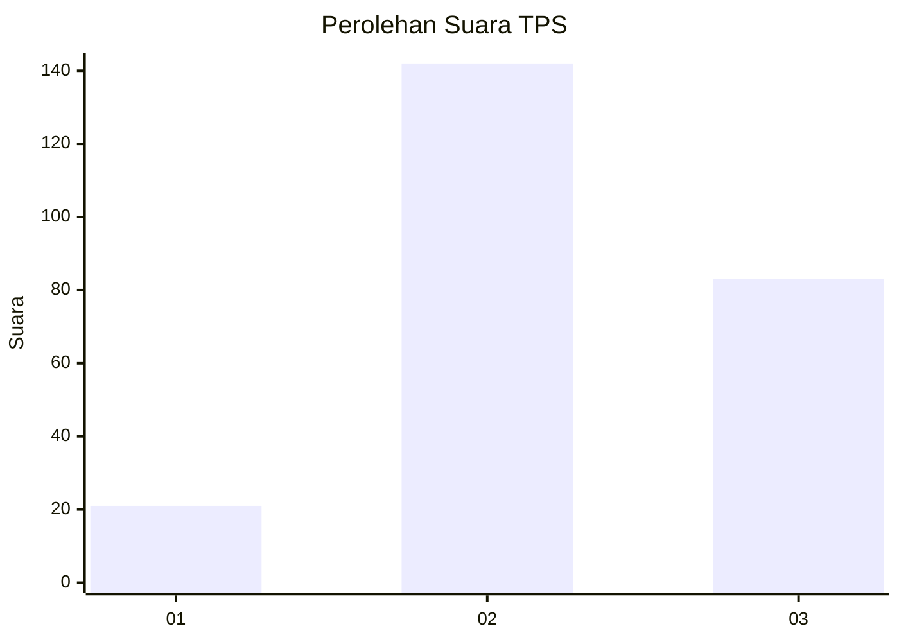
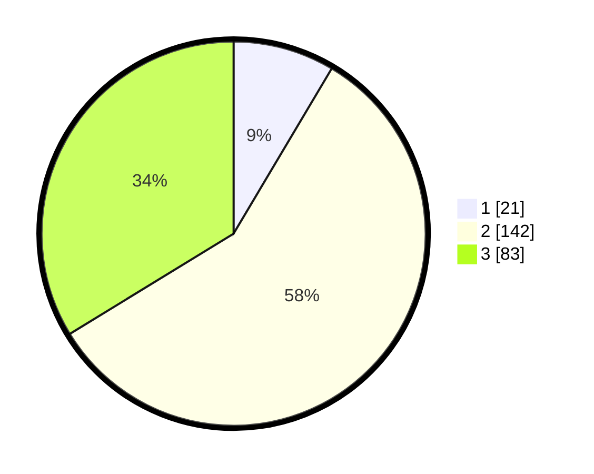

# Hasil

## Grafik

## Tabel

| No. | Nama Paslon    | Suara | Suara (raw) | Persentase |
|:--- |:-------------- | -----:| -----------:| ----------:|
| 1   | ANIES MUHAIMIN | 21    | [21][p-1]   | 8,54       |
| 2   | PRABOWO GIBRAN | 142   | [142][p-2]  | 57,72      |
| 3   | GANJAR MAHFUD  | 83    | [83][p-3]   | 33,74      |

[p-1]: https://github.com/gigit-pemilu/pemilu-2024-34-di-yogyakarta/blob/main/pilpres/hitung-suara/sub/34-di-yogyakarta/sub/01-kulon-progo/sub/09-girimulyo/sub/2001-jatimulyo/sub/002-tps/sub/paslon-1.txt
[p-2]: https://github.com/gigit-pemilu/pemilu-2024-34-di-yogyakarta/blob/main/pilpres/hitung-suara/sub/34-di-yogyakarta/sub/01-kulon-progo/sub/09-girimulyo/sub/2001-jatimulyo/sub/002-tps/sub/paslon-2.txt
[p-3]: https://github.com/gigit-pemilu/pemilu-2024-34-di-yogyakarta/blob/main/pilpres/hitung-suara/sub/34-di-yogyakarta/sub/01-kulon-progo/sub/09-girimulyo/sub/2001-jatimulyo/sub/002-tps/sub/paslon-3.txt

## Foto C Plano

https://sirekap-obj-formc.kpu.go.id/1dca/pemilu/ppwp/34/01/09/20/01/3401092001002-20240216-083901--f65c8221-392a-4d5e-9ef4-8cad6ec3d8db.jpg

https://sirekap-obj-formc.kpu.go.id/1dca/pemilu/ppwp/34/01/09/20/01/3401092001002-20240216-083903--64ec295d-8083-4ae2-ad5b-5e5fd9926391.jpg

https://sirekap-obj-formc.kpu.go.id/1dca/pemilu/ppwp/34/01/09/20/01/3401092001002-20240216-083902--df99fa98-d99f-49bd-99c8-70293501c4a8.jpg

## Metadata

| Key        | Value               |
| ---------- | ------------------- |
| Time Stamp | 2024-02-19 06:16:00 |

## DATA PEMILIH TETAP

Jumlah pemilih dalam DPT: **290**.
 * L: **142**.
 * P: **148**.

## DATA PENGGUNA HAK PILIH

Jumlah pengguna hak pilih dalam DPT: **251**.
 * L: **121**.
 * P: **130**.

Jumlah pengguna hak pilih dalam DPTb: **3**.
 * L: **2**.
 * P: **1**.

Jumlah pengguna hak pilih dalam DPK: **0**.
 * L: **0**.
 * P: **0**.

Jumlah pengguna hak pilih: **254**.
 * L: **123**.
 * P: **131**.

## JUMLAH SUARA SAH DAN TIDAK SAH

JUMLAH SELURUH SUARA SAH: **246**.

JUMLAH SUARA TIDAK SAH: **8**.

JUMLAH SELURUH SUARA SAH DAN SUARA TIDAK SAH: **254**.

