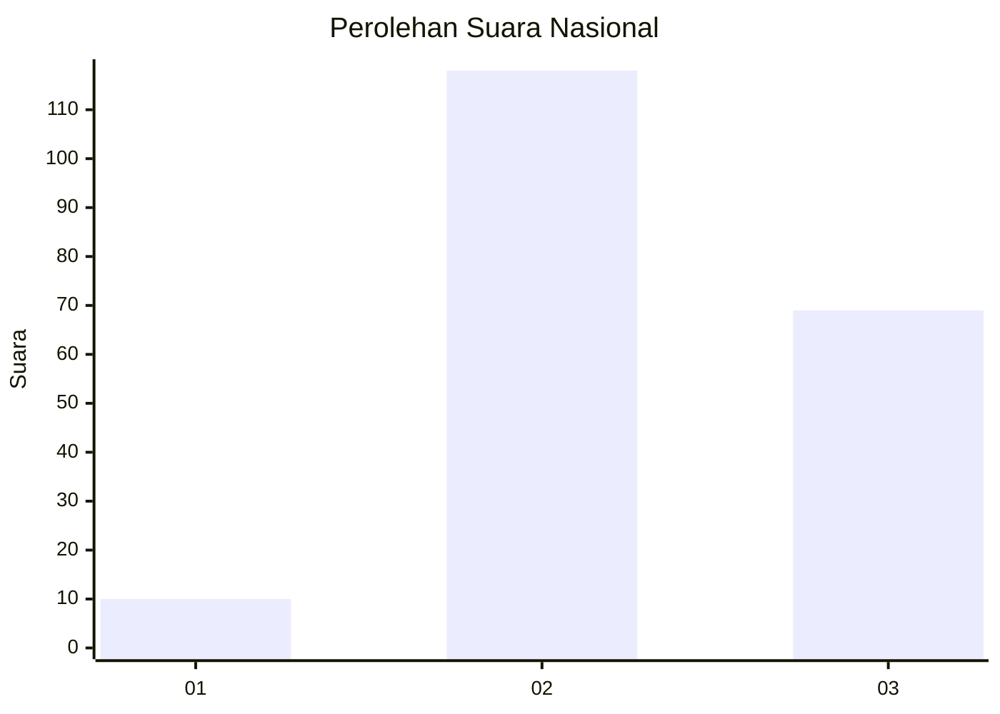
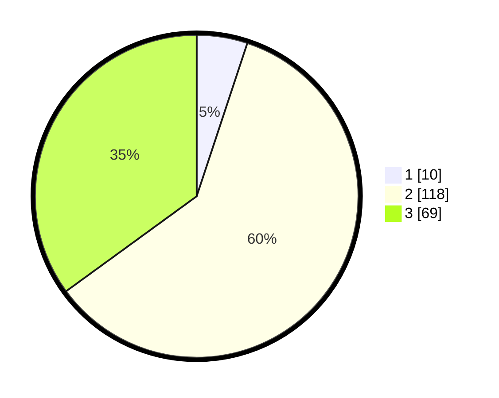

# Hasil

## Grafik

## Tabel

| No. | Nama Paslon    | Suara | Suara (raw) | Persentase |
|:--- |:-------------- | -----:| -----------:| ----------:|
| 1   | ANIES MUHAIMIN | 10    | [10][p-1]   | 5,08       |
| 2   | PRABOWO GIBRAN | 118   | [118][p-2]  | 59,90      |
| 3   | GANJAR MAHFUD  | 69    | [69][p-3]   | 35,03      |

[p-1]: https://github.com/gigit-pemilu/pemilu-2024/blob/main/pilpres/hitung-suara/sub/34-di-yogyakarta/sub/01-kulon-progo/sub/09-girimulyo/sub/2001-jatimulyo/sub/004-tps/sub/paslon-1.txt
[p-2]: https://github.com/gigit-pemilu/pemilu-2024/blob/main/pilpres/hitung-suara/sub/34-di-yogyakarta/sub/01-kulon-progo/sub/09-girimulyo/sub/2001-jatimulyo/sub/004-tps/sub/paslon-2.txt
[p-3]: https://github.com/gigit-pemilu/pemilu-2024/blob/main/pilpres/hitung-suara/sub/34-di-yogyakarta/sub/01-kulon-progo/sub/09-girimulyo/sub/2001-jatimulyo/sub/004-tps/sub/paslon-3.txt

## Foto C Plano

https://sirekap-obj-formc.kpu.go.id/bf8b/pemilu/ppwp/34/01/09/20/01/3401092001004-20240214-200635--5f8169ef-652a-4f5c-82a4-3fda2cefd891.jpg

https://sirekap-obj-formc.kpu.go.id/bf8b/pemilu/ppwp/34/01/09/20/01/3401092001004-20240214-191939--9c15462a-78ba-4772-9c89-55e38cf2a2f8.jpg

https://sirekap-obj-formc.kpu.go.id/bf8b/pemilu/ppwp/34/01/09/20/01/3401092001004-20240214-202808--f1dad2a7-c774-4a33-9508-1cd1a323c52e.jpg

## Metadata

| Key        | Value               |
| ---------- | ------------------- |
| Time Stamp | 2024-02-15 04:00:24 |

## DATA PEMILIH TETAP

Jumlah pemilih dalam DPT: **235**.
 * L: **117**.
 * P: **118**.

## DATA PENGGUNA HAK PILIH

Jumlah pengguna hak pilih dalam DPT: **197**.
 * L: **95**.
 * P: **102**.

Jumlah pengguna hak pilih dalam DPTb: **1**.
 * L: **1**.
 * P: **0**.

Jumlah pengguna hak pilih dalam DPK: **1**.
 * L: **1**.
 * P: **0**.

Jumlah pengguna hak pilih: **199**.
 * L: **97**.
 * P: **102**.

## JUMLAH SUARA SAH DAN TIDAK SAH

JUMLAH SELURUH SUARA SAH: **197**.

JUMLAH SUARA TIDAK SAH: **2**.

JUMLAH SELURUH SUARA SAH DAN SUARA TIDAK SAH: **199**.

