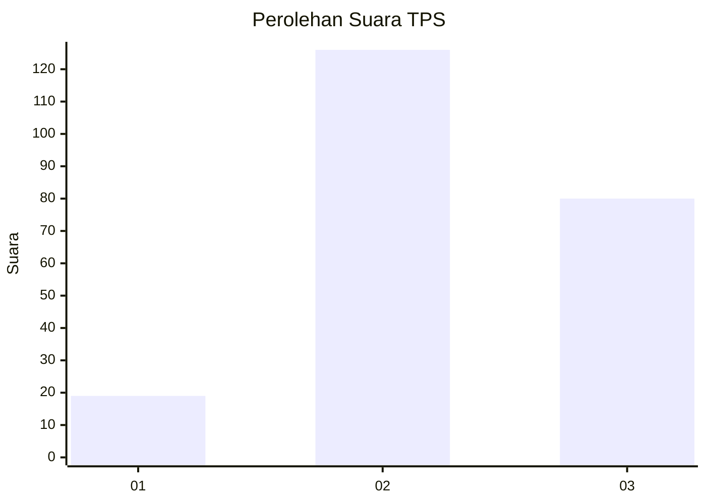
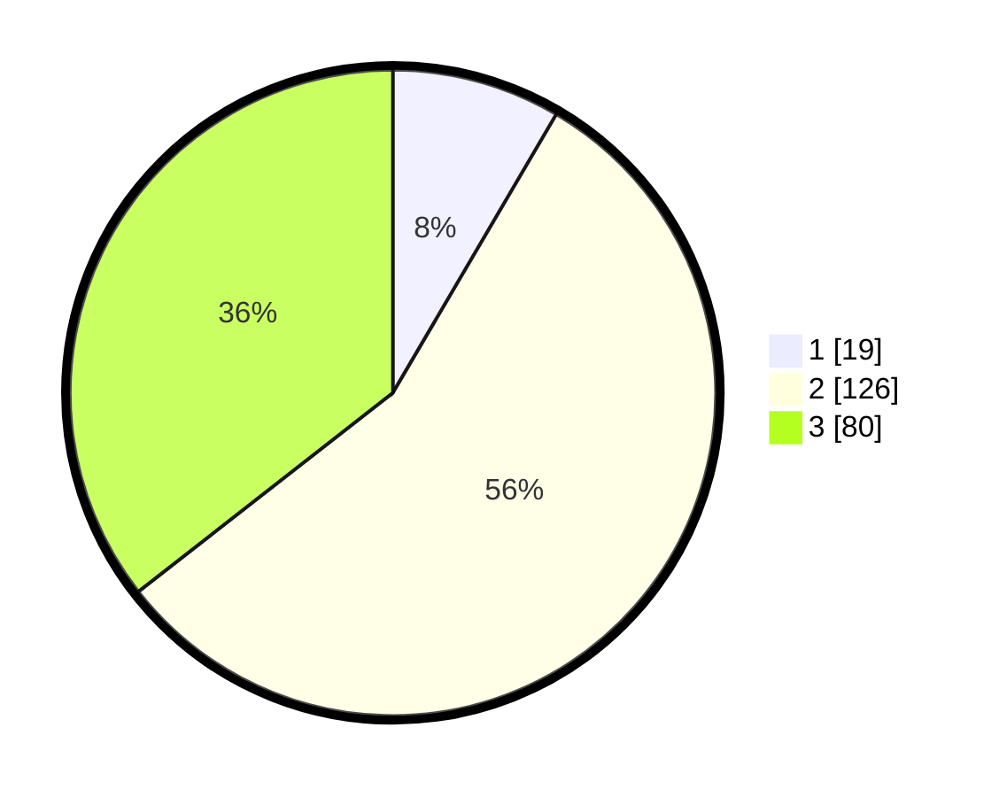

# Hasil

## Grafik

## Tabel

| No. | Nama Paslon    | Suara | Suara (raw) | Persentase |
|:--- |:-------------- | -----:| -----------:| ----------:|
| 1   | ANIES MUHAIMIN | 19    | [19][p-1]   | 8,44       |
| 2   | PRABOWO GIBRAN | 126   | [126][p-2]  | 56,00      |
| 3   | GANJAR MAHFUD  | 80    | [80][p-3]   | 35,56      |

[p-1]: https://github.com/gigit-pemilu/pemilu-2024-34-di-yogyakarta/blob/main/pilpres/hitung-suara/sub/34-di-yogyakarta/sub/01-kulon-progo/sub/09-girimulyo/sub/2001-jatimulyo/sub/006-tps/sub/paslon-1.txt
[p-2]: https://github.com/gigit-pemilu/pemilu-2024-34-di-yogyakarta/blob/main/pilpres/hitung-suara/sub/34-di-yogyakarta/sub/01-kulon-progo/sub/09-girimulyo/sub/2001-jatimulyo/sub/006-tps/sub/paslon-2.txt
[p-3]: https://github.com/gigit-pemilu/pemilu-2024-34-di-yogyakarta/blob/main/pilpres/hitung-suara/sub/34-di-yogyakarta/sub/01-kulon-progo/sub/09-girimulyo/sub/2001-jatimulyo/sub/006-tps/sub/paslon-3.txt

## Foto C Plano

https://sirekap-obj-formc.kpu.go.id/d735/pemilu/ppwp/34/01/09/20/01/3401092001006-20240215-222050--421c8fed-6a8b-4fe0-aed6-489c7b78d7fb.jpg

https://sirekap-obj-formc.kpu.go.id/d735/pemilu/ppwp/34/01/09/20/01/3401092001006-20240215-222052--8f29994b-8a43-4abd-9f04-41e1e411cade.jpg

https://sirekap-obj-formc.kpu.go.id/d735/pemilu/ppwp/34/01/09/20/01/3401092001006-20240215-222051--8d1b8f11-5a32-40be-b1f8-638f6b020624.jpg

## Metadata

| Key        | Value               |
| ---------- | ------------------- |
| Time Stamp | 2024-02-16 08:00:28 |

## DATA PEMILIH TETAP

Jumlah pemilih dalam DPT: **292**.
 * L: **143**.
 * P: **149**.

## DATA PENGGUNA HAK PILIH

Jumlah pengguna hak pilih dalam DPT: **231**.
 * L: **107**.
 * P: **124**.

Jumlah pengguna hak pilih dalam DPTb: **1**.
 * L: **1**.
 * P: **0**.

Jumlah pengguna hak pilih dalam DPK: **0**.
 * L: **0**.
 * P: **0**.

Jumlah pengguna hak pilih: **232**.
 * L: **108**.
 * P: **124**.

## JUMLAH SUARA SAH DAN TIDAK SAH

JUMLAH SELURUH SUARA SAH: **225**.

JUMLAH SUARA TIDAK SAH: **7**.

JUMLAH SELURUH SUARA SAH DAN SUARA TIDAK SAH: **232**.

