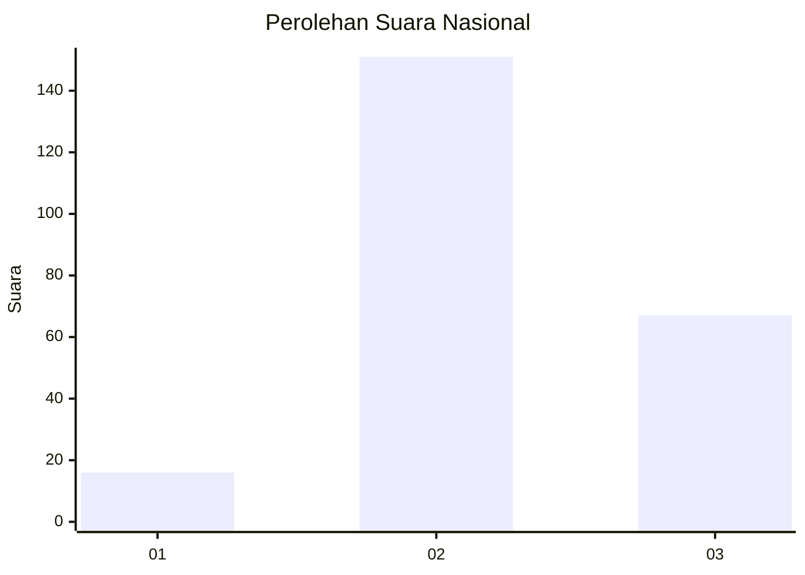
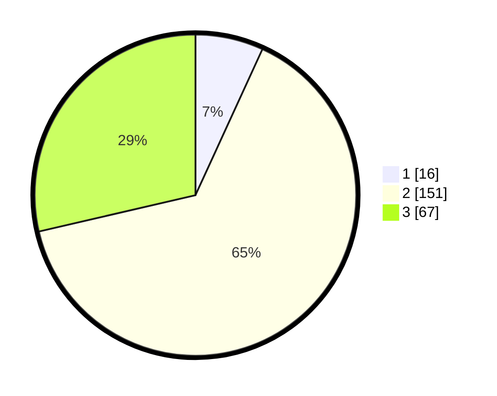

# Hasil

## Grafik

## Tabel

| No. | Nama Paslon    | Suara | Suara (raw) | Persentase |
|:--- |:-------------- | -----:| -----------:| ----------:|
| 1   | ANIES MUHAIMIN | 16    | [16][p-1]   | 6,84       |
| 2   | PRABOWO GIBRAN | 151   | [151][p-2]  | 64,53      |
| 3   | GANJAR MAHFUD  | 67    | [67][p-3]   | 28,63      |

[p-1]: https://github.com/gigit-pemilu/pemilu-2024/blob/main/pilpres/hitung-suara/sub/34-di-yogyakarta/sub/01-kulon-progo/sub/09-girimulyo/sub/2001-jatimulyo/sub/007-tps/sub/paslon-1.txt
[p-2]: https://github.com/gigit-pemilu/pemilu-2024/blob/main/pilpres/hitung-suara/sub/34-di-yogyakarta/sub/01-kulon-progo/sub/09-girimulyo/sub/2001-jatimulyo/sub/007-tps/sub/paslon-2.txt
[p-3]: https://github.com/gigit-pemilu/pemilu-2024/blob/main/pilpres/hitung-suara/sub/34-di-yogyakarta/sub/01-kulon-progo/sub/09-girimulyo/sub/2001-jatimulyo/sub/007-tps/sub/paslon-3.txt

## Foto C Plano

https://sirekap-obj-formc.kpu.go.id/ff0f/pemilu/ppwp/34/01/09/20/01/3401092001007-20240216-124245--00b75445-d683-4e5a-8a5e-c9b76c40d362.jpg

https://sirekap-obj-formc.kpu.go.id/ff0f/pemilu/ppwp/34/01/09/20/01/3401092001007-20240216-124253--be043c3f-2372-42ae-bdb0-4e637806004c.jpg

https://sirekap-obj-formc.kpu.go.id/ff0f/pemilu/ppwp/34/01/09/20/01/3401092001007-20240216-124249--762519c0-1948-4122-b87d-aa5462c4a0ae.jpg

## Metadata

| Key        | Value               |
| ---------- | ------------------- |
| Time Stamp | 2024-02-19 06:16:00 |

## DATA PEMILIH TETAP

Jumlah pemilih dalam DPT: **296**.
 * L: **150**.
 * P: **146**.

## DATA PENGGUNA HAK PILIH

Jumlah pengguna hak pilih dalam DPT: **244**.
 * L: **127**.
 * P: **117**.

Jumlah pengguna hak pilih dalam DPTb: **2**.
 * L: **1**.
 * P: **1**.

Jumlah pengguna hak pilih dalam DPK: **0**.
 * L: **0**.
 * P: **0**.

Jumlah pengguna hak pilih: **246**.
 * L: **128**.
 * P: **118**.

## JUMLAH SUARA SAH DAN TIDAK SAH

JUMLAH SELURUH SUARA SAH: **234**.

JUMLAH SUARA TIDAK SAH: **12**.

JUMLAH SELURUH SUARA SAH DAN SUARA TIDAK SAH: **246**.

