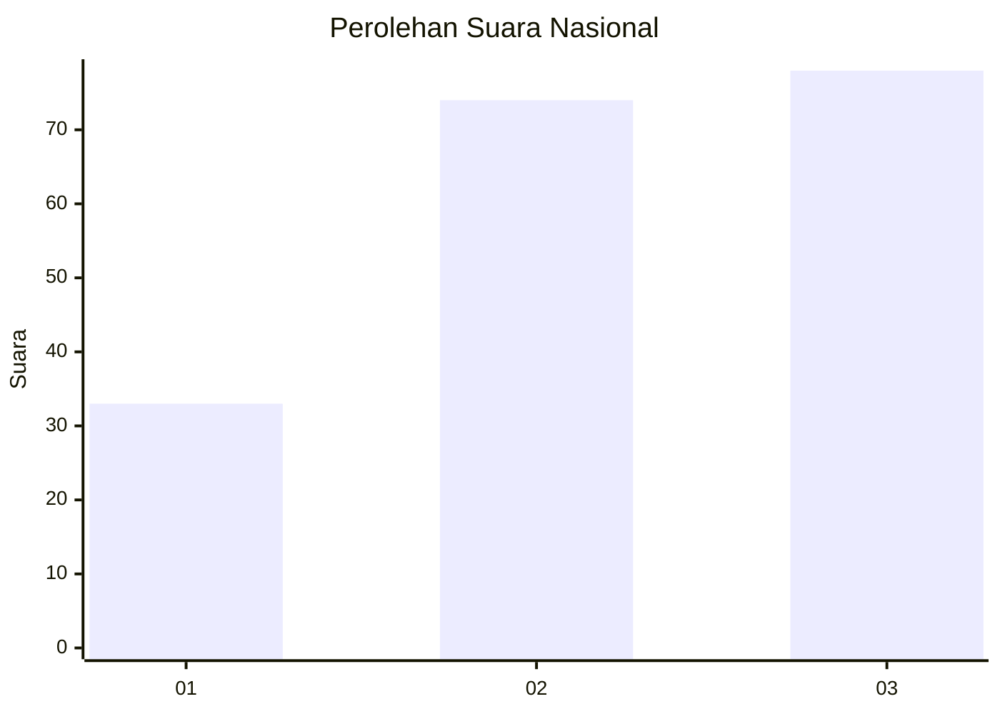
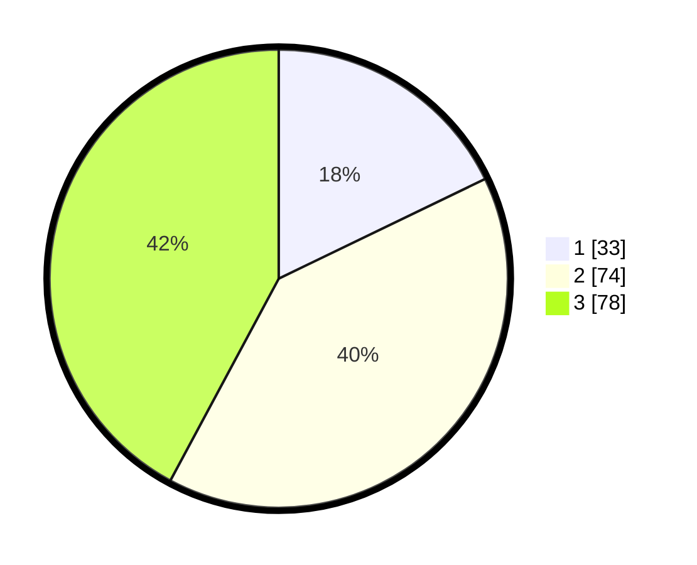

# Hasil

## Grafik

## Tabel

| No. | Nama Paslon    | Suara | Suara (raw) | Persentase |
|:--- |:-------------- | -----:| -----------:| ----------:|
| 1   | ANIES MUHAIMIN | 33    | [33][p-1]   | 17,84      |
| 2   | PRABOWO GIBRAN | 74    | [74][p-2]   | 40,00      |
| 3   | GANJAR MAHFUD  | 78    | [78][p-3]   | 42,16      |

[p-1]: https://github.com/gigit-pemilu/pemilu-2024/blob/main/pilpres/hitung-suara/sub/34-di-yogyakarta/sub/01-kulon-progo/sub/09-girimulyo/sub/2001-jatimulyo/sub/023-tps/sub/paslon-1.txt
[p-2]: https://github.com/gigit-pemilu/pemilu-2024/blob/main/pilpres/hitung-suara/sub/34-di-yogyakarta/sub/01-kulon-progo/sub/09-girimulyo/sub/2001-jatimulyo/sub/023-tps/sub/paslon-2.txt
[p-3]: https://github.com/gigit-pemilu/pemilu-2024/blob/main/pilpres/hitung-suara/sub/34-di-yogyakarta/sub/01-kulon-progo/sub/09-girimulyo/sub/2001-jatimulyo/sub/023-tps/sub/paslon-3.txt

## Foto C Plano

https://sirekap-obj-formc.kpu.go.id/432f/pemilu/ppwp/34/01/09/20/01/3401092001023-20240216-184249--006090d6-54de-4c02-acda-74c0fdb3d75d.jpg

https://sirekap-obj-formc.kpu.go.id/432f/pemilu/ppwp/34/01/09/20/01/3401092001023-20240216-183218--2314e657-9933-4fad-9358-f8eabda84a14.jpg

https://sirekap-obj-formc.kpu.go.id/432f/pemilu/ppwp/34/01/09/20/01/3401092001023-20240216-202458--dcd4e5dc-f10b-4fcd-a3a5-a7746d785a28.jpg

## Metadata

| Key        | Value               |
| ---------- | ------------------- |
| Time Stamp | 2024-02-16 21:01:00 |

