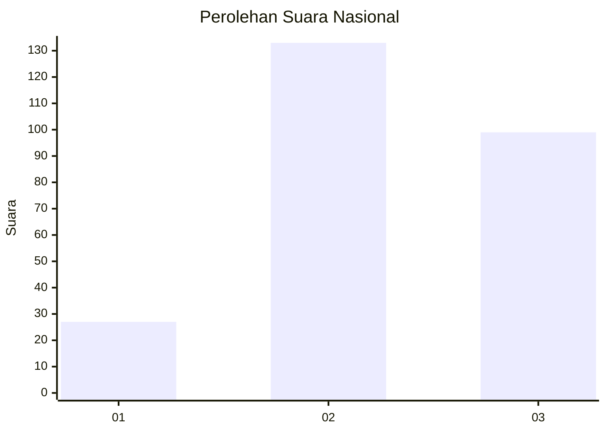
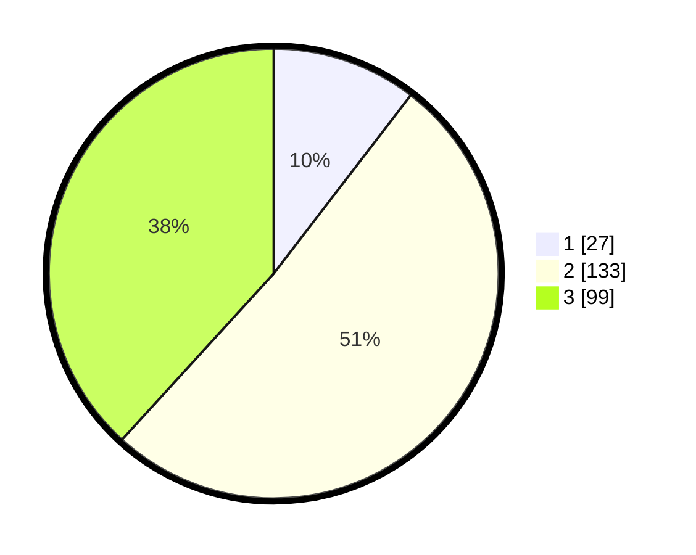

# Hasil

## Grafik

## Tabel

| No. | Nama Paslon    | Suara | Suara (raw) | Persentase |
|:--- |:-------------- | -----:| -----------:| ----------:|
| 1   | ANIES MUHAIMIN | 27    | [27][p-1]   | 10,42      |
| 2   | PRABOWO GIBRAN | 133   | [133][p-2]  | 51,35      |
| 3   | GANJAR MAHFUD  | 99    | [99][p-3]   | 38,22      |

[p-1]: https://github.com/gigit-pemilu/pemilu-2024/blob/main/pilpres/hitung-suara/sub/34-di-yogyakarta/sub/01-kulon-progo/sub/09-girimulyo/sub/2002-giripurwo/sub/004-tps/sub/paslon-1.txt
[p-2]: https://github.com/gigit-pemilu/pemilu-2024/blob/main/pilpres/hitung-suara/sub/34-di-yogyakarta/sub/01-kulon-progo/sub/09-girimulyo/sub/2002-giripurwo/sub/004-tps/sub/paslon-2.txt
[p-3]: https://github.com/gigit-pemilu/pemilu-2024/blob/main/pilpres/hitung-suara/sub/34-di-yogyakarta/sub/01-kulon-progo/sub/09-girimulyo/sub/2002-giripurwo/sub/004-tps/sub/paslon-3.txt

## Foto C Plano

https://sirekap-obj-formc.kpu.go.id/2b0b/pemilu/ppwp/34/01/09/20/02/3401092002004-20240216-030742--8f7ca53b-7cf9-4972-93e2-30ba62e900eb.jpg

https://sirekap-obj-formc.kpu.go.id/2b0b/pemilu/ppwp/34/01/09/20/02/3401092002004-20240214-201231--f09de656-0572-471a-88f8-dbad9fcf152d.jpg

https://sirekap-obj-formc.kpu.go.id/2b0b/pemilu/ppwp/34/01/09/20/02/3401092002004-20240214-201449--1c5667f2-9586-4dd2-8a87-67e3b239d622.jpg

## Metadata

| Key        | Value               |
| ---------- | ------------------- |
| Time Stamp | 2024-02-16 03:30:26 |

## DATA PEMILIH TETAP

Jumlah pemilih dalam DPT: **297**.
 * L: **142**.
 * P: **155**.

## DATA PENGGUNA HAK PILIH

Jumlah pengguna hak pilih dalam DPT: **261**.
 * L: **120**.
 * P: **141**.

Jumlah pengguna hak pilih dalam DPTb: **0**.
 * L: **0**.
 * P: **0**.

Jumlah pengguna hak pilih dalam DPK: **2**.
 * L: **0**.
 * P: **2**.

Jumlah pengguna hak pilih: **263**.
 * L: **120**.
 * P: **143**.

## JUMLAH SUARA SAH DAN TIDAK SAH

JUMLAH SELURUH SUARA SAH: **259**.

JUMLAH SUARA TIDAK SAH: **4**.

JUMLAH SELURUH SUARA SAH DAN SUARA TIDAK SAH: **263**.

