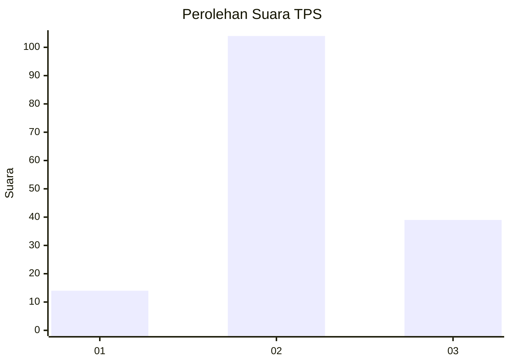
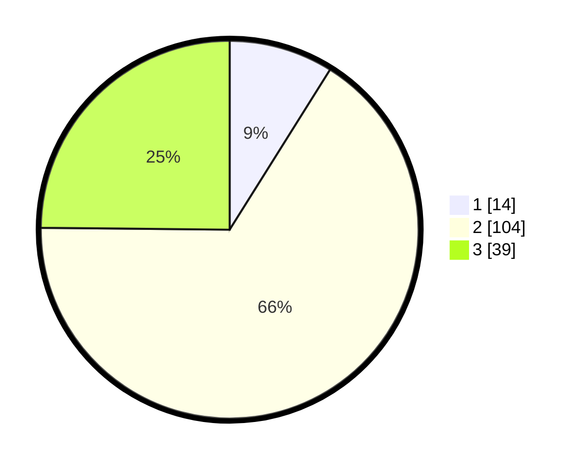

# Hasil

## Grafik

## Tabel

| No. | Nama Paslon    | Suara | Suara (raw) | Persentase |
|:--- |:-------------- | -----:| -----------:| ----------:|
| 1   | ANIES MUHAIMIN | 14    | [14][p-1]   | 8,92       |
| 2   | PRABOWO GIBRAN | 104   | [104][p-2]  | 66,24      |
| 3   | GANJAR MAHFUD  | 39    | [39][p-3]   | 24,84      |

[p-1]: https://github.com/gigit-pemilu/pemilu-2024-34-di-yogyakarta/blob/main/pilpres/hitung-suara/sub/34-di-yogyakarta/sub/01-kulon-progo/sub/09-girimulyo/sub/2002-giripurwo/sub/015-tps/sub/paslon-1.txt
[p-2]: https://github.com/gigit-pemilu/pemilu-2024-34-di-yogyakarta/blob/main/pilpres/hitung-suara/sub/34-di-yogyakarta/sub/01-kulon-progo/sub/09-girimulyo/sub/2002-giripurwo/sub/015-tps/sub/paslon-2.txt
[p-3]: https://github.com/gigit-pemilu/pemilu-2024-34-di-yogyakarta/blob/main/pilpres/hitung-suara/sub/34-di-yogyakarta/sub/01-kulon-progo/sub/09-girimulyo/sub/2002-giripurwo/sub/015-tps/sub/paslon-3.txt

## Foto C Plano

https://sirekap-obj-formc.kpu.go.id/b7fe/pemilu/ppwp/34/01/09/20/02/3401092002015-20240216-160054--8f51bce2-8bdf-4793-98f8-1d384953a9c3.jpg

https://sirekap-obj-formc.kpu.go.id/b7fe/pemilu/ppwp/34/01/09/20/02/3401092002015-20240216-160135--600631e6-78c0-48ed-8539-82eda531eba6.jpg

https://sirekap-obj-formc.kpu.go.id/b7fe/pemilu/ppwp/34/01/09/20/02/3401092002015-20240216-160508--0f500a42-bdf6-4fd1-907e-e75f79ec2f7e.jpg

## Metadata

| Key        | Value               |
| ---------- | ------------------- |
| Time Stamp | 2024-02-16 16:25:10 |

## DATA PEMILIH TETAP

Jumlah pemilih dalam DPT: **242**.
 * L: **124**.
 * P: **118**.

## DATA PENGGUNA HAK PILIH

Jumlah pengguna hak pilih dalam DPT: **218**.
 * L: **111**.
 * P: **107**.

Jumlah pengguna hak pilih dalam DPTb: **1**.
 * L: **1**.
 * P: **0**.

Jumlah pengguna hak pilih dalam DPK: **555**.
 * L: **0**.
 * P: **5**.

Jumlah pengguna hak pilih: **219**.
 * L: **112**.
 * P: **107**.

## JUMLAH SUARA SAH DAN TIDAK SAH

JUMLAH SELURUH SUARA SAH: **11**.

JUMLAH SUARA TIDAK SAH: **8**.

JUMLAH SELURUH SUARA SAH DAN SUARA TIDAK SAH: **219**.

