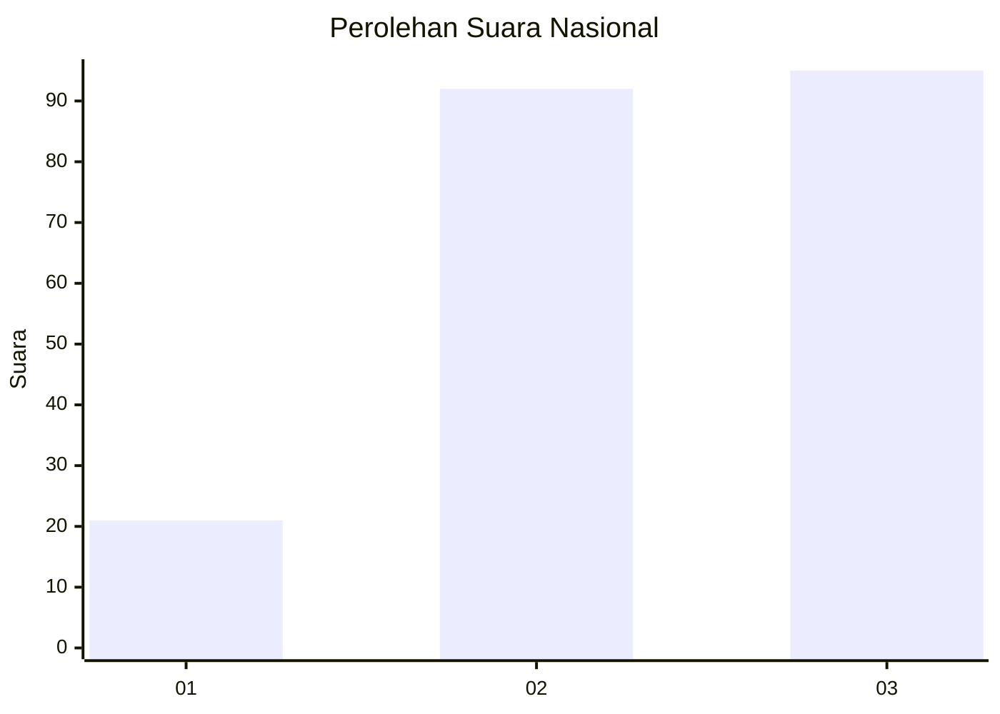
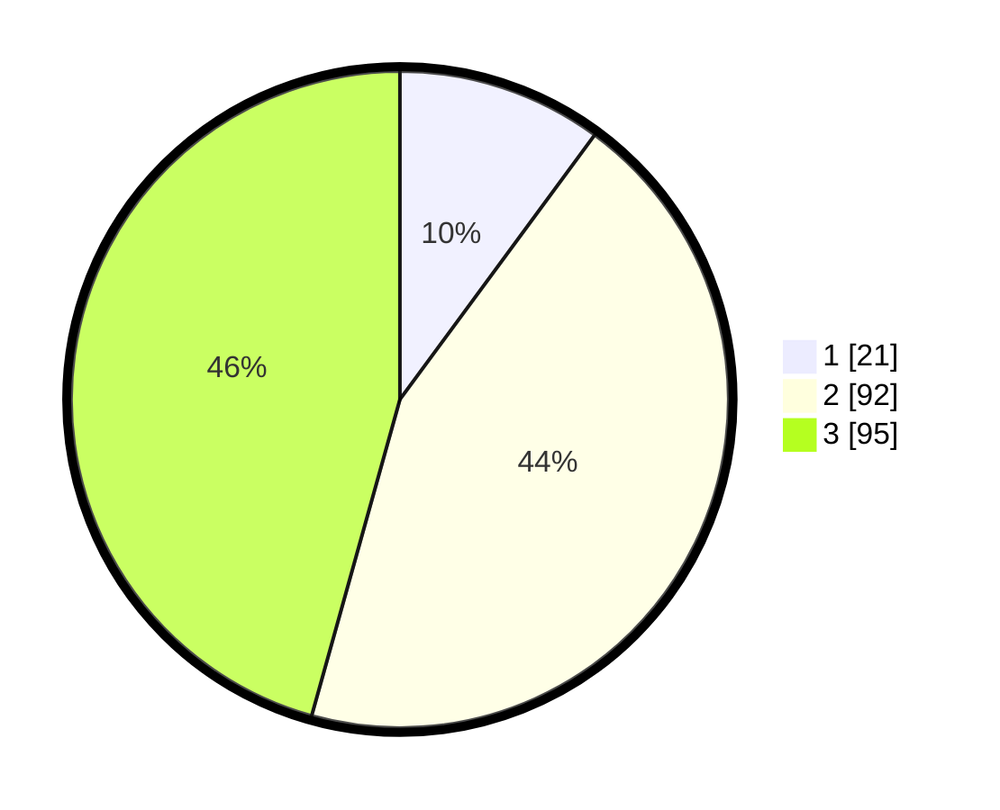

# Hasil

## Grafik

## Tabel

| No. | Nama Paslon    | Suara | Suara (raw) | Persentase |
|:--- |:-------------- | -----:| -----------:| ----------:|
| 1   | ANIES MUHAIMIN | 21    | [21][p-1]   | 10,10      |
| 2   | PRABOWO GIBRAN | 92    | [92][p-2]   | 44,23      |
| 3   | GANJAR MAHFUD  | 95    | [95][p-3]   | 45,67      |

[p-1]: https://github.com/gigit-pemilu/pemilu-2024/blob/main/pilpres/hitung-suara/sub/34-di-yogyakarta/sub/01-kulon-progo/sub/09-girimulyo/sub/2002-giripurwo/sub/021-tps/sub/paslon-1.txt
[p-2]: https://github.com/gigit-pemilu/pemilu-2024/blob/main/pilpres/hitung-suara/sub/34-di-yogyakarta/sub/01-kulon-progo/sub/09-girimulyo/sub/2002-giripurwo/sub/021-tps/sub/paslon-2.txt
[p-3]: https://github.com/gigit-pemilu/pemilu-2024/blob/main/pilpres/hitung-suara/sub/34-di-yogyakarta/sub/01-kulon-progo/sub/09-girimulyo/sub/2002-giripurwo/sub/021-tps/sub/paslon-3.txt

## Foto C Plano

https://sirekap-obj-formc.kpu.go.id/2e55/pemilu/ppwp/34/01/09/20/02/3401092002021-20240216-145357--a0e1c2a1-d4cd-4df4-8674-6860f4351ec2.jpg

https://sirekap-obj-formc.kpu.go.id/2e55/pemilu/ppwp/34/01/09/20/02/3401092002021-20240214-155022--8bf10f2e-e0f2-4504-9973-27954ee7096f.jpg

https://sirekap-obj-formc.kpu.go.id/2e55/pemilu/ppwp/34/01/09/20/02/3401092002021-20240216-145358--a6255435-67b3-41f3-8cc5-870813d54771.jpg

## Metadata

| Key        | Value               |
| ---------- | ------------------- |
| Time Stamp | 2024-02-16 16:25:10 |

## DATA PEMILIH TETAP

Jumlah pemilih dalam DPT: **162**.
 * L: **121**.
 * P: **141**.

## DATA PENGGUNA HAK PILIH

Jumlah pengguna hak pilih dalam DPT: **228**.
 * L: **111**.
 * P: **117**.

Jumlah pengguna hak pilih dalam DPTb: **2**.
 * L: **1**.
 * P: **1**.

Jumlah pengguna hak pilih dalam DPK: **0**.
 * L: **0**.
 * P: **0**.

Jumlah pengguna hak pilih: **230**.
 * L: **112**.
 * P: **118**.

## JUMLAH SUARA SAH DAN TIDAK SAH

JUMLAH SELURUH SUARA SAH: **208**.

JUMLAH SUARA TIDAK SAH: **22**.

JUMLAH SELURUH SUARA SAH DAN SUARA TIDAK SAH: **230**.

