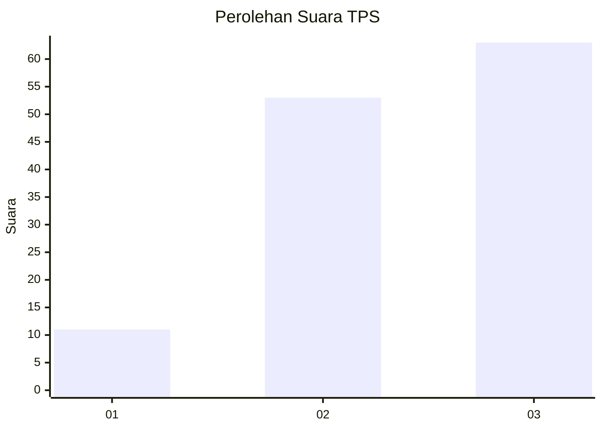
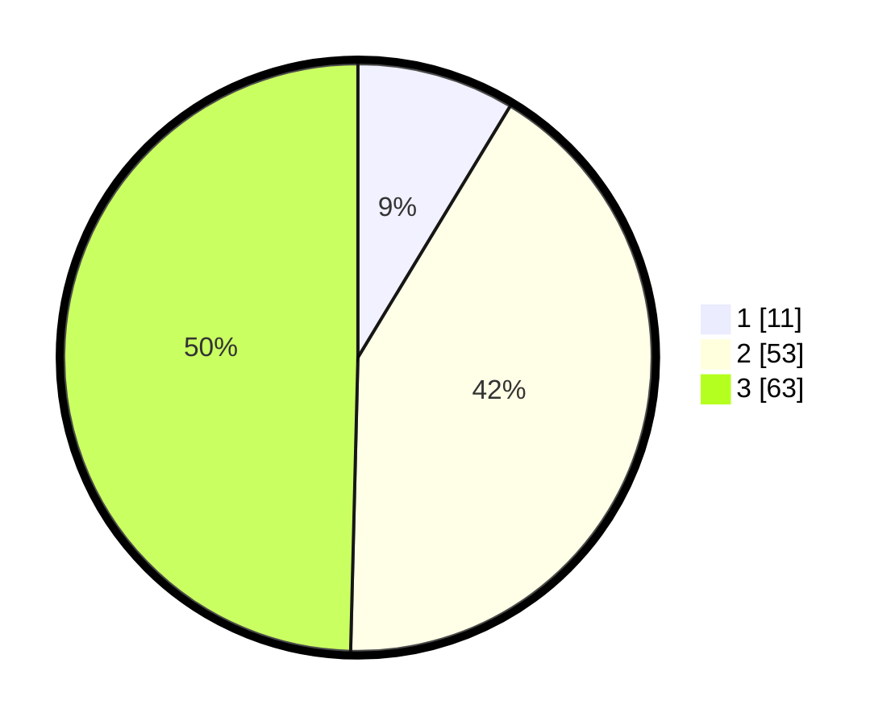

# Hasil

## Grafik

## Tabel

| No. | Nama Paslon    | Suara | Suara (raw) | Persentase |
|:--- |:-------------- | -----:| -----------:| ----------:|
| 1   | ANIES MUHAIMIN | 11    | [11][p-1]   | 8,66       |
| 2   | PRABOWO GIBRAN | 53    | [53][p-2]   | 41,73      |
| 3   | GANJAR MAHFUD  | 63    | [63][p-3]   | 49,61      |

[p-1]: https://github.com/gigit-pemilu/pemilu-2024-34-di-yogyakarta/blob/main/pilpres/hitung-suara/sub/34-di-yogyakarta/sub/01-kulon-progo/sub/09-girimulyo/sub/2003-pendoworejo/sub/003-tps/sub/paslon-1.txt
[p-2]: https://github.com/gigit-pemilu/pemilu-2024-34-di-yogyakarta/blob/main/pilpres/hitung-suara/sub/34-di-yogyakarta/sub/01-kulon-progo/sub/09-girimulyo/sub/2003-pendoworejo/sub/003-tps/sub/paslon-2.txt
[p-3]: https://github.com/gigit-pemilu/pemilu-2024-34-di-yogyakarta/blob/main/pilpres/hitung-suara/sub/34-di-yogyakarta/sub/01-kulon-progo/sub/09-girimulyo/sub/2003-pendoworejo/sub/003-tps/sub/paslon-3.txt

## Foto C Plano

https://sirekap-obj-formc.kpu.go.id/ecfc/pemilu/ppwp/34/01/09/20/03/3401092003003-20240214-192306--be373cc3-443f-4a06-9157-3632295f0ab3.jpg

https://sirekap-obj-formc.kpu.go.id/ecfc/pemilu/ppwp/34/01/09/20/03/3401092003003-20240217-163713--2647ec56-ce01-4dc0-8f5b-6f66aaa83c91.jpg

https://sirekap-obj-formc.kpu.go.id/ecfc/pemilu/ppwp/34/01/09/20/03/3401092003003-20240217-163712--6ec37668-b0f3-405d-9d39-61367caa02cb.jpg

## Metadata

| Key        | Value               |
| ---------- | ------------------- |
| Time Stamp | 2024-02-22 09:00:00 |

## DATA PEMILIH TETAP

Jumlah pemilih dalam DPT: **144**.
 * L: **66**.
 * P: **78**.

## DATA PENGGUNA HAK PILIH

Jumlah pengguna hak pilih dalam DPT: **127**.
 * L: **59**.
 * P: **68**.

Jumlah pengguna hak pilih dalam DPTb: **1**.
 * L: **0**.
 * P: **1**.

Jumlah pengguna hak pilih dalam DPK: **1**.
 * L: **0**.
 * P: **1**.

Jumlah pengguna hak pilih: **129**.
 * L: **59**.
 * P: **70**.

## JUMLAH SUARA SAH DAN TIDAK SAH

JUMLAH SELURUH SUARA SAH: **127**.

JUMLAH SUARA TIDAK SAH: **2**.

JUMLAH SELURUH SUARA SAH DAN SUARA TIDAK SAH: **129**.

