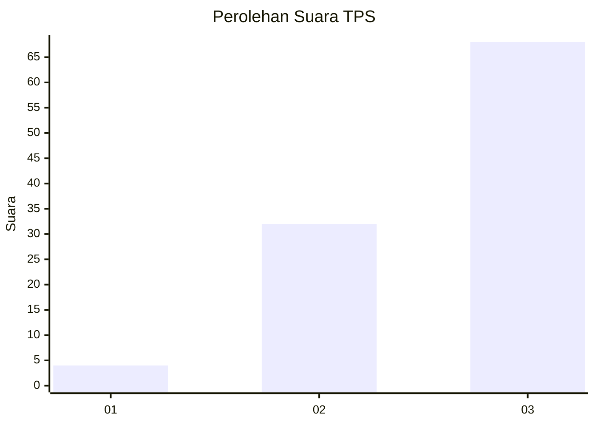
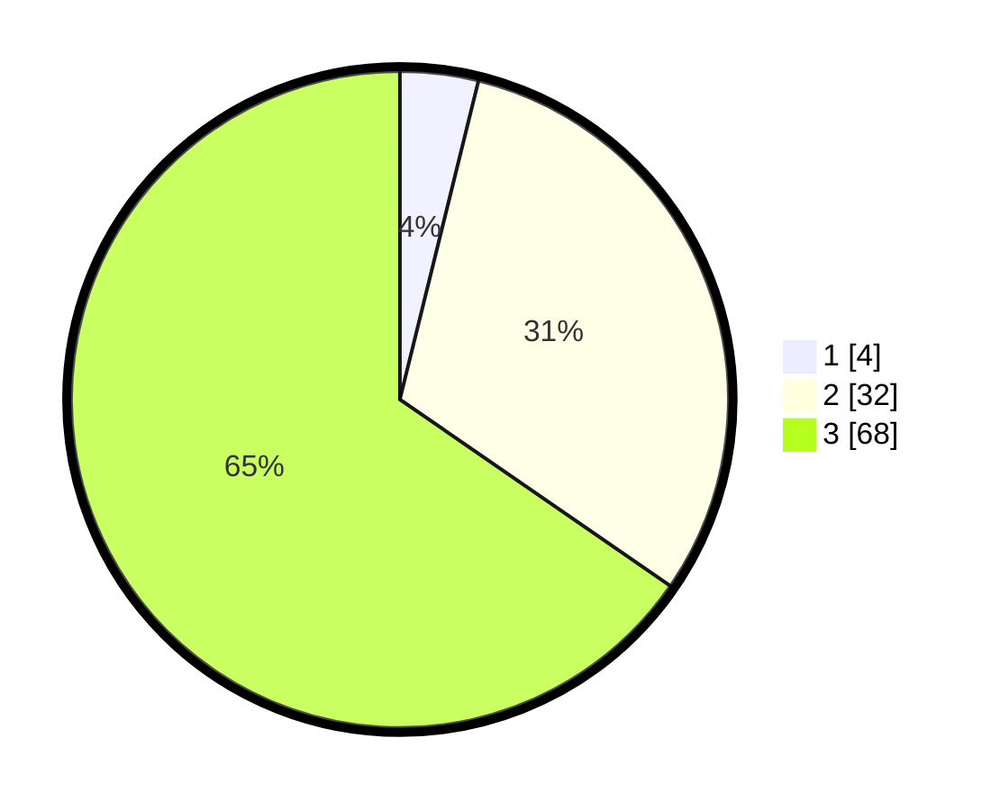

# Hasil

## Grafik

## Tabel

| No. | Nama Paslon    | Suara | Suara (raw) | Persentase |
|:--- |:-------------- | -----:| -----------:| ----------:|
| 1   | ANIES MUHAIMIN | 4     | [4][p-1]    | 3,85       |
| 2   | PRABOWO GIBRAN | 32    | [32][p-2]   | 30,77      |
| 3   | GANJAR MAHFUD  | 68    | [68][p-3]   | 65,38      |

[p-1]: https://github.com/gigit-pemilu/pemilu-2024-34-di-yogyakarta/blob/main/pilpres/hitung-suara/sub/34-di-yogyakarta/sub/01-kulon-progo/sub/09-girimulyo/sub/2003-pendoworejo/sub/004-tps/sub/paslon-1.txt
[p-2]: https://github.com/gigit-pemilu/pemilu-2024-34-di-yogyakarta/blob/main/pilpres/hitung-suara/sub/34-di-yogyakarta/sub/01-kulon-progo/sub/09-girimulyo/sub/2003-pendoworejo/sub/004-tps/sub/paslon-2.txt
[p-3]: https://github.com/gigit-pemilu/pemilu-2024-34-di-yogyakarta/blob/main/pilpres/hitung-suara/sub/34-di-yogyakarta/sub/01-kulon-progo/sub/09-girimulyo/sub/2003-pendoworejo/sub/004-tps/sub/paslon-3.txt

## Foto C Plano

https://sirekap-obj-formc.kpu.go.id/4a70/pemilu/ppwp/34/01/09/20/03/3401092003004-20240214-141420--3396c129-90ad-4b9a-a06f-3fa715bf0a79.jpg

https://sirekap-obj-formc.kpu.go.id/4a70/pemilu/ppwp/34/01/09/20/03/3401092003004-20240214-205947--bcd461ee-25d1-4ce5-ae4a-8fb0665a5d8d.jpg

https://sirekap-obj-formc.kpu.go.id/4a70/pemilu/ppwp/34/01/09/20/03/3401092003004-20240216-175848--ef8b0720-1959-432e-b9ca-95f48f2c40f3.jpg

## Metadata

| Key        | Value               |
| ---------- | ------------------- |
| Time Stamp | 2024-02-16 21:01:00 |

## DATA PEMILIH TETAP

Jumlah pemilih dalam DPT: **123**.
 * L: **62**.
 * P: **61**.

## DATA PENGGUNA HAK PILIH

Jumlah pengguna hak pilih dalam DPT: **103**.
 * L: **51**.
 * P: **52**.

Jumlah pengguna hak pilih dalam DPTb: **2**.
 * L: **0**.
 * P: **2**.

Jumlah pengguna hak pilih dalam DPK: **0**.
 * L: **0**.
 * P: **0**.

Jumlah pengguna hak pilih: **105**.
 * L: **51**.
 * P: **54**.

## JUMLAH SUARA SAH DAN TIDAK SAH

JUMLAH SELURUH SUARA SAH: **104**.

JUMLAH SUARA TIDAK SAH: **1**.

JUMLAH SELURUH SUARA SAH DAN SUARA TIDAK SAH: **105**.

