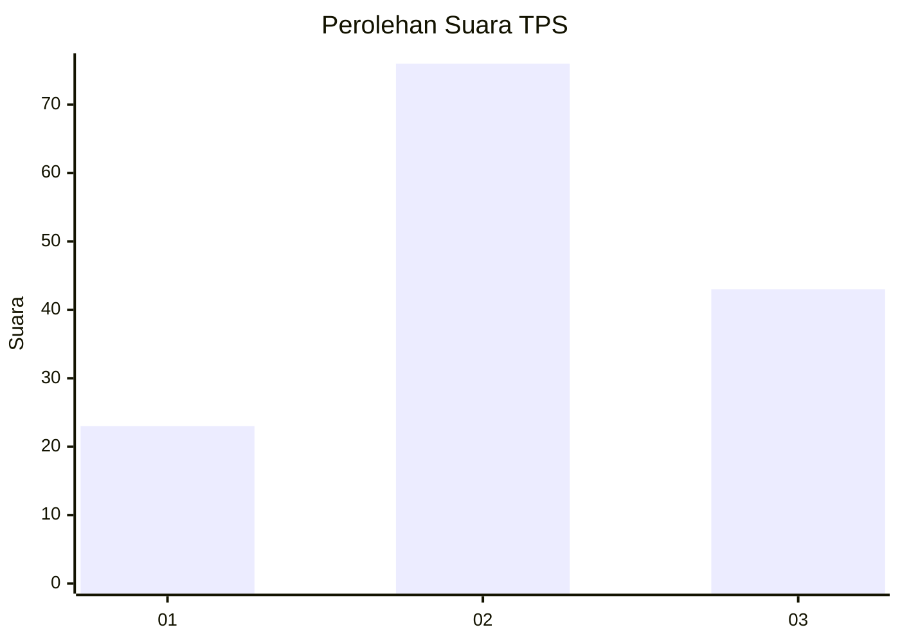
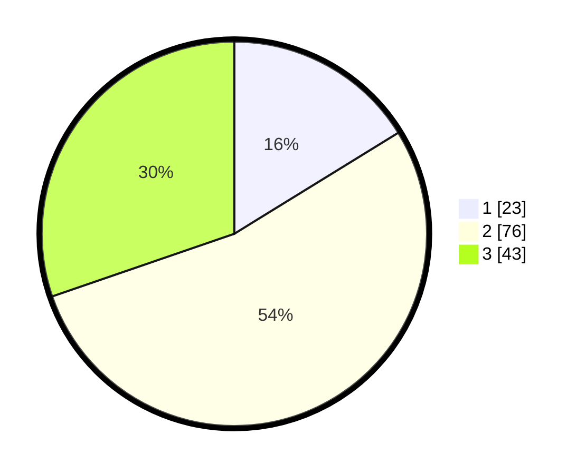

# Hasil

## Grafik

## Tabel

| No. | Nama Paslon    | Suara | Suara (raw) | Persentase |
|:--- |:-------------- | -----:| -----------:| ----------:|
| 1   | ANIES MUHAIMIN | 23    | [23][p-1]   | 16,20      |
| 2   | PRABOWO GIBRAN | 76    | [76][p-2]   | 53,52      |
| 3   | GANJAR MAHFUD  | 43    | [43][p-3]   | 30,28      |

[p-1]: https://github.com/gigit-pemilu/pemilu-2024-34-di-yogyakarta/blob/main/pilpres/hitung-suara/sub/34-di-yogyakarta/sub/01-kulon-progo/sub/09-girimulyo/sub/2003-pendoworejo/sub/007-tps/sub/paslon-1.txt
[p-2]: https://github.com/gigit-pemilu/pemilu-2024-34-di-yogyakarta/blob/main/pilpres/hitung-suara/sub/34-di-yogyakarta/sub/01-kulon-progo/sub/09-girimulyo/sub/2003-pendoworejo/sub/007-tps/sub/paslon-2.txt
[p-3]: https://github.com/gigit-pemilu/pemilu-2024-34-di-yogyakarta/blob/main/pilpres/hitung-suara/sub/34-di-yogyakarta/sub/01-kulon-progo/sub/09-girimulyo/sub/2003-pendoworejo/sub/007-tps/sub/paslon-3.txt

## Foto C Plano

https://sirekap-obj-formc.kpu.go.id/4281/pemilu/ppwp/34/01/09/20/03/3401092003007-20240216-115003--dfbe2da6-69b4-44a9-a5c7-304c206bd5af.jpg

https://sirekap-obj-formc.kpu.go.id/4281/pemilu/ppwp/34/01/09/20/03/3401092003007-20240214-194506--366eb56e-44c6-48a2-9bfa-67f85f9613e3.jpg

https://sirekap-obj-formc.kpu.go.id/4281/pemilu/ppwp/34/01/09/20/03/3401092003007-20240216-115823--db8dc4d4-6ae8-4b7a-9fc6-f0c76bafaa60.jpg

## Metadata

| Key        | Value               |
| ---------- | ------------------- |
| Time Stamp | 2024-02-16 12:51:22 |

