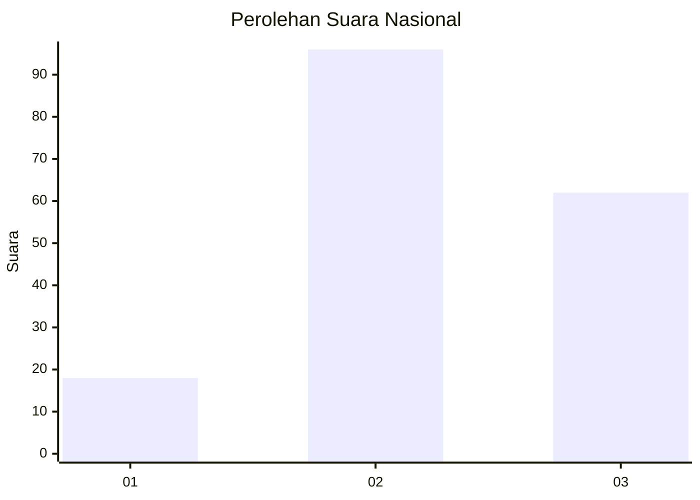
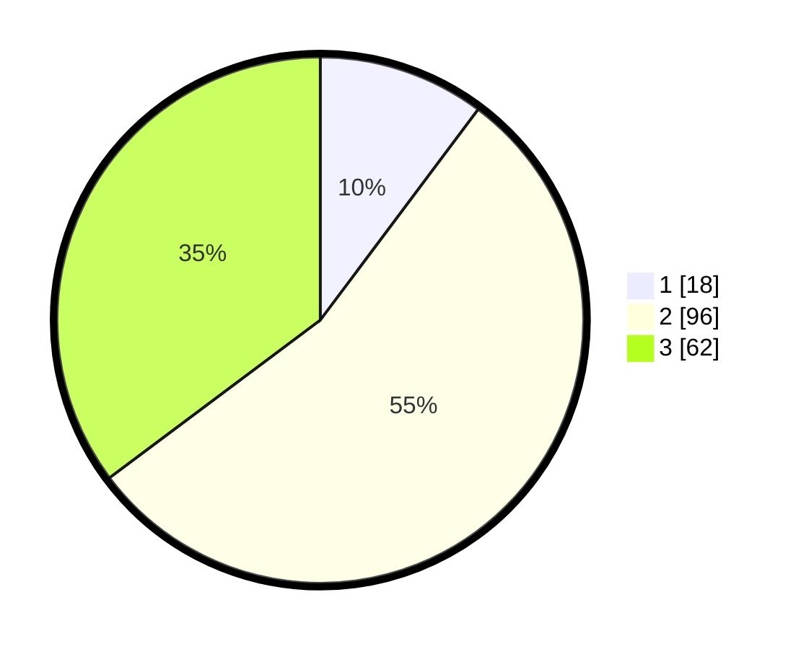

# Hasil

## Grafik

## Tabel

| No. | Nama Paslon    | Suara | Suara (raw) | Persentase |
|:--- |:-------------- | -----:| -----------:| ----------:|
| 1   | ANIES MUHAIMIN | 18    | [18][p-1]   | 10,23      |
| 2   | PRABOWO GIBRAN | 96    | [96][p-2]   | 54,55      |
| 3   | GANJAR MAHFUD  | 62    | [62][p-3]   | 35,23      |

[p-1]: https://github.com/gigit-pemilu/pemilu-2024/blob/main/pilpres/hitung-suara/sub/34-di-yogyakarta/sub/01-kulon-progo/sub/09-girimulyo/sub/2003-pendoworejo/sub/011-tps/sub/paslon-1.txt
[p-2]: https://github.com/gigit-pemilu/pemilu-2024/blob/main/pilpres/hitung-suara/sub/34-di-yogyakarta/sub/01-kulon-progo/sub/09-girimulyo/sub/2003-pendoworejo/sub/011-tps/sub/paslon-2.txt
[p-3]: https://github.com/gigit-pemilu/pemilu-2024/blob/main/pilpres/hitung-suara/sub/34-di-yogyakarta/sub/01-kulon-progo/sub/09-girimulyo/sub/2003-pendoworejo/sub/011-tps/sub/paslon-3.txt

## Foto C Plano

https://sirekap-obj-formc.kpu.go.id/0a30/pemilu/ppwp/34/01/09/20/03/3401092003011-20240216-093500--20a80950-aa9d-4900-aec4-f76dd675c0ff.jpg

https://sirekap-obj-formc.kpu.go.id/0a30/pemilu/ppwp/34/01/09/20/03/3401092003011-20240216-093644--1f3c5af4-021e-4f37-a26b-6a8b529d6ef7.jpg

https://sirekap-obj-formc.kpu.go.id/0a30/pemilu/ppwp/34/01/09/20/03/3401092003011-20240216-093747--3e55207d-12ce-413a-baeb-0165b6237083.jpg

## Metadata

| Key        | Value               |
| ---------- | ------------------- |
| Time Stamp | 2024-02-24 22:31:28 |

