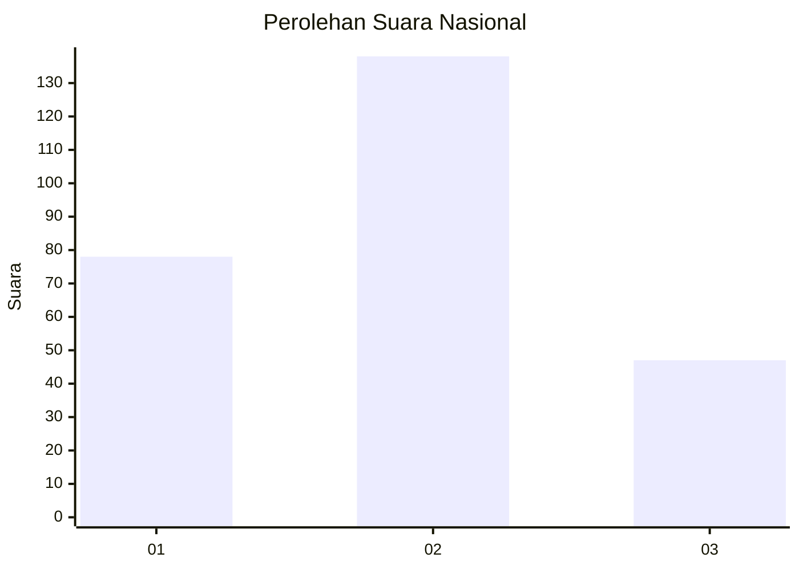
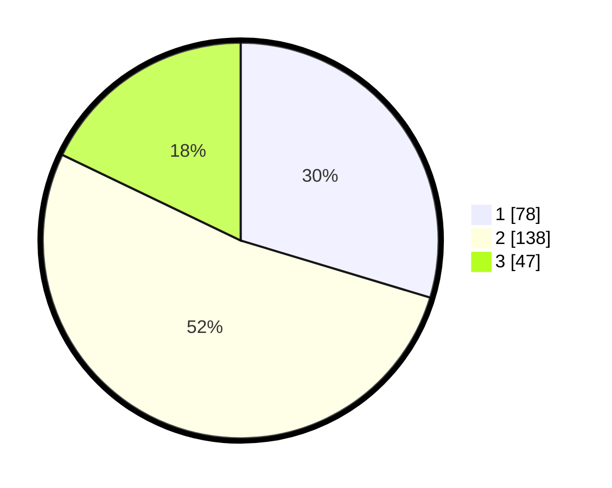

# Hasil

## Grafik

## Tabel

| No. | Nama Paslon    | Suara | Suara (raw) | Persentase |
|:--- |:-------------- | -----:| -----------:| ----------:|
| 1   | ANIES MUHAIMIN | 78    | [78][p-1]   | 29,66      |
| 2   | PRABOWO GIBRAN | 138   | [138][p-2]  | 52,47      |
| 3   | GANJAR MAHFUD  | 47    | [47][p-3]   | 17,87      |

[p-1]: https://github.com/gigit-pemilu/pemilu-2024/blob/main/pilpres/hitung-suara/sub/34-di-yogyakarta/sub/01-kulon-progo/sub/10-nanggulan/sub/2001-banyuroto/sub/001-tps/sub/paslon-1.txt
[p-2]: https://github.com/gigit-pemilu/pemilu-2024/blob/main/pilpres/hitung-suara/sub/34-di-yogyakarta/sub/01-kulon-progo/sub/10-nanggulan/sub/2001-banyuroto/sub/001-tps/sub/paslon-2.txt
[p-3]: https://github.com/gigit-pemilu/pemilu-2024/blob/main/pilpres/hitung-suara/sub/34-di-yogyakarta/sub/01-kulon-progo/sub/10-nanggulan/sub/2001-banyuroto/sub/001-tps/sub/paslon-3.txt

## Foto C Plano

https://sirekap-obj-formc.kpu.go.id/9e04/pemilu/ppwp/34/01/10/20/01/3401102001001-20240218-092433--7151d64c-bc1f-4351-819d-759e8b724f0f.jpg

https://sirekap-obj-formc.kpu.go.id/9e04/pemilu/ppwp/34/01/10/20/01/3401102001001-20240218-092434--eeb1119f-aaa7-4547-814a-41e4798e12ba.jpg

https://sirekap-obj-formc.kpu.go.id/9e04/pemilu/ppwp/34/01/10/20/01/3401102001001-20240218-092433--d6e77936-de10-4b75-b351-ad5f9bd1f99c.jpg

## Metadata

| Key        | Value               |
| ---------- | ------------------- |
| Time Stamp | 2024-02-21 13:00:00 |

## DATA PEMILIH TETAP

Jumlah pemilih dalam DPT: **0**.
 * L: **0**.
 * P: **0**.

## DATA PENGGUNA HAK PILIH

Jumlah pengguna hak pilih dalam DPT: **0**.
 * L: **0**.
 * P: **0**.

Jumlah pengguna hak pilih dalam DPTb: **0**.
 * L: **0**.
 * P: **0**.

Jumlah pengguna hak pilih dalam DPK: **0**.
 * L: **0**.
 * P: **0**.

Jumlah pengguna hak pilih: **0**.
 * L: **0**.
 * P: **0**.

## JUMLAH SUARA SAH DAN TIDAK SAH

JUMLAH SELURUH SUARA SAH: **263**.

JUMLAH SUARA TIDAK SAH: **12**.

JUMLAH SELURUH SUARA SAH DAN SUARA TIDAK SAH: **275**.

