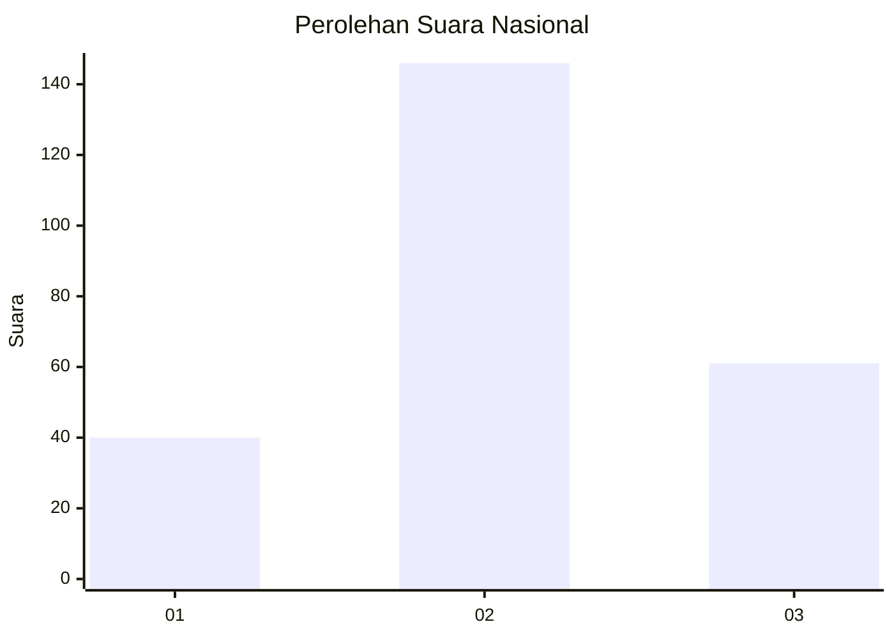
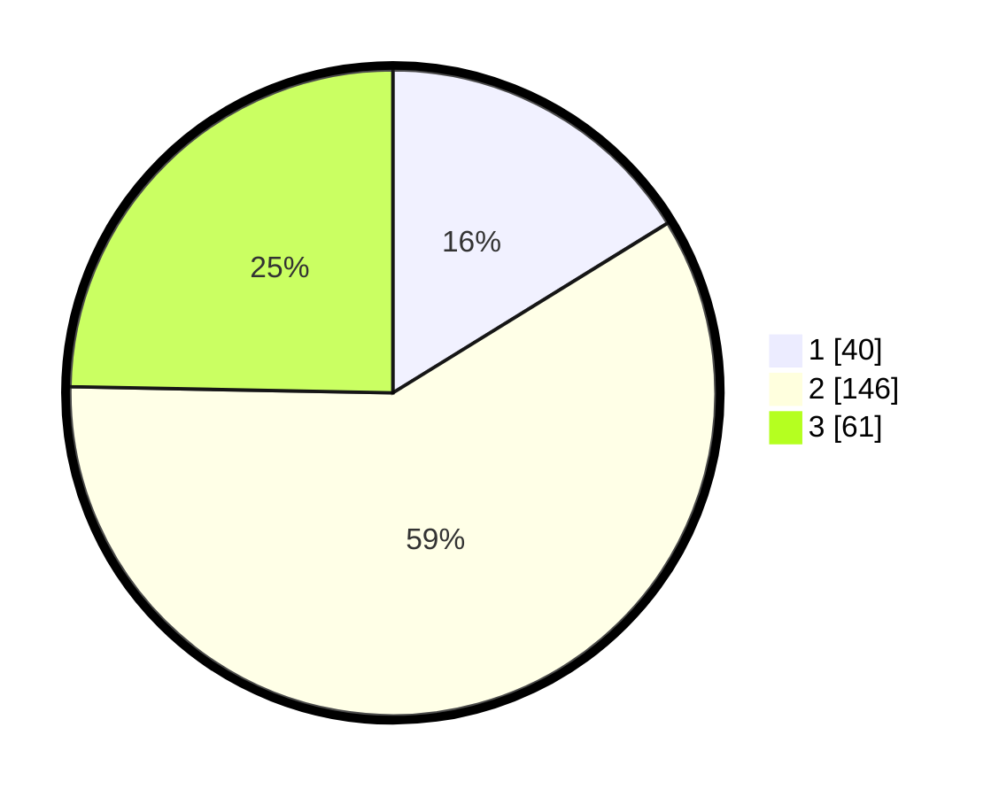

# Hasil

## Grafik

## Tabel

| No. | Nama Paslon    | Suara | Suara (raw) | Persentase |
|:--- |:-------------- | -----:| -----------:| ----------:|
| 1   | ANIES MUHAIMIN | 40    | [40][p-1]   | 16,19      |
| 2   | PRABOWO GIBRAN | 146   | [146][p-2]  | 59,11      |
| 3   | GANJAR MAHFUD  | 61    | [61][p-3]   | 24,70      |

[p-1]: https://github.com/gigit-pemilu/pemilu-2024/blob/main/pilpres/hitung-suara/sub/34-di-yogyakarta/sub/01-kulon-progo/sub/10-nanggulan/sub/2001-banyuroto/sub/002-tps/sub/paslon-1.txt
[p-2]: https://github.com/gigit-pemilu/pemilu-2024/blob/main/pilpres/hitung-suara/sub/34-di-yogyakarta/sub/01-kulon-progo/sub/10-nanggulan/sub/2001-banyuroto/sub/002-tps/sub/paslon-2.txt
[p-3]: https://github.com/gigit-pemilu/pemilu-2024/blob/main/pilpres/hitung-suara/sub/34-di-yogyakarta/sub/01-kulon-progo/sub/10-nanggulan/sub/2001-banyuroto/sub/002-tps/sub/paslon-3.txt

## Foto C Plano

https://sirekap-obj-formc.kpu.go.id/6685/pemilu/ppwp/34/01/10/20/01/3401102001002-20240219-103956--29354670-b04f-44f8-946e-a184812ac85e.jpg

https://sirekap-obj-formc.kpu.go.id/6685/pemilu/ppwp/34/01/10/20/01/3401102001002-20240215-185846--effe4b32-b300-49b1-8df5-9979742804f1.jpg

https://sirekap-obj-formc.kpu.go.id/6685/pemilu/ppwp/34/01/10/20/01/3401102001002-20240215-190001--636c4636-28c7-4beb-beaa-32d54fdf690c.jpg

## Metadata

| Key        | Value               |
| ---------- | ------------------- |
| Time Stamp | 2024-02-24 22:31:28 |

