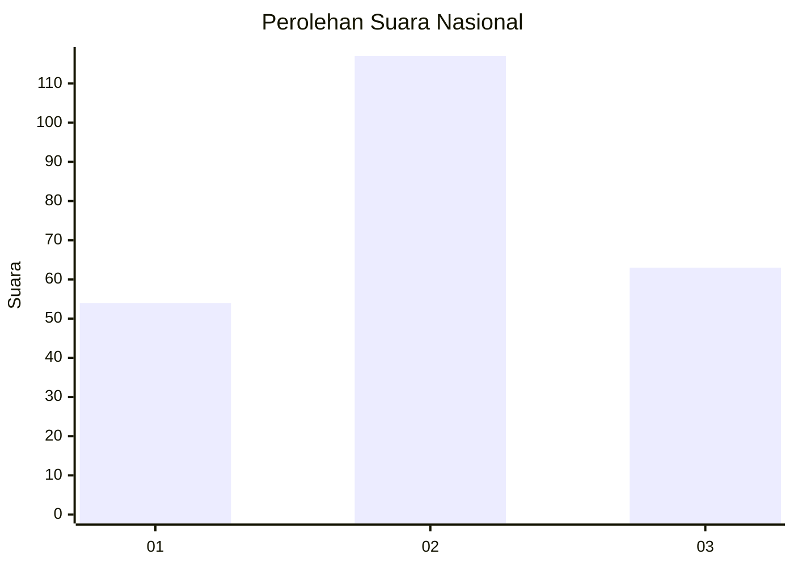
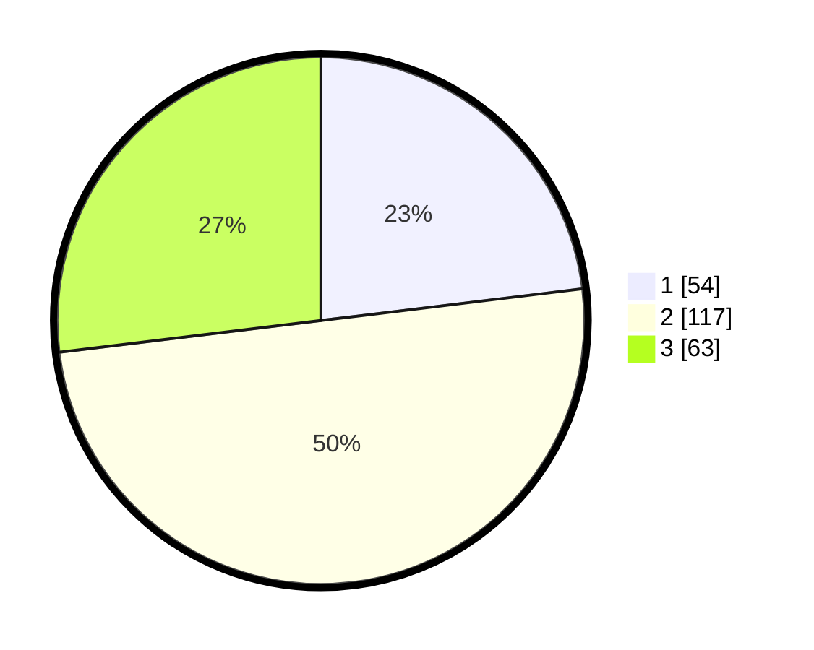

# Hasil

## Grafik

## Tabel

| No. | Nama Paslon    | Suara | Suara (raw) | Persentase |
|:--- |:-------------- | -----:| -----------:| ----------:|
| 1   | ANIES MUHAIMIN | 54    | [54][p-1]   | 23,08      |
| 2   | PRABOWO GIBRAN | 117   | [117][p-2]  | 50,00      |
| 3   | GANJAR MAHFUD  | 63    | [63][p-3]   | 26,92      |

[p-1]: https://github.com/gigit-pemilu/pemilu-2024/blob/main/pilpres/hitung-suara/sub/34-di-yogyakarta/sub/01-kulon-progo/sub/10-nanggulan/sub/2001-banyuroto/sub/003-tps/sub/paslon-1.txt
[p-2]: https://github.com/gigit-pemilu/pemilu-2024/blob/main/pilpres/hitung-suara/sub/34-di-yogyakarta/sub/01-kulon-progo/sub/10-nanggulan/sub/2001-banyuroto/sub/003-tps/sub/paslon-2.txt
[p-3]: https://github.com/gigit-pemilu/pemilu-2024/blob/main/pilpres/hitung-suara/sub/34-di-yogyakarta/sub/01-kulon-progo/sub/10-nanggulan/sub/2001-banyuroto/sub/003-tps/sub/paslon-3.txt

## Foto C Plano

https://sirekap-obj-formc.kpu.go.id/6ef9/pemilu/ppwp/34/01/10/20/01/3401102001003-20240216-092816--1a2ee9e6-d3ff-43d7-b05c-805ac10c96c6.jpg

https://sirekap-obj-formc.kpu.go.id/6ef9/pemilu/ppwp/34/01/10/20/01/3401102001003-20240216-092828--566b0b8c-45e2-40ca-a041-6e8ef5e4ad59.jpg

https://sirekap-obj-formc.kpu.go.id/6ef9/pemilu/ppwp/34/01/10/20/01/3401102001003-20240216-103832--862f3c48-6315-46e4-92a3-2b39bb530e58.jpg

## Metadata

| Key        | Value               |
| ---------- | ------------------- |
| Time Stamp | 2024-02-19 06:16:00 |

## DATA PEMILIH TETAP

Jumlah pemilih dalam DPT: **295**.
 * L: **145**.
 * P: **150**.

## DATA PENGGUNA HAK PILIH

Jumlah pengguna hak pilih dalam DPT: **157**.
 * L: **127**.
 * P: **130**.

Jumlah pengguna hak pilih dalam DPTb: **0**.
 * L: **0**.
 * P: **0**.

Jumlah pengguna hak pilih dalam DPK: **0**.
 * L: **0**.
 * P: **0**.

Jumlah pengguna hak pilih: **257**.
 * L: **127**.
 * P: **130**.

## JUMLAH SUARA SAH DAN TIDAK SAH

JUMLAH SELURUH SUARA SAH: **234**.

JUMLAH SUARA TIDAK SAH: **23**.

JUMLAH SELURUH SUARA SAH DAN SUARA TIDAK SAH: **257**.

