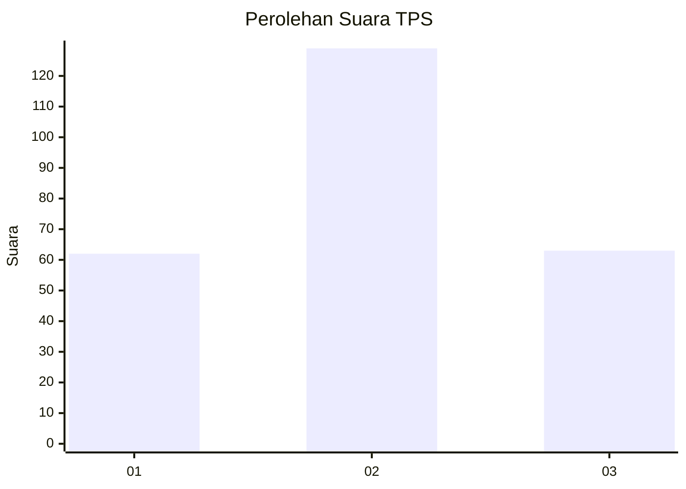
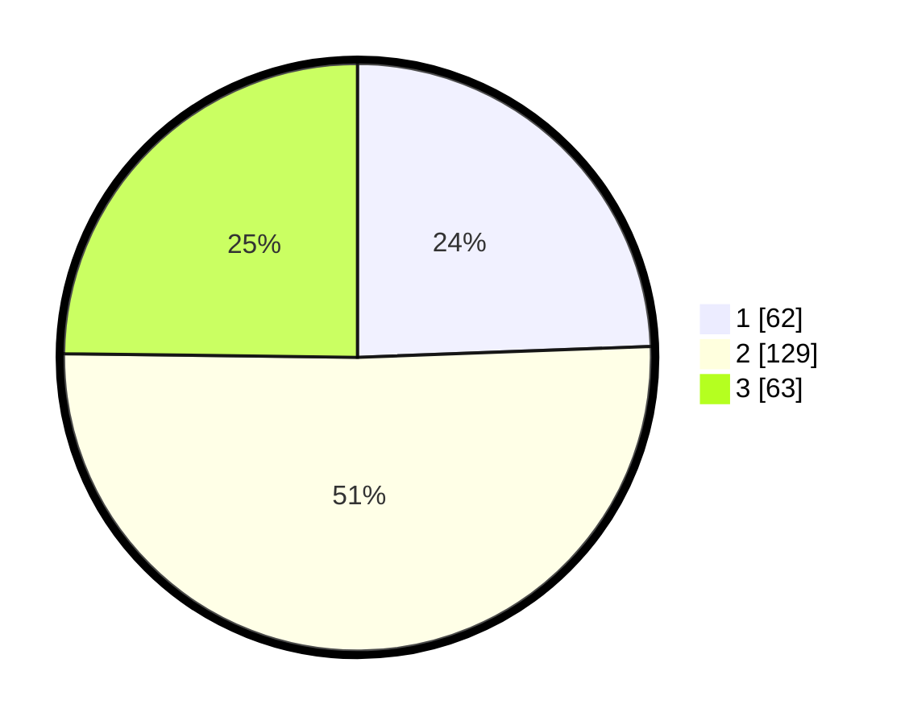

# Hasil

## Grafik

## Tabel

| No. | Nama Paslon    | Suara | Suara (raw) | Persentase |
|:--- |:-------------- | -----:| -----------:| ----------:|
| 1   | ANIES MUHAIMIN | 62    | [62][p-1]   | 24,41      |
| 2   | PRABOWO GIBRAN | 129   | [129][p-2]  | 50,79      |
| 3   | GANJAR MAHFUD  | 63    | [63][p-3]   | 24,80      |

[p-1]: https://github.com/gigit-pemilu/pemilu-2024-34-di-yogyakarta/blob/main/pilpres/hitung-suara/sub/34-di-yogyakarta/sub/01-kulon-progo/sub/10-nanggulan/sub/2001-banyuroto/sub/004-tps/sub/paslon-1.txt
[p-2]: https://github.com/gigit-pemilu/pemilu-2024-34-di-yogyakarta/blob/main/pilpres/hitung-suara/sub/34-di-yogyakarta/sub/01-kulon-progo/sub/10-nanggulan/sub/2001-banyuroto/sub/004-tps/sub/paslon-2.txt
[p-3]: https://github.com/gigit-pemilu/pemilu-2024-34-di-yogyakarta/blob/main/pilpres/hitung-suara/sub/34-di-yogyakarta/sub/01-kulon-progo/sub/10-nanggulan/sub/2001-banyuroto/sub/004-tps/sub/paslon-3.txt

## Foto C Plano

https://sirekap-obj-formc.kpu.go.id/55f6/pemilu/ppwp/34/01/10/20/01/3401102001004-20240215-062810--df514525-aa3e-48c9-af84-6cdc2ee73493.jpg

https://sirekap-obj-formc.kpu.go.id/55f6/pemilu/ppwp/34/01/10/20/01/3401102001004-20240214-155348--bfde4bab-4894-4f6f-a751-e7d8da201022.jpg

https://sirekap-obj-formc.kpu.go.id/55f6/pemilu/ppwp/34/01/10/20/01/3401102001004-20240215-063720--b4d7c6bb-beb6-4017-804b-3d6f08623873.jpg

## Metadata

| Key        | Value               |
| ---------- | ------------------- |
| Time Stamp | 2024-02-15 20:30:46 |

