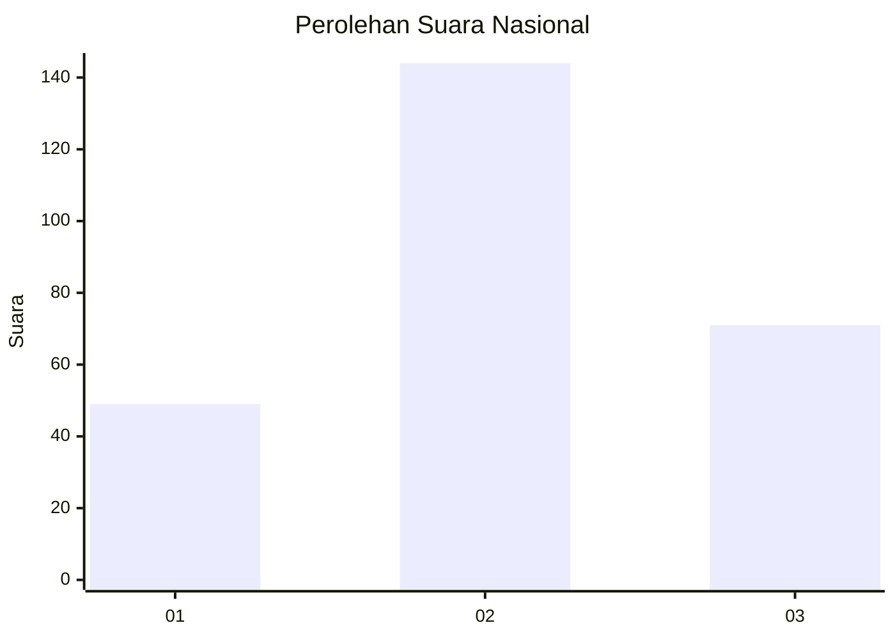
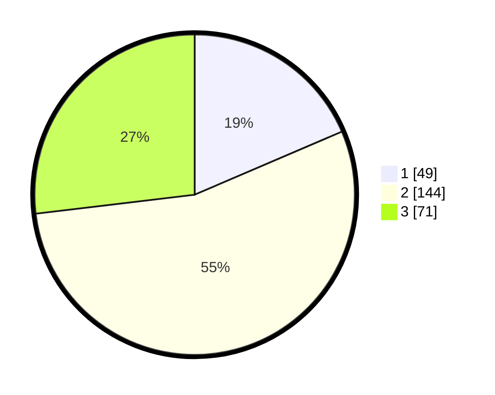

# Hasil

## Grafik

## Tabel

| No. | Nama Paslon    | Suara | Suara (raw) | Persentase |
|:--- |:-------------- | -----:| -----------:| ----------:|
| 1   | ANIES MUHAIMIN | 49    | [49][p-1]   | 18,56      |
| 2   | PRABOWO GIBRAN | 144   | [144][p-2]  | 54,55      |
| 3   | GANJAR MAHFUD  | 71    | [71][p-3]   | 26,89      |

[p-1]: https://github.com/gigit-pemilu/pemilu-2024/blob/main/pilpres/hitung-suara/sub/34-di-yogyakarta/sub/01-kulon-progo/sub/10-nanggulan/sub/2001-banyuroto/sub/005-tps/sub/paslon-1.txt
[p-2]: https://github.com/gigit-pemilu/pemilu-2024/blob/main/pilpres/hitung-suara/sub/34-di-yogyakarta/sub/01-kulon-progo/sub/10-nanggulan/sub/2001-banyuroto/sub/005-tps/sub/paslon-2.txt
[p-3]: https://github.com/gigit-pemilu/pemilu-2024/blob/main/pilpres/hitung-suara/sub/34-di-yogyakarta/sub/01-kulon-progo/sub/10-nanggulan/sub/2001-banyuroto/sub/005-tps/sub/paslon-3.txt

## Foto C Plano

https://sirekap-obj-formc.kpu.go.id/dfd3/pemilu/ppwp/34/01/10/20/01/3401102001005-20240214-160100--17fd4029-b4cc-4f5c-abcb-a1a94765bf81.jpg

https://sirekap-obj-formc.kpu.go.id/dfd3/pemilu/ppwp/34/01/10/20/01/3401102001005-20240214-160108--b00382a8-a5ec-4e2e-979f-daf597af5804.jpg

https://sirekap-obj-formc.kpu.go.id/dfd3/pemilu/ppwp/34/01/10/20/01/3401102001005-20240214-155928--c6eb5647-83ba-4f73-8dd0-7f9995794b5f.jpg

## Metadata

| Key        | Value               |
| ---------- | ------------------- |
| Time Stamp | 2024-02-15 20:30:46 |

