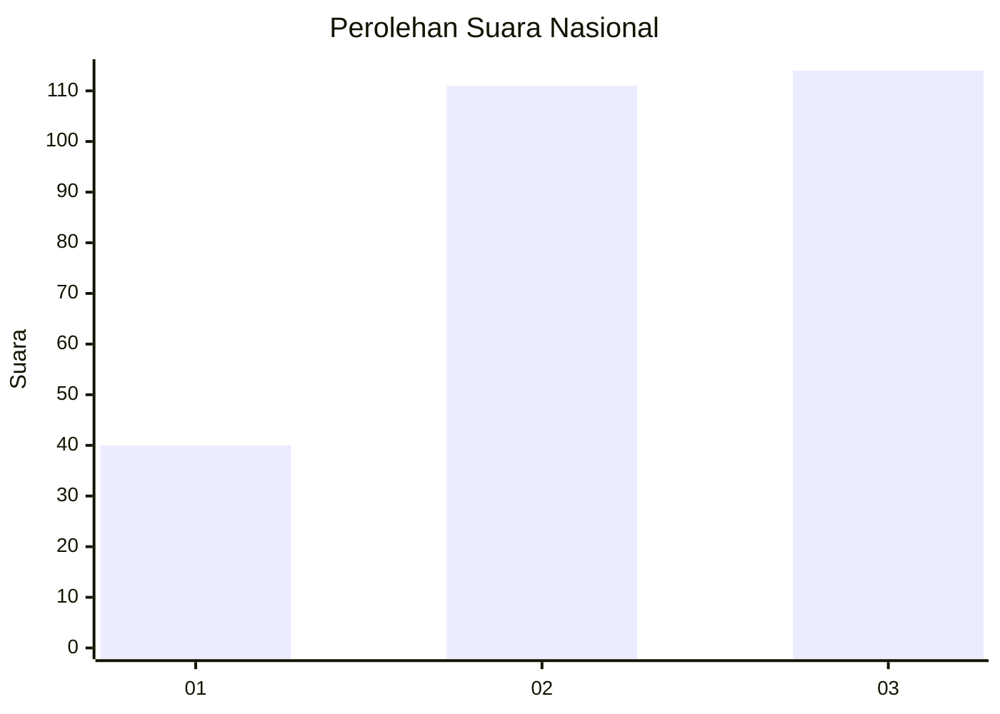
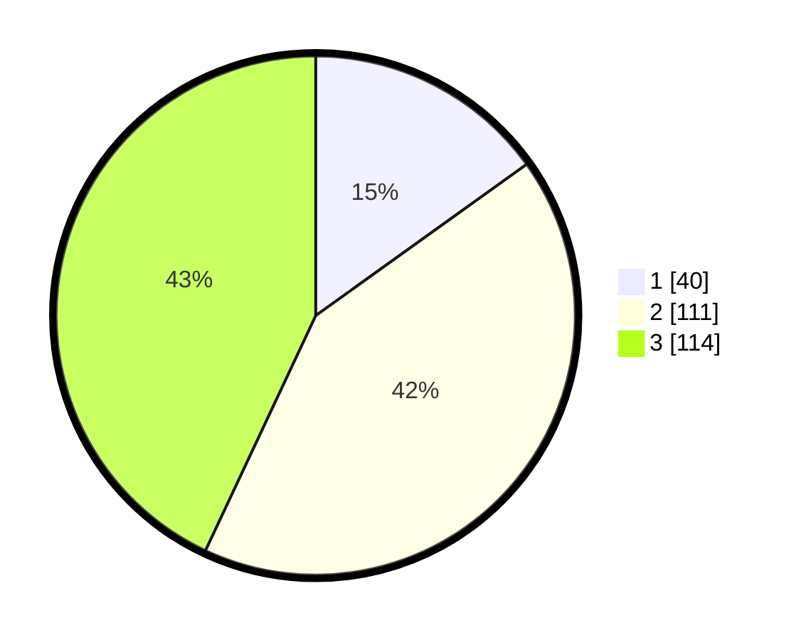

# Hasil

## Grafik

## Tabel

| No. | Nama Paslon    | Suara | Suara (raw) | Persentase |
|:--- |:-------------- | -----:| -----------:| ----------:|
| 1   | ANIES MUHAIMIN | 40    | [40][p-1]   | 15,09      |
| 2   | PRABOWO GIBRAN | 111   | [111][p-2]  | 41,89      |
| 3   | GANJAR MAHFUD  | 114   | [114][p-3]  | 43,02      |

[p-1]: https://github.com/gigit-pemilu/pemilu-2024/blob/main/pilpres/hitung-suara/sub/34-di-yogyakarta/sub/01-kulon-progo/sub/10-nanggulan/sub/2001-banyuroto/sub/008-tps/sub/paslon-1.txt
[p-2]: https://github.com/gigit-pemilu/pemilu-2024/blob/main/pilpres/hitung-suara/sub/34-di-yogyakarta/sub/01-kulon-progo/sub/10-nanggulan/sub/2001-banyuroto/sub/008-tps/sub/paslon-2.txt
[p-3]: https://github.com/gigit-pemilu/pemilu-2024/blob/main/pilpres/hitung-suara/sub/34-di-yogyakarta/sub/01-kulon-progo/sub/10-nanggulan/sub/2001-banyuroto/sub/008-tps/sub/paslon-3.txt

## Foto C Plano

https://sirekap-obj-formc.kpu.go.id/5ffa/pemilu/ppwp/34/01/10/20/01/3401102001008-20240214-230916--0b4d5a3e-f577-405b-bd9a-a544368aa4bc.jpg

https://sirekap-obj-formc.kpu.go.id/5ffa/pemilu/ppwp/34/01/10/20/01/3401102001008-20240214-221349--6dfa5c6b-ae83-4d71-b3f1-5cc88db514fc.jpg

https://sirekap-obj-formc.kpu.go.id/5ffa/pemilu/ppwp/34/01/10/20/01/3401102001008-20240214-221456--ff8f863c-6c1c-4a32-9c34-5d4bc83ed9a2.jpg

## Metadata

| Key        | Value               |
| ---------- | ------------------- |
| Time Stamp | 2024-02-15 20:30:46 |

