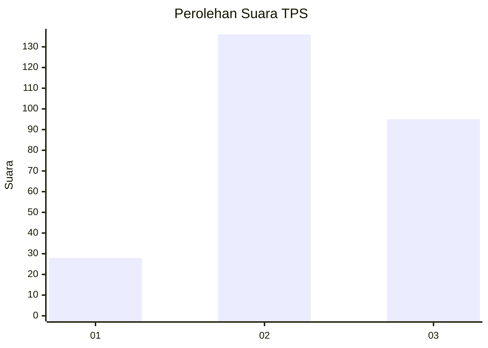
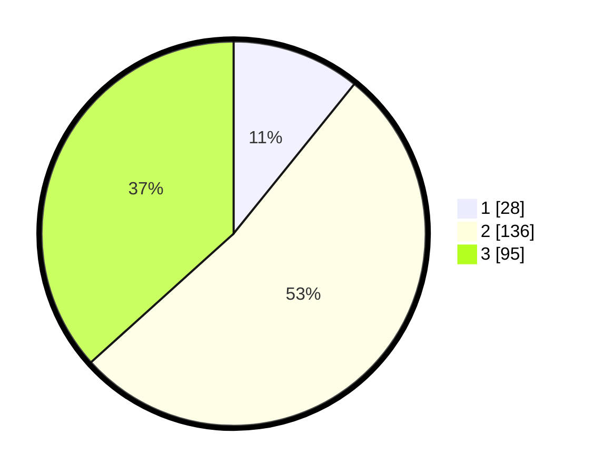

# Hasil

## Grafik

## Tabel

| No. | Nama Paslon    | Suara | Suara (raw) | Persentase |
|:--- |:-------------- | -----:| -----------:| ----------:|
| 1   | ANIES MUHAIMIN | 28    | [28][p-1]   | 10,81      |
| 2   | PRABOWO GIBRAN | 136   | [136][p-2]  | 52,51      |
| 3   | GANJAR MAHFUD  | 95    | [95][p-3]   | 36,68      |

[p-1]: https://github.com/gigit-pemilu/pemilu-2024-34-di-yogyakarta/blob/main/pilpres/hitung-suara/sub/34-di-yogyakarta/sub/01-kulon-progo/sub/10-nanggulan/sub/2001-banyuroto/sub/010-tps/sub/paslon-1.txt
[p-2]: https://github.com/gigit-pemilu/pemilu-2024-34-di-yogyakarta/blob/main/pilpres/hitung-suara/sub/34-di-yogyakarta/sub/01-kulon-progo/sub/10-nanggulan/sub/2001-banyuroto/sub/010-tps/sub/paslon-2.txt
[p-3]: https://github.com/gigit-pemilu/pemilu-2024-34-di-yogyakarta/blob/main/pilpres/hitung-suara/sub/34-di-yogyakarta/sub/01-kulon-progo/sub/10-nanggulan/sub/2001-banyuroto/sub/010-tps/sub/paslon-3.txt

## Foto C Plano

https://sirekap-obj-formc.kpu.go.id/2e51/pemilu/ppwp/34/01/10/20/01/3401102001010-20240216-115742--74dfe8f2-b44f-4ad4-9c99-437b4b2321d7.jpg

https://sirekap-obj-formc.kpu.go.id/2e51/pemilu/ppwp/34/01/10/20/01/3401102001010-20240216-115747--848ccb12-a462-4327-bf6c-caf83b52aa57.jpg

https://sirekap-obj-formc.kpu.go.id/2e51/pemilu/ppwp/34/01/10/20/01/3401102001010-20240216-115743--2363cf16-d768-418b-9761-a74805c9bfb4.jpg

## Metadata

| Key        | Value               |
| ---------- | ------------------- |
| Time Stamp | 2024-02-19 06:16:00 |

## DATA PEMILIH TETAP

Jumlah pemilih dalam DPT: **293**.
 * L: **140**.
 * P: **153**.

## DATA PENGGUNA HAK PILIH

Jumlah pengguna hak pilih dalam DPT: **253**.
 * L: **119**.
 * P: **134**.

Jumlah pengguna hak pilih dalam DPTb: **0**.
 * L: **1**.
 * P: **0**.

Jumlah pengguna hak pilih dalam DPK: **6**.
 * L: **3**.
 * P: **3**.

Jumlah pengguna hak pilih: **260**.
 * L: **123**.
 * P: **137**.

## JUMLAH SUARA SAH DAN TIDAK SAH

JUMLAH SELURUH SUARA SAH: **259**.

JUMLAH SUARA TIDAK SAH: **1**.

JUMLAH SELURUH SUARA SAH DAN SUARA TIDAK SAH: **260**.

