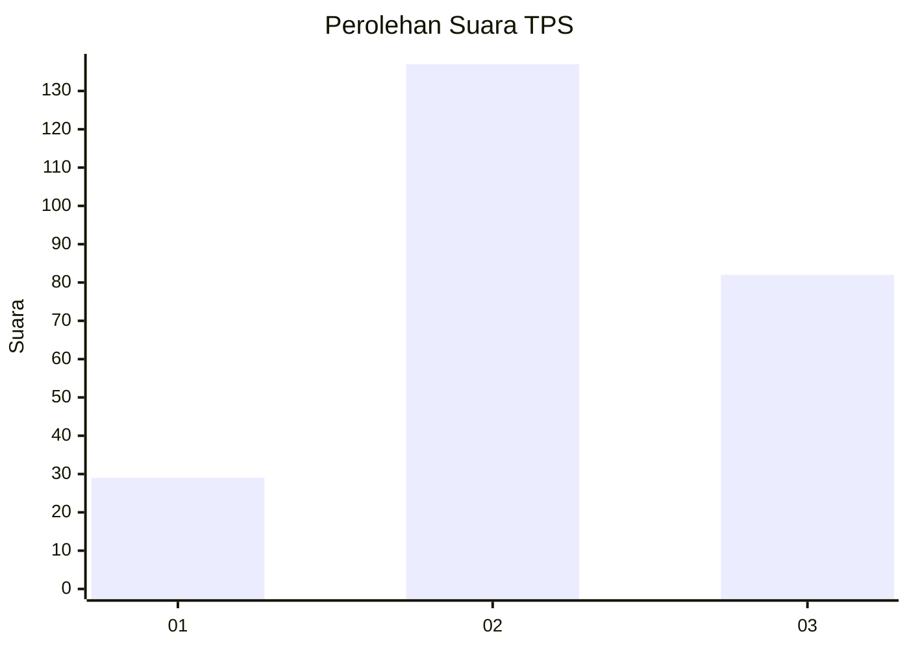
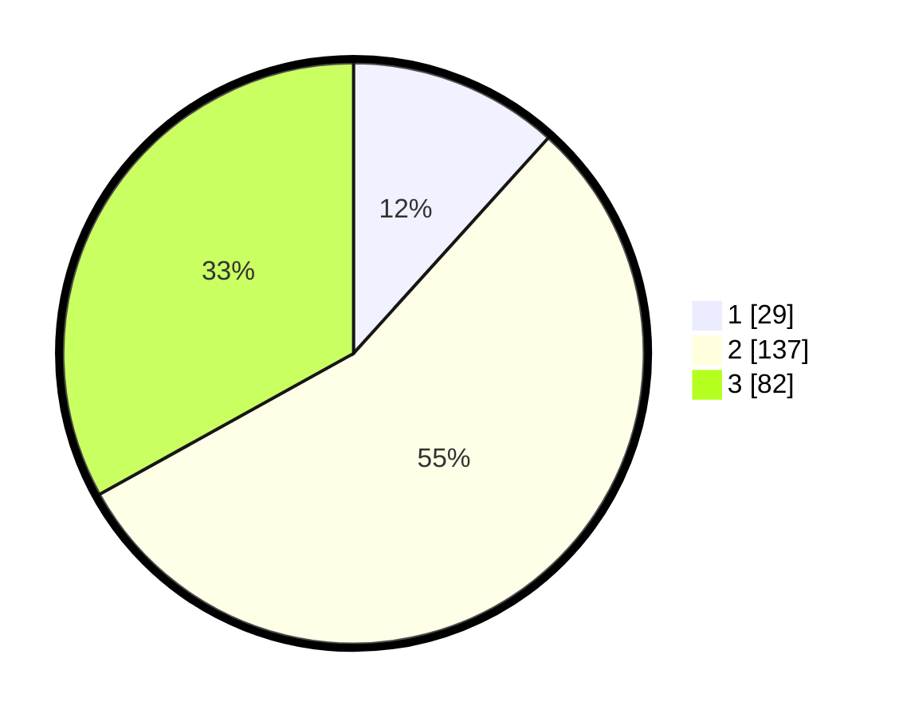

# Hasil

## Grafik

## Tabel

| No. | Nama Paslon    | Suara | Suara (raw) | Persentase |
|:--- |:-------------- | -----:| -----------:| ----------:|
| 1   | ANIES MUHAIMIN | 29    | [29][p-1]   | 11,69      |
| 2   | PRABOWO GIBRAN | 137   | [137][p-2]  | 55,24      |
| 3   | GANJAR MAHFUD  | 82    | [82][p-3]   | 33,06      |

[p-1]: https://github.com/gigit-pemilu/pemilu-2024-34-di-yogyakarta/blob/main/pilpres/hitung-suara/sub/34-di-yogyakarta/sub/01-kulon-progo/sub/10-nanggulan/sub/2002-donomulyo/sub/003-tps/sub/paslon-1.txt
[p-2]: https://github.com/gigit-pemilu/pemilu-2024-34-di-yogyakarta/blob/main/pilpres/hitung-suara/sub/34-di-yogyakarta/sub/01-kulon-progo/sub/10-nanggulan/sub/2002-donomulyo/sub/003-tps/sub/paslon-2.txt
[p-3]: https://github.com/gigit-pemilu/pemilu-2024-34-di-yogyakarta/blob/main/pilpres/hitung-suara/sub/34-di-yogyakarta/sub/01-kulon-progo/sub/10-nanggulan/sub/2002-donomulyo/sub/003-tps/sub/paslon-3.txt

## Foto C Plano

https://sirekap-obj-formc.kpu.go.id/89c1/pemilu/ppwp/34/01/10/20/02/3401102002003-20240214-205352--013d393a-c7b5-46e7-8c7b-a5bcede33fff.jpg

https://sirekap-obj-formc.kpu.go.id/89c1/pemilu/ppwp/34/01/10/20/02/3401102002003-20240214-230231--3d6b60de-d045-4925-bb90-8f5076ddc4e5.jpg

https://sirekap-obj-formc.kpu.go.id/89c1/pemilu/ppwp/34/01/10/20/02/3401102002003-20240214-230326--07d465a6-db15-4a2c-aaf9-65a8724bd7ab.jpg

## Metadata

| Key        | Value               |
| ---------- | ------------------- |
| Time Stamp | 2024-02-15 20:30:46 |

