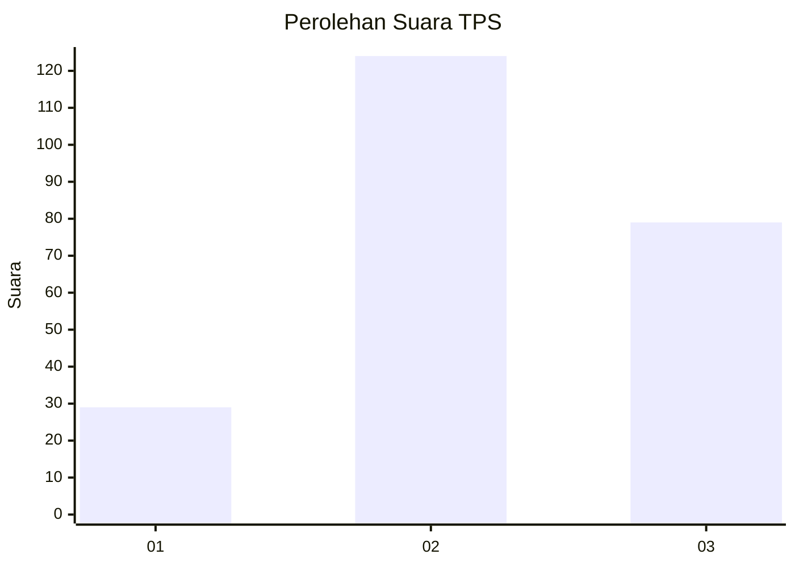
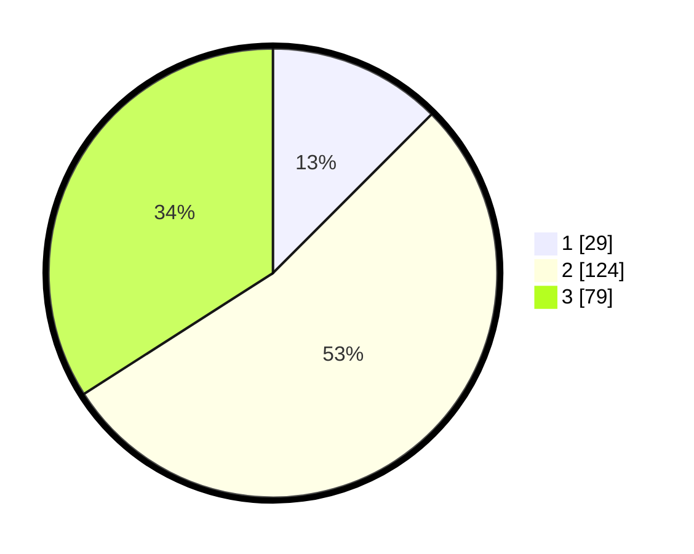

# Hasil

## Grafik

## Tabel

| No. | Nama Paslon    | Suara | Suara (raw) | Persentase |
|:--- |:-------------- | -----:| -----------:| ----------:|
| 1   | ANIES MUHAIMIN | 29    | [29][p-1]   | 12,50      |
| 2   | PRABOWO GIBRAN | 124   | [124][p-2]  | 53,45      |
| 3   | GANJAR MAHFUD  | 79    | [79][p-3]   | 34,05      |

[p-1]: https://github.com/gigit-pemilu/pemilu-2024-34-di-yogyakarta/blob/main/pilpres/hitung-suara/sub/34-di-yogyakarta/sub/01-kulon-progo/sub/10-nanggulan/sub/2002-donomulyo/sub/011-tps/sub/paslon-1.txt
[p-2]: https://github.com/gigit-pemilu/pemilu-2024-34-di-yogyakarta/blob/main/pilpres/hitung-suara/sub/34-di-yogyakarta/sub/01-kulon-progo/sub/10-nanggulan/sub/2002-donomulyo/sub/011-tps/sub/paslon-2.txt
[p-3]: https://github.com/gigit-pemilu/pemilu-2024-34-di-yogyakarta/blob/main/pilpres/hitung-suara/sub/34-di-yogyakarta/sub/01-kulon-progo/sub/10-nanggulan/sub/2002-donomulyo/sub/011-tps/sub/paslon-3.txt

## Foto C Plano

https://sirekap-obj-formc.kpu.go.id/3ef3/pemilu/ppwp/34/01/10/20/02/3401102002011-20240215-033320--2c17a64e-56a3-4421-9161-21e371a91a4e.jpg

https://sirekap-obj-formc.kpu.go.id/3ef3/pemilu/ppwp/34/01/10/20/02/3401102002011-20240215-033455--a24ace06-186b-4354-a44e-c3abcd048c83.jpg

https://sirekap-obj-formc.kpu.go.id/3ef3/pemilu/ppwp/34/01/10/20/02/3401102002011-20240214-194828--f6bf33b4-8368-4833-95d1-43427b819aff.jpg

## Metadata

| Key        | Value               |
| ---------- | ------------------- |
| Time Stamp | 2024-02-15 12:00:28 |

