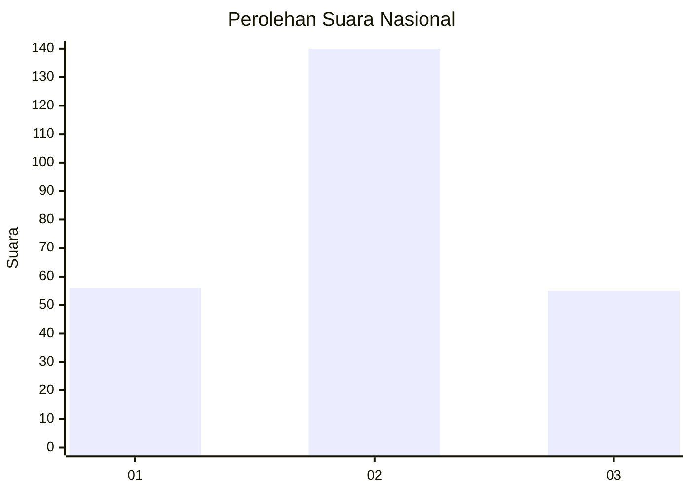
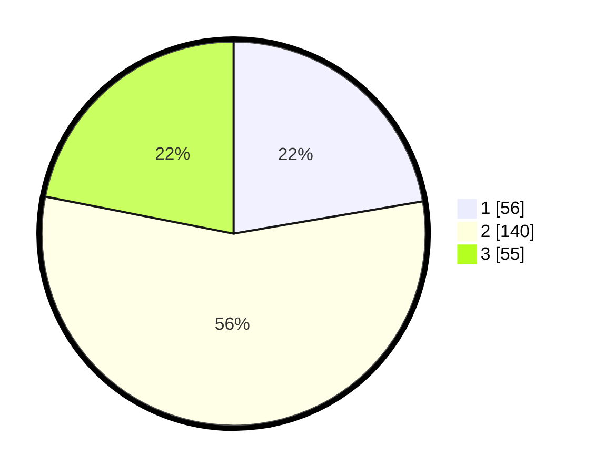

# Hasil

## Grafik

## Tabel

| No. | Nama Paslon    | Suara | Suara (raw) | Persentase |
|:--- |:-------------- | -----:| -----------:| ----------:|
| 1   | ANIES MUHAIMIN | 56    | [56][p-1]   | 22,31      |
| 2   | PRABOWO GIBRAN | 140   | [140][p-2]  | 55,78      |
| 3   | GANJAR MAHFUD  | 55    | [55][p-3]   | 21,91      |

[p-1]: https://github.com/gigit-pemilu/pemilu-2024/blob/main/pilpres/hitung-suara/sub/34-di-yogyakarta/sub/01-kulon-progo/sub/10-nanggulan/sub/2003-wijimulyo/sub/001-tps/sub/paslon-1.txt
[p-2]: https://github.com/gigit-pemilu/pemilu-2024/blob/main/pilpres/hitung-suara/sub/34-di-yogyakarta/sub/01-kulon-progo/sub/10-nanggulan/sub/2003-wijimulyo/sub/001-tps/sub/paslon-2.txt
[p-3]: https://github.com/gigit-pemilu/pemilu-2024/blob/main/pilpres/hitung-suara/sub/34-di-yogyakarta/sub/01-kulon-progo/sub/10-nanggulan/sub/2003-wijimulyo/sub/001-tps/sub/paslon-3.txt

## Foto C Plano

https://sirekap-obj-formc.kpu.go.id/b1fa/pemilu/ppwp/34/01/10/20/03/3401102003001-20240215-031125--cd0feb17-f042-43ce-b696-bdac30ae0b53.jpg

https://sirekap-obj-formc.kpu.go.id/b1fa/pemilu/ppwp/34/01/10/20/03/3401102003001-20240215-031155--be05a779-b343-4e99-b614-7208c3e08224.jpg

https://sirekap-obj-formc.kpu.go.id/b1fa/pemilu/ppwp/34/01/10/20/03/3401102003001-20240215-031218--f6e0a637-29f6-4840-ab57-1d19187855b0.jpg

## Metadata

| Key        | Value               |
| ---------- | ------------------- |
| Time Stamp | 2024-02-15 12:00:28 |

