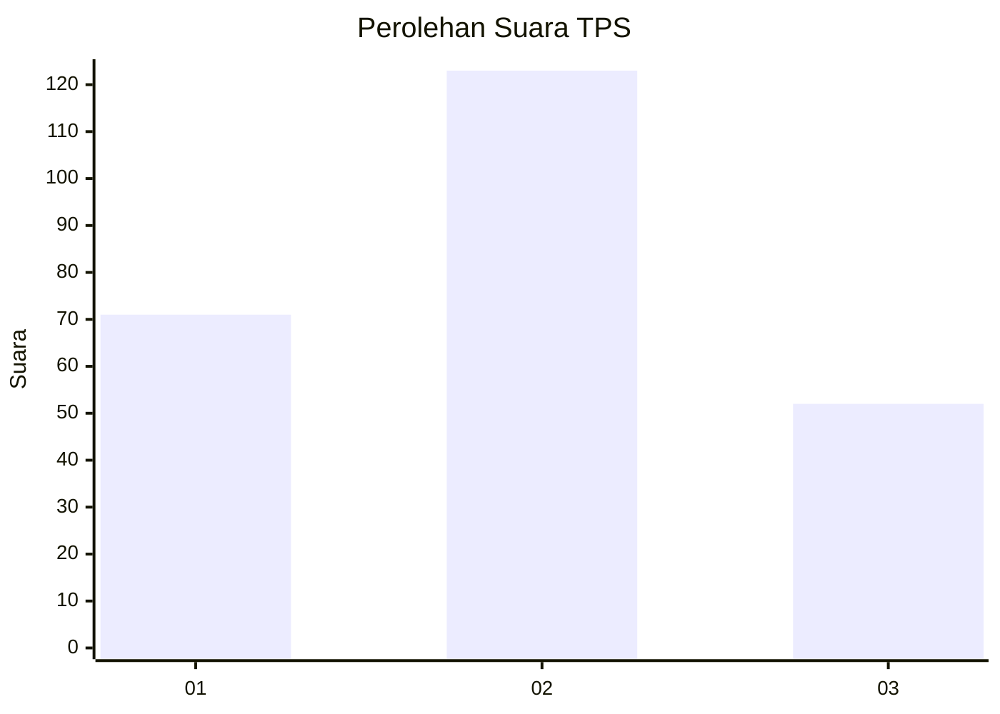
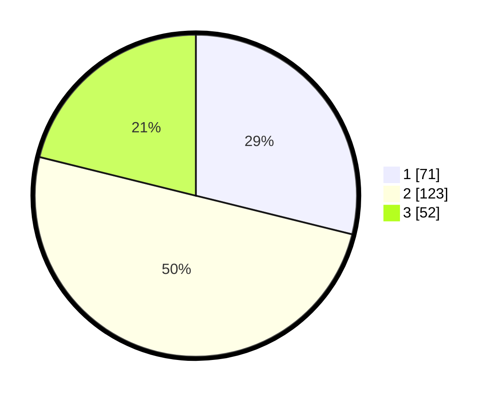

# Hasil

## Grafik

## Tabel

| No. | Nama Paslon    | Suara | Suara (raw) | Persentase |
|:--- |:-------------- | -----:| -----------:| ----------:|
| 1   | ANIES MUHAIMIN | 71    | [71][p-1]   | 28,86      |
| 2   | PRABOWO GIBRAN | 123   | [123][p-2]  | 50,00      |
| 3   | GANJAR MAHFUD  | 52    | [52][p-3]   | 21,14      |

[p-1]: https://github.com/gigit-pemilu/pemilu-2024-34-di-yogyakarta/blob/main/pilpres/hitung-suara/sub/34-di-yogyakarta/sub/01-kulon-progo/sub/10-nanggulan/sub/2003-wijimulyo/sub/005-tps/sub/paslon-1.txt
[p-2]: https://github.com/gigit-pemilu/pemilu-2024-34-di-yogyakarta/blob/main/pilpres/hitung-suara/sub/34-di-yogyakarta/sub/01-kulon-progo/sub/10-nanggulan/sub/2003-wijimulyo/sub/005-tps/sub/paslon-2.txt
[p-3]: https://github.com/gigit-pemilu/pemilu-2024-34-di-yogyakarta/blob/main/pilpres/hitung-suara/sub/34-di-yogyakarta/sub/01-kulon-progo/sub/10-nanggulan/sub/2003-wijimulyo/sub/005-tps/sub/paslon-3.txt

## Foto C Plano

https://sirekap-obj-formc.kpu.go.id/d7a3/pemilu/ppwp/34/01/10/20/03/3401102003005-20240215-060530--240e1f23-6835-46ec-90fd-1e079de541f9.jpg

https://sirekap-obj-formc.kpu.go.id/d7a3/pemilu/ppwp/34/01/10/20/03/3401102003005-20240215-060614--96cb2f65-536d-4319-b160-0aaa54032bb4.jpg

https://sirekap-obj-formc.kpu.go.id/d7a3/pemilu/ppwp/34/01/10/20/03/3401102003005-20240215-060730--00dce3a8-f4ff-4ca3-9e61-dde8c193e558.jpg

## Metadata

| Key        | Value               |
| ---------- | ------------------- |
| Time Stamp | 2024-02-15 20:30:46 |

