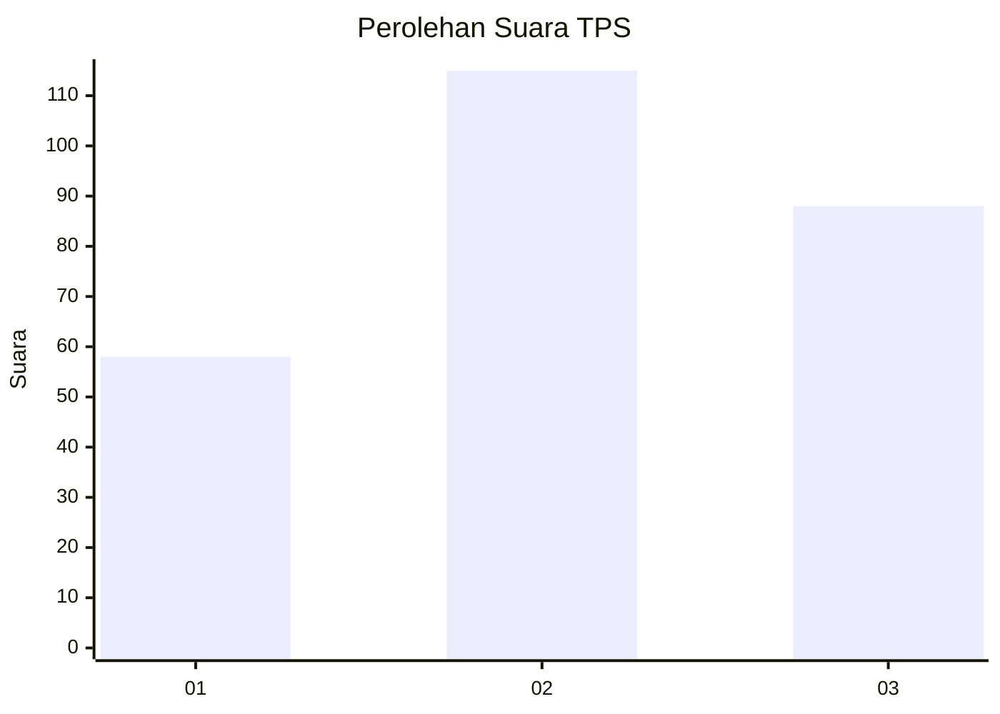
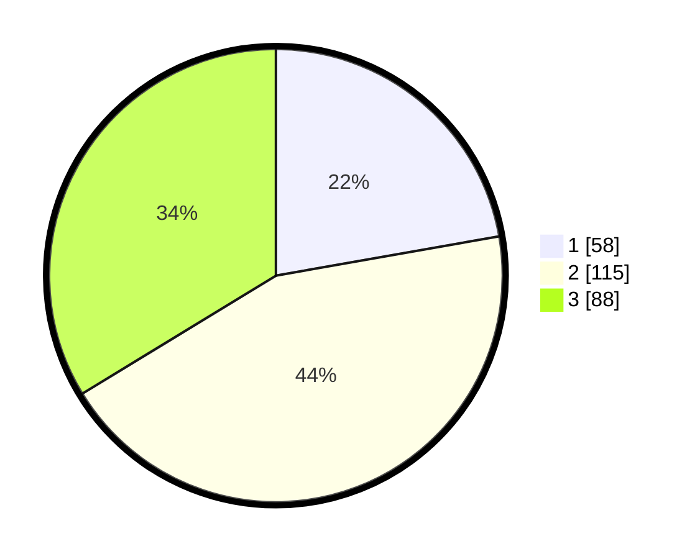

# Hasil

## Grafik

## Tabel

| No. | Nama Paslon    | Suara | Suara (raw) | Persentase |
|:--- |:-------------- | -----:| -----------:| ----------:|
| 1   | ANIES MUHAIMIN | 58    | [58][p-1]   | 22,22      |
| 2   | PRABOWO GIBRAN | 115   | [115][p-2]  | 44,06      |
| 3   | GANJAR MAHFUD  | 88    | [88][p-3]   | 33,72      |

[p-1]: https://github.com/gigit-pemilu/pemilu-2024-34-di-yogyakarta/blob/main/pilpres/hitung-suara/sub/34-di-yogyakarta/sub/01-kulon-progo/sub/10-nanggulan/sub/2003-wijimulyo/sub/007-tps/sub/paslon-1.txt
[p-2]: https://github.com/gigit-pemilu/pemilu-2024-34-di-yogyakarta/blob/main/pilpres/hitung-suara/sub/34-di-yogyakarta/sub/01-kulon-progo/sub/10-nanggulan/sub/2003-wijimulyo/sub/007-tps/sub/paslon-2.txt
[p-3]: https://github.com/gigit-pemilu/pemilu-2024-34-di-yogyakarta/blob/main/pilpres/hitung-suara/sub/34-di-yogyakarta/sub/01-kulon-progo/sub/10-nanggulan/sub/2003-wijimulyo/sub/007-tps/sub/paslon-3.txt

## Foto C Plano

https://sirekap-obj-formc.kpu.go.id/7375/pemilu/ppwp/34/01/10/20/03/3401102003007-20240214-210049--a099a77b-81ba-42e1-8b8c-800871e16996.jpg

https://sirekap-obj-formc.kpu.go.id/7375/pemilu/ppwp/34/01/10/20/03/3401102003007-20240214-213245--d6c350d7-1f00-42ba-830d-bcd891d5a628.jpg

https://sirekap-obj-formc.kpu.go.id/7375/pemilu/ppwp/34/01/10/20/03/3401102003007-20240214-213311--e158bac8-3274-4998-93e3-894e50dddc21.jpg

## Metadata

| Key        | Value               |
| ---------- | ------------------- |
| Time Stamp | 2024-02-15 20:30:46 |

## DATA PEMILIH TETAP

Jumlah pemilih dalam DPT: **255**.
 * L: **122**.
 * P: **133**.

## DATA PENGGUNA HAK PILIH

Jumlah pengguna hak pilih dalam DPT: **267**.
 * L: **127**.
 * P: **140**.

Jumlah pengguna hak pilih dalam DPTb: **267**.
 * L: **127**.
 * P: **140**.

Jumlah pengguna hak pilih dalam DPK: **4**.
 * L: **0**.
 * P: **4**.

Jumlah pengguna hak pilih: **267**.
 * L: **127**.
 * P: **140**.

## JUMLAH SUARA SAH DAN TIDAK SAH

JUMLAH SELURUH SUARA SAH: **261**.

JUMLAH SUARA TIDAK SAH: **6**.

JUMLAH SELURUH SUARA SAH DAN SUARA TIDAK SAH: **267**.

