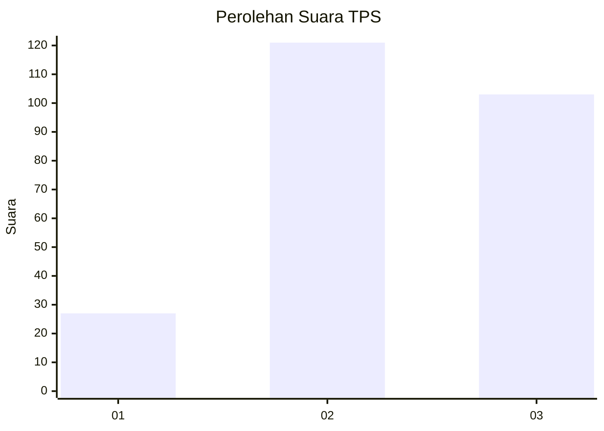
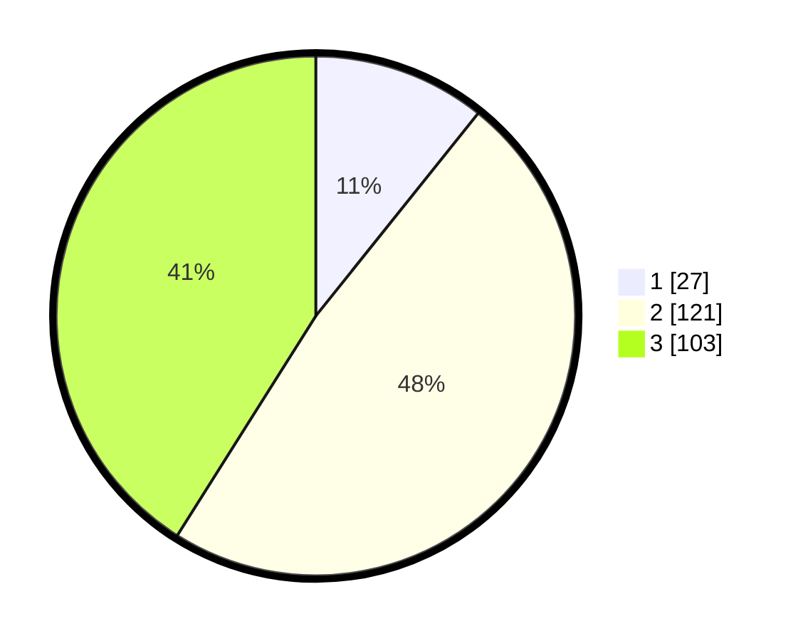

# Hasil

## Grafik

## Tabel

| No. | Nama Paslon    | Suara | Suara (raw) | Persentase |
|:--- |:-------------- | -----:| -----------:| ----------:|
| 1   | ANIES MUHAIMIN | 27    | [27][p-1]   | 10,76      |
| 2   | PRABOWO GIBRAN | 121   | [121][p-2]  | 48,21      |
| 3   | GANJAR MAHFUD  | 103   | [103][p-3]  | 41,04      |

[p-1]: https://github.com/gigit-pemilu/pemilu-2024-34-di-yogyakarta/blob/main/pilpres/hitung-suara/sub/34-di-yogyakarta/sub/01-kulon-progo/sub/10-nanggulan/sub/2005-jatisarono/sub/002-tps/sub/paslon-1.txt
[p-2]: https://github.com/gigit-pemilu/pemilu-2024-34-di-yogyakarta/blob/main/pilpres/hitung-suara/sub/34-di-yogyakarta/sub/01-kulon-progo/sub/10-nanggulan/sub/2005-jatisarono/sub/002-tps/sub/paslon-2.txt
[p-3]: https://github.com/gigit-pemilu/pemilu-2024-34-di-yogyakarta/blob/main/pilpres/hitung-suara/sub/34-di-yogyakarta/sub/01-kulon-progo/sub/10-nanggulan/sub/2005-jatisarono/sub/002-tps/sub/paslon-3.txt

## Foto C Plano

https://sirekap-obj-formc.kpu.go.id/4732/pemilu/ppwp/34/01/10/20/05/3401102005002-20240214-193316--16661e67-8dd9-4c8c-ad8f-7013e0581b07.jpg

https://sirekap-obj-formc.kpu.go.id/4732/pemilu/ppwp/34/01/10/20/05/3401102005002-20240214-194007--d32c5d42-ddd1-409d-aaae-a09bfbb65fd9.jpg

https://sirekap-obj-formc.kpu.go.id/4732/pemilu/ppwp/34/01/10/20/05/3401102005002-20240214-194438--41454326-72b3-46ba-a75b-8d0afdf0a09b.jpg

## Metadata

| Key        | Value               |
| ---------- | ------------------- |
| Time Stamp | 2024-02-15 20:30:46 |

