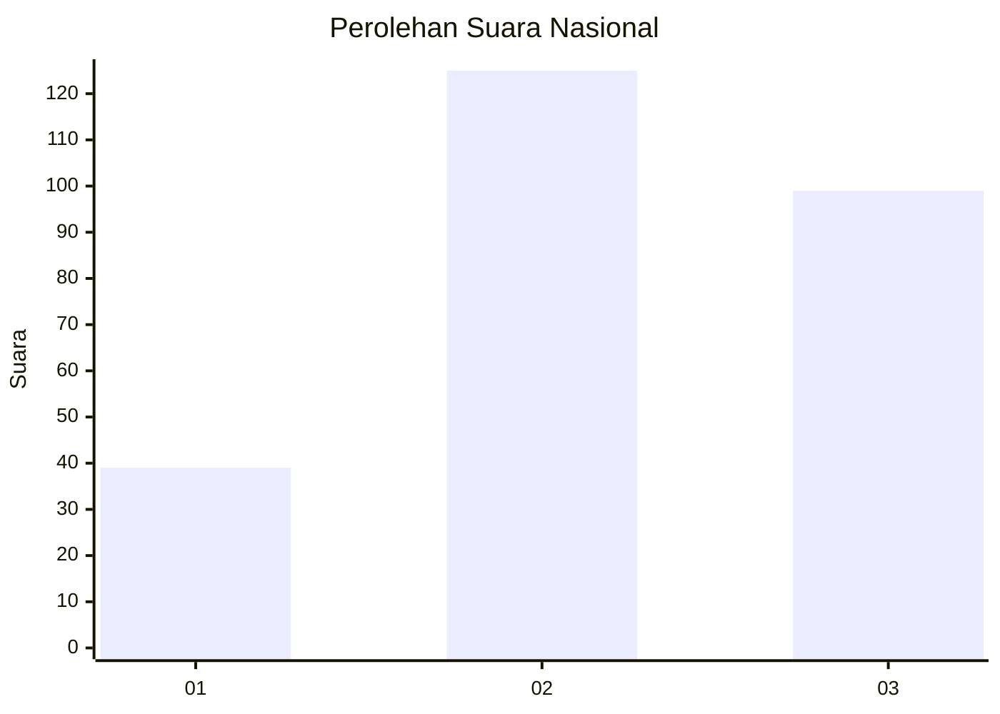
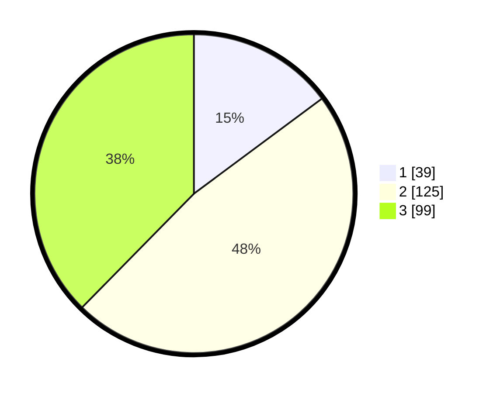

# Hasil

## Grafik

## Tabel

| No. | Nama Paslon    | Suara | Suara (raw) | Persentase |
|:--- |:-------------- | -----:| -----------:| ----------:|
| 1   | ANIES MUHAIMIN | 39    | [39][p-1]   | 14,83      |
| 2   | PRABOWO GIBRAN | 125   | [125][p-2]  | 47,53      |
| 3   | GANJAR MAHFUD  | 99    | [99][p-3]   | 37,64      |

[p-1]: https://github.com/gigit-pemilu/pemilu-2024/blob/main/pilpres/hitung-suara/sub/34-di-yogyakarta/sub/01-kulon-progo/sub/10-nanggulan/sub/2005-jatisarono/sub/005-tps/sub/paslon-1.txt
[p-2]: https://github.com/gigit-pemilu/pemilu-2024/blob/main/pilpres/hitung-suara/sub/34-di-yogyakarta/sub/01-kulon-progo/sub/10-nanggulan/sub/2005-jatisarono/sub/005-tps/sub/paslon-2.txt
[p-3]: https://github.com/gigit-pemilu/pemilu-2024/blob/main/pilpres/hitung-suara/sub/34-di-yogyakarta/sub/01-kulon-progo/sub/10-nanggulan/sub/2005-jatisarono/sub/005-tps/sub/paslon-3.txt

## Foto C Plano

https://sirekap-obj-formc.kpu.go.id/be4e/pemilu/ppwp/34/01/10/20/05/3401102005005-20240214-155908--b8085c67-c00f-4980-986a-1292b2af7ada.jpg

https://sirekap-obj-formc.kpu.go.id/be4e/pemilu/ppwp/34/01/10/20/05/3401102005005-20240214-155405--d2c59ea4-ed8e-4aa0-98aa-9788e71086b8.jpg

https://sirekap-obj-formc.kpu.go.id/be4e/pemilu/ppwp/34/01/10/20/05/3401102005005-20240214-155652--0d9e985c-6abd-4ec0-82c8-e440e10d1499.jpg

## Metadata

| Key        | Value               |
| ---------- | ------------------- |
| Time Stamp | 2024-02-14 21:46:01 |

## DATA PEMILIH TETAP

Jumlah pemilih dalam DPT: **295**.
 * L: **151**.
 * P: **144**.

## DATA PENGGUNA HAK PILIH

Jumlah pengguna hak pilih dalam DPT: **261**.
 * L: **129**.
 * P: **132**.

Jumlah pengguna hak pilih dalam DPTb: **6**.
 * L: **0**.
 * P: **6**.

Jumlah pengguna hak pilih dalam DPK: **1**.
 * L: **0**.
 * P: **1**.

Jumlah pengguna hak pilih: **268**.
 * L: **129**.
 * P: **139**.

## JUMLAH SUARA SAH DAN TIDAK SAH

JUMLAH SELURUH SUARA SAH: **263**.

JUMLAH SUARA TIDAK SAH: **5**.

JUMLAH SELURUH SUARA SAH DAN SUARA TIDAK SAH: **268**.

