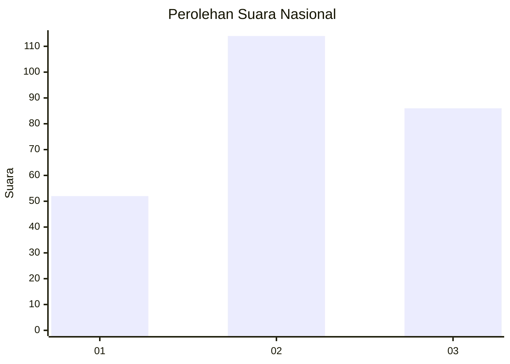
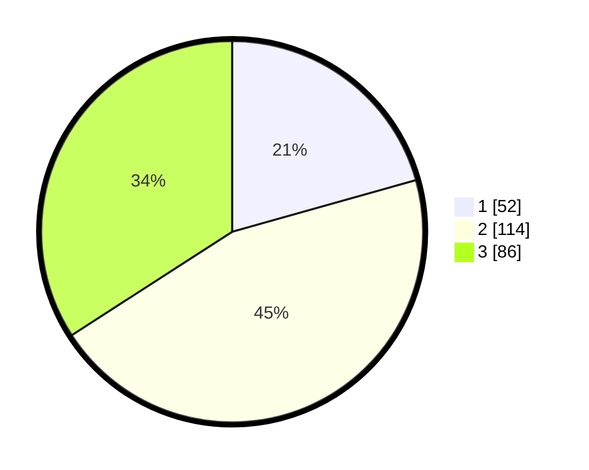

# Hasil

## Grafik

## Tabel

| No. | Nama Paslon    | Suara | Suara (raw) | Persentase |
|:--- |:-------------- | -----:| -----------:| ----------:|
| 1   | ANIES MUHAIMIN | 52    | [52][p-1]   | 20,63      |
| 2   | PRABOWO GIBRAN | 114   | [114][p-2]  | 45,24      |
| 3   | GANJAR MAHFUD  | 86    | [86][p-3]   | 34,13      |

[p-1]: https://github.com/gigit-pemilu/pemilu-2024/blob/main/pilpres/hitung-suara/sub/34-di-yogyakarta/sub/01-kulon-progo/sub/10-nanggulan/sub/2005-jatisarono/sub/009-tps/sub/paslon-1.txt
[p-2]: https://github.com/gigit-pemilu/pemilu-2024/blob/main/pilpres/hitung-suara/sub/34-di-yogyakarta/sub/01-kulon-progo/sub/10-nanggulan/sub/2005-jatisarono/sub/009-tps/sub/paslon-2.txt
[p-3]: https://github.com/gigit-pemilu/pemilu-2024/blob/main/pilpres/hitung-suara/sub/34-di-yogyakarta/sub/01-kulon-progo/sub/10-nanggulan/sub/2005-jatisarono/sub/009-tps/sub/paslon-3.txt

## Foto C Plano

https://sirekap-obj-formc.kpu.go.id/0f90/pemilu/ppwp/34/01/10/20/05/3401102005009-20240214-192706--a97c9b53-d579-470e-b9c8-85a96cfc0c44.jpg

https://sirekap-obj-formc.kpu.go.id/0f90/pemilu/ppwp/34/01/10/20/05/3401102005009-20240214-192751--7d8e872d-9ed2-409f-ab66-099df33cbc41.jpg

https://sirekap-obj-formc.kpu.go.id/0f90/pemilu/ppwp/34/01/10/20/05/3401102005009-20240214-192839--f7eefdc0-2a09-446a-a935-c0fb1273358e.jpg

## Metadata

| Key        | Value               |
| ---------- | ------------------- |
| Time Stamp | 2024-02-15 16:00:26 |

