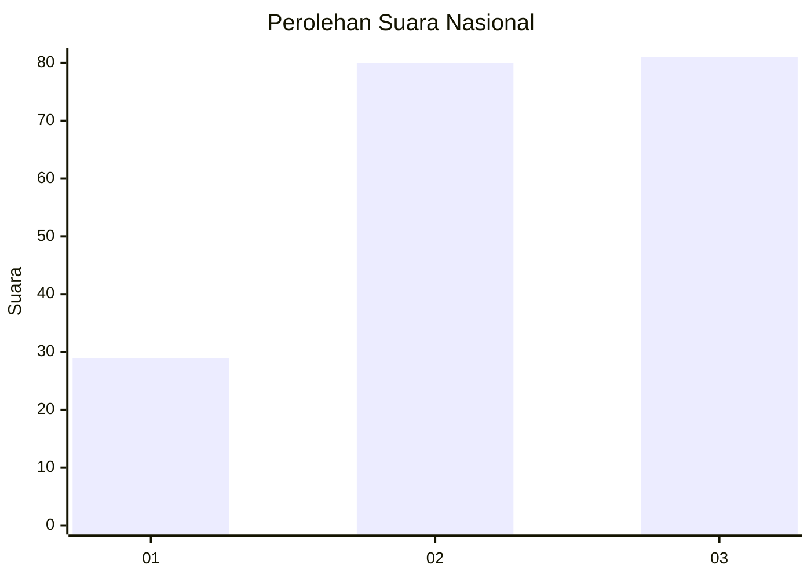
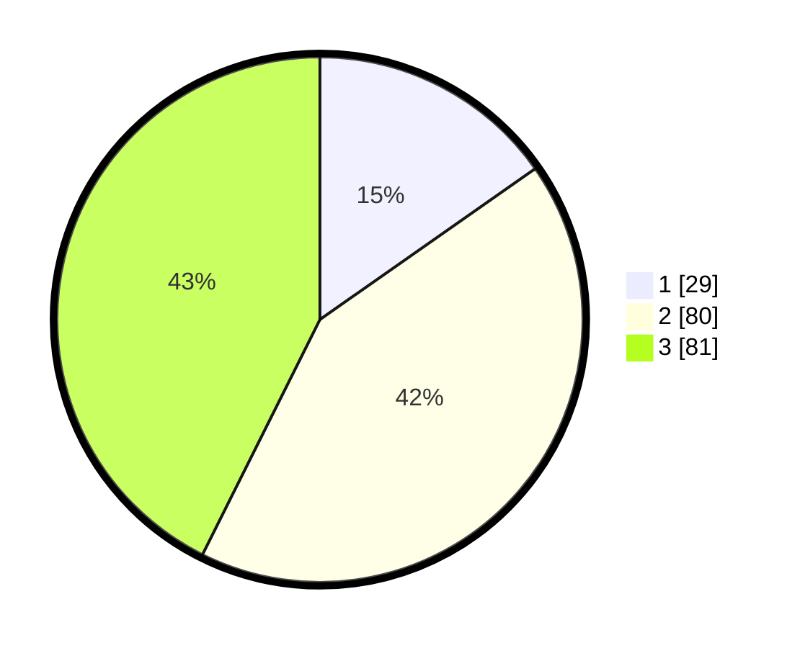

# Hasil

## Grafik

## Tabel

| No. | Nama Paslon    | Suara | Suara (raw) | Persentase |
|:--- |:-------------- | -----:| -----------:| ----------:|
| 1   | ANIES MUHAIMIN | 29    | [29][p-1]   | 15,26      |
| 2   | PRABOWO GIBRAN | 80    | [80][p-2]   | 42,11      |
| 3   | GANJAR MAHFUD  | 81    | [81][p-3]   | 42,63      |

[p-1]: https://github.com/gigit-pemilu/pemilu-2024/blob/main/pilpres/hitung-suara/sub/34-di-yogyakarta/sub/01-kulon-progo/sub/10-nanggulan/sub/2006-kembang/sub/010-tps/sub/paslon-1.txt
[p-2]: https://github.com/gigit-pemilu/pemilu-2024/blob/main/pilpres/hitung-suara/sub/34-di-yogyakarta/sub/01-kulon-progo/sub/10-nanggulan/sub/2006-kembang/sub/010-tps/sub/paslon-2.txt
[p-3]: https://github.com/gigit-pemilu/pemilu-2024/blob/main/pilpres/hitung-suara/sub/34-di-yogyakarta/sub/01-kulon-progo/sub/10-nanggulan/sub/2006-kembang/sub/010-tps/sub/paslon-3.txt

## Foto C Plano

https://sirekap-obj-formc.kpu.go.id/bc62/pemilu/ppwp/34/01/10/20/06/3401102006010-20240215-003737--8187ca46-179f-43d4-bda1-607e474abc05.jpg

https://sirekap-obj-formc.kpu.go.id/bc62/pemilu/ppwp/34/01/10/20/06/3401102006010-20240215-003814--03e0184b-102f-428b-bb73-ac610f5b09e1.jpg

https://sirekap-obj-formc.kpu.go.id/bc62/pemilu/ppwp/34/01/10/20/06/3401102006010-20240215-003852--d2033d7a-b4e8-4c4e-9171-f6a475611f04.jpg

## Metadata

| Key        | Value               |
| ---------- | ------------------- |
| Time Stamp | 2024-02-15 20:30:46 |

