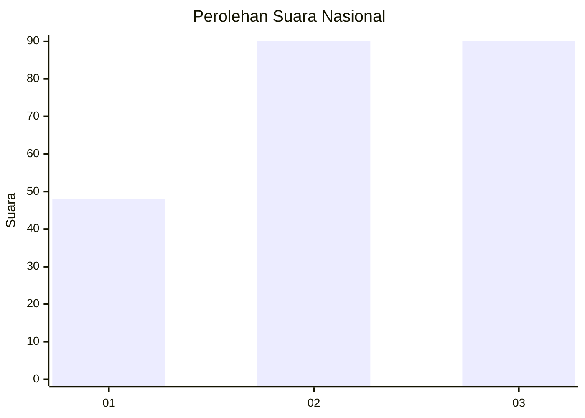
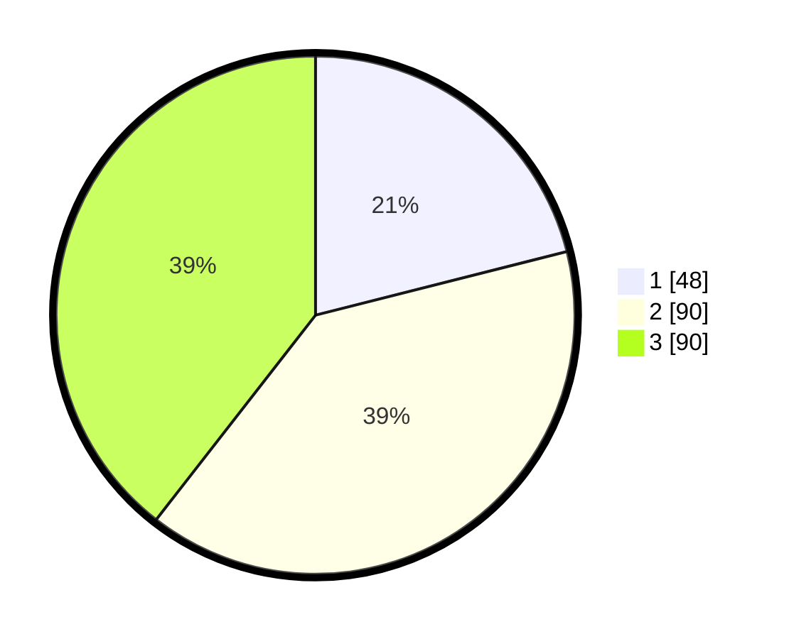

# Hasil

## Grafik

## Tabel

| No. | Nama Paslon    | Suara | Suara (raw) | Persentase |
|:--- |:-------------- | -----:| -----------:| ----------:|
| 1   | ANIES MUHAIMIN | 48    | [48][p-1]   | 21,05      |
| 2   | PRABOWO GIBRAN | 90    | [90][p-2]   | 39,47      |
| 3   | GANJAR MAHFUD  | 90    | [90][p-3]   | 39,47      |

[p-1]: https://github.com/gigit-pemilu/pemilu-2024/blob/main/pilpres/hitung-suara/sub/34-di-yogyakarta/sub/01-kulon-progo/sub/11-samigaluh/sub/2001-kebonharjo/sub/001-tps/sub/paslon-1.txt
[p-2]: https://github.com/gigit-pemilu/pemilu-2024/blob/main/pilpres/hitung-suara/sub/34-di-yogyakarta/sub/01-kulon-progo/sub/11-samigaluh/sub/2001-kebonharjo/sub/001-tps/sub/paslon-2.txt
[p-3]: https://github.com/gigit-pemilu/pemilu-2024/blob/main/pilpres/hitung-suara/sub/34-di-yogyakarta/sub/01-kulon-progo/sub/11-samigaluh/sub/2001-kebonharjo/sub/001-tps/sub/paslon-3.txt

## Foto C Plano

https://sirekap-obj-formc.kpu.go.id/7114/pemilu/ppwp/34/01/11/20/01/3401112001001-20240216-142218--47455a39-cd27-4328-b75e-f4d8f13223d3.jpg

https://sirekap-obj-formc.kpu.go.id/7114/pemilu/ppwp/34/01/11/20/01/3401112001001-20240216-143422--8ac76927-dbbb-47e9-8800-c6f8e9c23e61.jpg

https://sirekap-obj-formc.kpu.go.id/7114/pemilu/ppwp/34/01/11/20/01/3401112001001-20240216-142218--76718585-112c-43b4-9fc4-6baa6ac79b67.jpg

## Metadata

| Key        | Value               |
| ---------- | ------------------- |
| Time Stamp | 2024-02-21 13:00:00 |

## DATA PEMILIH TETAP

Jumlah pemilih dalam DPT: **261**.
 * L: **121**.
 * P: **140**.

## DATA PENGGUNA HAK PILIH

Jumlah pengguna hak pilih dalam DPT: **224**.
 * L: **107**.
 * P: **117**.

Jumlah pengguna hak pilih dalam DPTb: **2**.
 * L: **1**.
 * P: **1**.

Jumlah pengguna hak pilih dalam DPK: **1**.
 * L: **1**.
 * P: **0**.

Jumlah pengguna hak pilih: **227**.
 * L: **109**.
 * P: **118**.

## JUMLAH SUARA SAH DAN TIDAK SAH

JUMLAH SELURUH SUARA SAH: **221**.

JUMLAH SUARA TIDAK SAH: **6**.

JUMLAH SELURUH SUARA SAH DAN SUARA TIDAK SAH: **227**.

