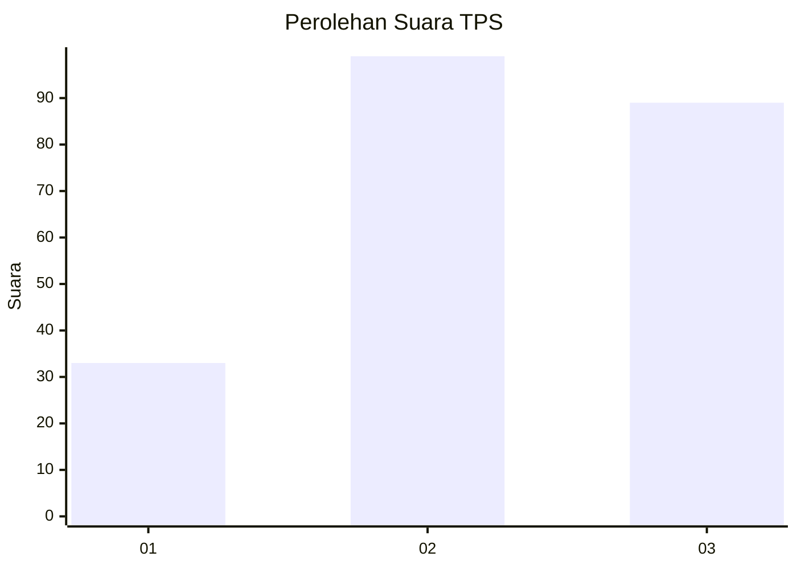
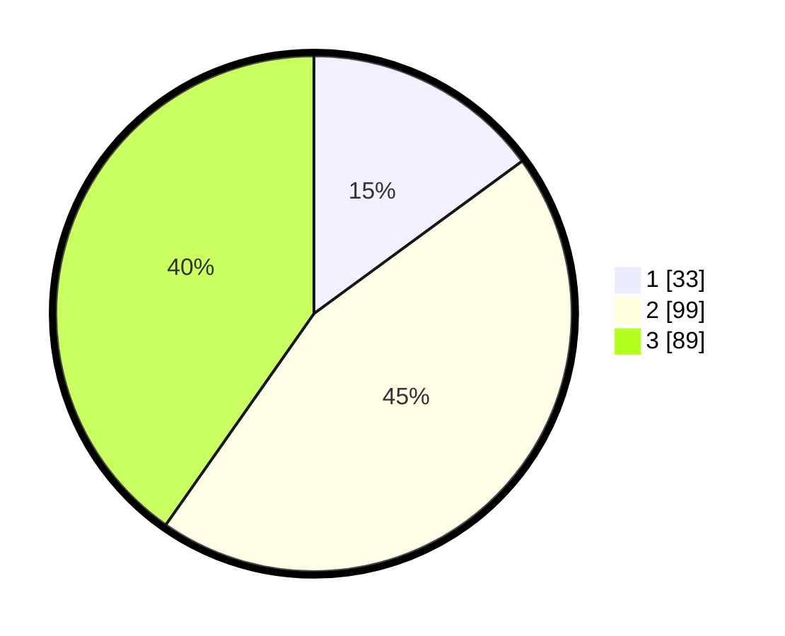

# Hasil

## Grafik

## Tabel

| No. | Nama Paslon    | Suara | Suara (raw) | Persentase |
|:--- |:-------------- | -----:| -----------:| ----------:|
| 1   | ANIES MUHAIMIN | 33    | [33][p-1]   | 14,93      |
| 2   | PRABOWO GIBRAN | 99    | [99][p-2]   | 44,80      |
| 3   | GANJAR MAHFUD  | 89    | [89][p-3]   | 40,27      |

[p-1]: https://github.com/gigit-pemilu/pemilu-2024-34-di-yogyakarta/blob/main/pilpres/hitung-suara/sub/34-di-yogyakarta/sub/01-kulon-progo/sub/11-samigaluh/sub/2001-kebonharjo/sub/002-tps/sub/paslon-1.txt
[p-2]: https://github.com/gigit-pemilu/pemilu-2024-34-di-yogyakarta/blob/main/pilpres/hitung-suara/sub/34-di-yogyakarta/sub/01-kulon-progo/sub/11-samigaluh/sub/2001-kebonharjo/sub/002-tps/sub/paslon-2.txt
[p-3]: https://github.com/gigit-pemilu/pemilu-2024-34-di-yogyakarta/blob/main/pilpres/hitung-suara/sub/34-di-yogyakarta/sub/01-kulon-progo/sub/11-samigaluh/sub/2001-kebonharjo/sub/002-tps/sub/paslon-3.txt

## Foto C Plano

https://sirekap-obj-formc.kpu.go.id/7ec3/pemilu/ppwp/34/01/11/20/01/3401112001002-20240216-140746--1062affd-9ad9-4ec7-b098-bab54518df02.jpg

https://sirekap-obj-formc.kpu.go.id/7ec3/pemilu/ppwp/34/01/11/20/01/3401112001002-20240216-140747--b14ddb60-610b-46f3-8535-b28cfeb5cdc7.jpg

https://sirekap-obj-formc.kpu.go.id/7ec3/pemilu/ppwp/34/01/11/20/01/3401112001002-20240216-140747--96326eb8-a132-4b42-b33c-481c3bf40239.jpg

## Metadata

| Key        | Value               |
| ---------- | ------------------- |
| Time Stamp | 2024-02-21 12:00:00 |

## DATA PEMILIH TETAP

Jumlah pemilih dalam DPT: **265**.
 * L: **126**.
 * P: **139**.

## DATA PENGGUNA HAK PILIH

Jumlah pengguna hak pilih dalam DPT: **222**.
 * L: **105**.
 * P: **117**.

Jumlah pengguna hak pilih dalam DPTb: **7**.
 * L: **3**.
 * P: **4**.

Jumlah pengguna hak pilih dalam DPK: **0**.
 * L: **0**.
 * P: **0**.

Jumlah pengguna hak pilih: **229**.
 * L: **108**.
 * P: **121**.

## JUMLAH SUARA SAH DAN TIDAK SAH

JUMLAH SELURUH SUARA SAH: **221**.

JUMLAH SUARA TIDAK SAH: **8**.

JUMLAH SELURUH SUARA SAH DAN SUARA TIDAK SAH: **229**.

