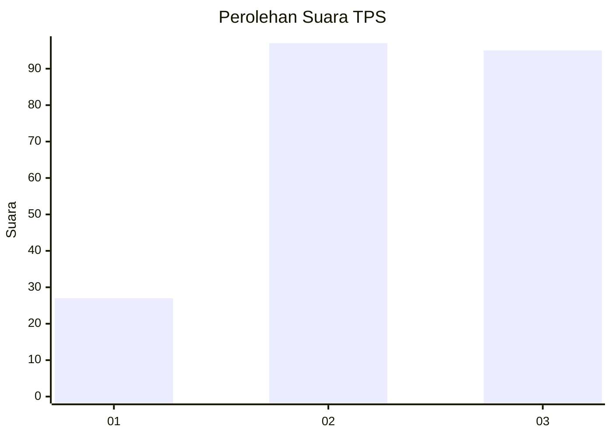
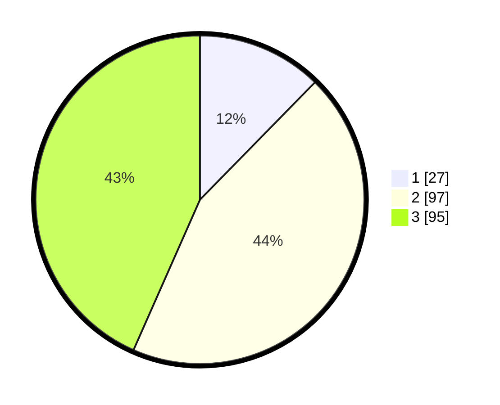

# Hasil

## Grafik

## Tabel

| No. | Nama Paslon    | Suara | Suara (raw) | Persentase |
|:--- |:-------------- | -----:| -----------:| ----------:|
| 1   | ANIES MUHAIMIN | 27    | [27][p-1]   | 12,33      |
| 2   | PRABOWO GIBRAN | 97    | [97][p-2]   | 44,29      |
| 3   | GANJAR MAHFUD  | 95    | [95][p-3]   | 43,38      |

[p-1]: https://github.com/gigit-pemilu/pemilu-2024-34-di-yogyakarta/blob/main/pilpres/hitung-suara/sub/34-di-yogyakarta/sub/01-kulon-progo/sub/11-samigaluh/sub/2001-kebonharjo/sub/003-tps/sub/paslon-1.txt
[p-2]: https://github.com/gigit-pemilu/pemilu-2024-34-di-yogyakarta/blob/main/pilpres/hitung-suara/sub/34-di-yogyakarta/sub/01-kulon-progo/sub/11-samigaluh/sub/2001-kebonharjo/sub/003-tps/sub/paslon-2.txt
[p-3]: https://github.com/gigit-pemilu/pemilu-2024-34-di-yogyakarta/blob/main/pilpres/hitung-suara/sub/34-di-yogyakarta/sub/01-kulon-progo/sub/11-samigaluh/sub/2001-kebonharjo/sub/003-tps/sub/paslon-3.txt

## Foto C Plano

https://sirekap-obj-formc.kpu.go.id/9956/pemilu/ppwp/34/01/11/20/01/3401112001003-20240216-090934--fe101e89-8565-4ce9-ade4-b9a6089b1843.jpg

https://sirekap-obj-formc.kpu.go.id/9956/pemilu/ppwp/34/01/11/20/01/3401112001003-20240216-090937--8b3bfbe4-5a25-45f0-b67a-2926ae217106.jpg

https://sirekap-obj-formc.kpu.go.id/9956/pemilu/ppwp/34/01/11/20/01/3401112001003-20240216-090934--3feb0276-cc92-4a71-aef9-4f303d94bd7b.jpg

## Metadata

| Key        | Value               |
| ---------- | ------------------- |
| Time Stamp | 2024-02-21 13:00:00 |

## DATA PEMILIH TETAP

Jumlah pemilih dalam DPT: **243**.
 * L: **128**.
 * P: **115**.

## DATA PENGGUNA HAK PILIH

Jumlah pengguna hak pilih dalam DPT: **213**.
 * L: **108**.
 * P: **105**.

Jumlah pengguna hak pilih dalam DPTb: **11**.
 * L: **5**.
 * P: **6**.

Jumlah pengguna hak pilih dalam DPK: **1**.
 * L: **0**.
 * P: **1**.

Jumlah pengguna hak pilih: **225**.
 * L: **113**.
 * P: **112**.

## JUMLAH SUARA SAH DAN TIDAK SAH

JUMLAH SELURUH SUARA SAH: **219**.

JUMLAH SUARA TIDAK SAH: **6**.

JUMLAH SELURUH SUARA SAH DAN SUARA TIDAK SAH: **225**.

