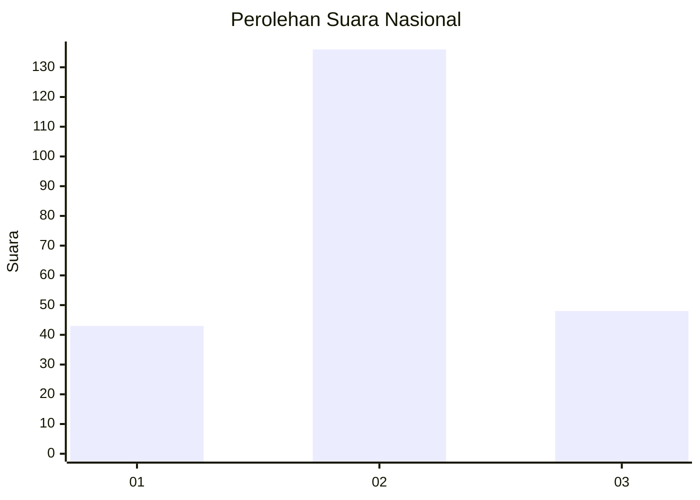
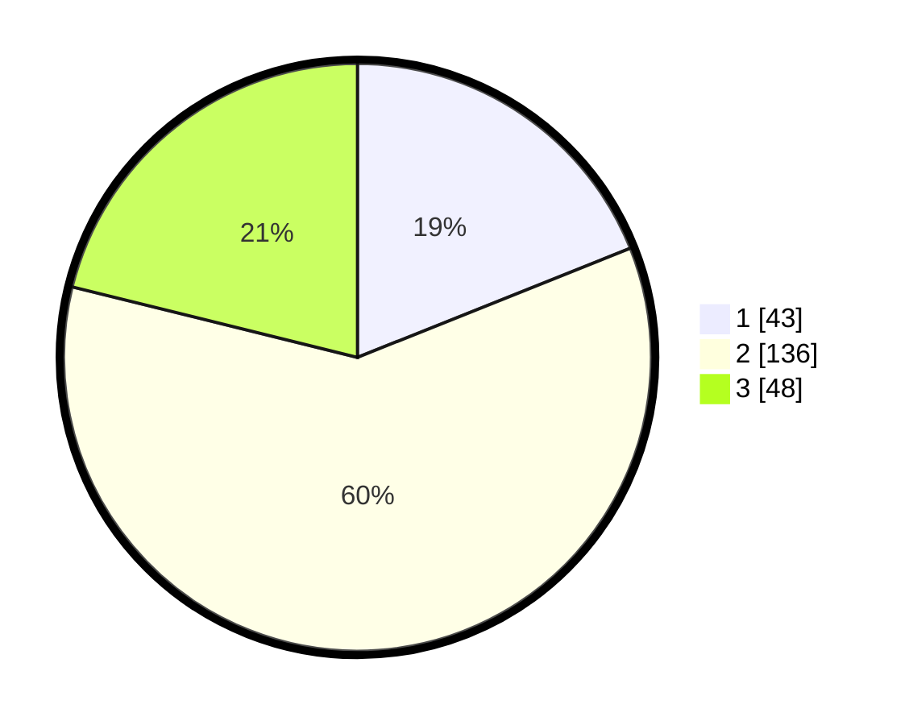

# Hasil

## Grafik

## Tabel

| No. | Nama Paslon    | Suara | Suara (raw) | Persentase |
|:--- |:-------------- | -----:| -----------:| ----------:|
| 1   | ANIES MUHAIMIN | 43    | [43][p-1]   | 18,94      |
| 2   | PRABOWO GIBRAN | 136   | [136][p-2]  | 59,91      |
| 3   | GANJAR MAHFUD  | 48    | [48][p-3]   | 21,15      |

[p-1]: https://github.com/gigit-pemilu/pemilu-2024/blob/main/pilpres/hitung-suara/sub/34-di-yogyakarta/sub/01-kulon-progo/sub/11-samigaluh/sub/2001-kebonharjo/sub/004-tps/sub/paslon-1.txt
[p-2]: https://github.com/gigit-pemilu/pemilu-2024/blob/main/pilpres/hitung-suara/sub/34-di-yogyakarta/sub/01-kulon-progo/sub/11-samigaluh/sub/2001-kebonharjo/sub/004-tps/sub/paslon-2.txt
[p-3]: https://github.com/gigit-pemilu/pemilu-2024/blob/main/pilpres/hitung-suara/sub/34-di-yogyakarta/sub/01-kulon-progo/sub/11-samigaluh/sub/2001-kebonharjo/sub/004-tps/sub/paslon-3.txt

## Foto C Plano

https://sirekap-obj-formc.kpu.go.id/a9b4/pemilu/ppwp/34/01/11/20/01/3401112001004-20240216-123222--0840ff53-bd15-4b6d-a32a-de728d0c9d0b.jpg

https://sirekap-obj-formc.kpu.go.id/a9b4/pemilu/ppwp/34/01/11/20/01/3401112001004-20240216-123227--b1ab9d2a-1a11-4cf0-ad12-590af7bd3e6b.jpg

https://sirekap-obj-formc.kpu.go.id/a9b4/pemilu/ppwp/34/01/11/20/01/3401112001004-20240216-123224--d7c31210-3adf-43a1-8fad-444d6b47eca3.jpg

## Metadata

| Key        | Value               |
| ---------- | ------------------- |
| Time Stamp | 2024-02-21 13:00:00 |

## DATA PEMILIH TETAP

Jumlah pemilih dalam DPT: **266**.
 * L: **139**.
 * P: **127**.

## DATA PENGGUNA HAK PILIH

Jumlah pengguna hak pilih dalam DPT: **220**.
 * L: **110**.
 * P: **110**.

Jumlah pengguna hak pilih dalam DPTb: **12**.
 * L: **3**.
 * P: **9**.

Jumlah pengguna hak pilih dalam DPK: **0**.
 * L: **0**.
 * P: **0**.

Jumlah pengguna hak pilih: **232**.
 * L: **113**.
 * P: **119**.

## JUMLAH SUARA SAH DAN TIDAK SAH

JUMLAH SELURUH SUARA SAH: **227**.

JUMLAH SUARA TIDAK SAH: **5**.

JUMLAH SELURUH SUARA SAH DAN SUARA TIDAK SAH: **232**.

