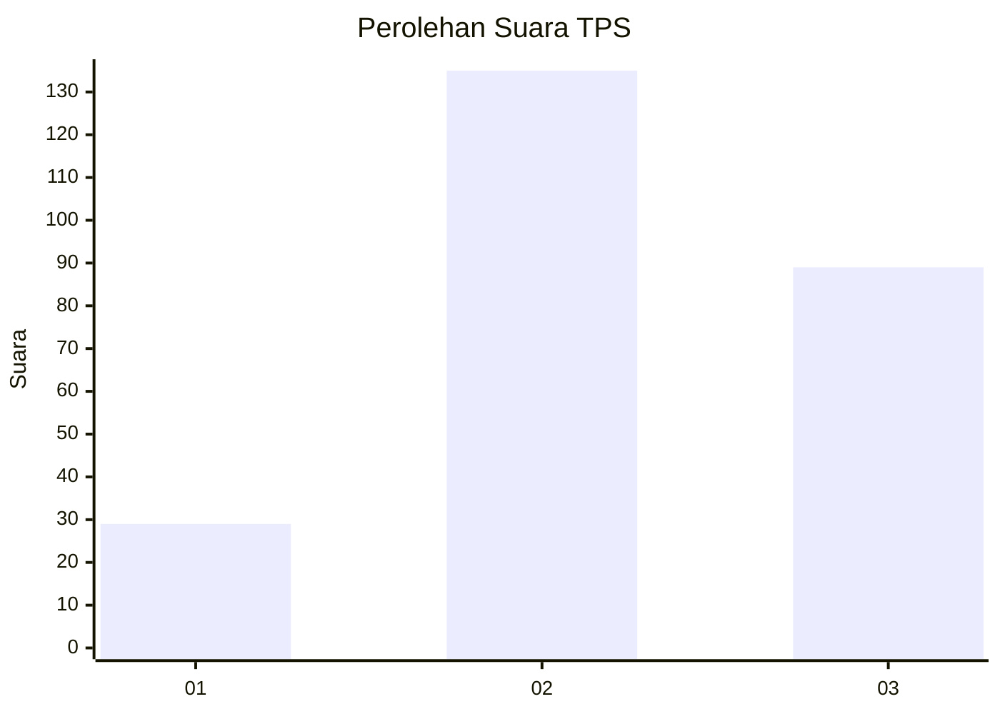
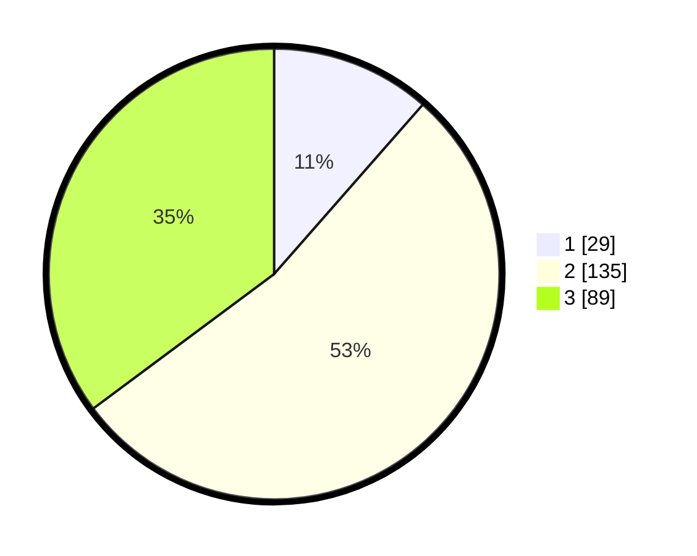

# Hasil

## Grafik

## Tabel

| No. | Nama Paslon    | Suara | Suara (raw) | Persentase |
|:--- |:-------------- | -----:| -----------:| ----------:|
| 1   | ANIES MUHAIMIN | 29    | [29][p-1]   | 11,46      |
| 2   | PRABOWO GIBRAN | 135   | [135][p-2]  | 53,36      |
| 3   | GANJAR MAHFUD  | 89    | [89][p-3]   | 35,18      |

[p-1]: https://github.com/gigit-pemilu/pemilu-2024-34-di-yogyakarta/blob/main/pilpres/hitung-suara/sub/34-di-yogyakarta/sub/01-kulon-progo/sub/11-samigaluh/sub/2001-kebonharjo/sub/005-tps/sub/paslon-1.txt
[p-2]: https://github.com/gigit-pemilu/pemilu-2024-34-di-yogyakarta/blob/main/pilpres/hitung-suara/sub/34-di-yogyakarta/sub/01-kulon-progo/sub/11-samigaluh/sub/2001-kebonharjo/sub/005-tps/sub/paslon-2.txt
[p-3]: https://github.com/gigit-pemilu/pemilu-2024-34-di-yogyakarta/blob/main/pilpres/hitung-suara/sub/34-di-yogyakarta/sub/01-kulon-progo/sub/11-samigaluh/sub/2001-kebonharjo/sub/005-tps/sub/paslon-3.txt

## Foto C Plano

https://sirekap-obj-formc.kpu.go.id/438b/pemilu/ppwp/34/01/11/20/01/3401112001005-20240215-192236--037be305-83e8-4f5d-9c6b-c8b86e7b1521.jpg

https://sirekap-obj-formc.kpu.go.id/438b/pemilu/ppwp/34/01/11/20/01/3401112001005-20240214-204050--fabf9d07-e16f-4547-876c-faf3c8d08e79.jpg

https://sirekap-obj-formc.kpu.go.id/438b/pemilu/ppwp/34/01/11/20/01/3401112001005-20240214-204555--c2ef0ed7-7d53-4e79-aecd-332387bae06c.jpg

## Metadata

| Key        | Value               |
| ---------- | ------------------- |
| Time Stamp | 2024-02-15 20:30:46 |

## DATA PEMILIH TETAP

Jumlah pemilih dalam DPT: **268**.
 * L: **126**.
 * P: **142**.

## DATA PENGGUNA HAK PILIH

Jumlah pengguna hak pilih dalam DPT: **252**.
 * L: **119**.
 * P: **133**.

Jumlah pengguna hak pilih dalam DPTb: **16**.
 * L: **7**.
 * P: **9**.

Jumlah pengguna hak pilih dalam DPK: **0**.
 * L: **0**.
 * P: **0**.

Jumlah pengguna hak pilih: **268**.
 * L: **126**.
 * P: **142**.

## JUMLAH SUARA SAH DAN TIDAK SAH

JUMLAH SELURUH SUARA SAH: **253**.

JUMLAH SUARA TIDAK SAH: **15**.

JUMLAH SELURUH SUARA SAH DAN SUARA TIDAK SAH: **268**.

