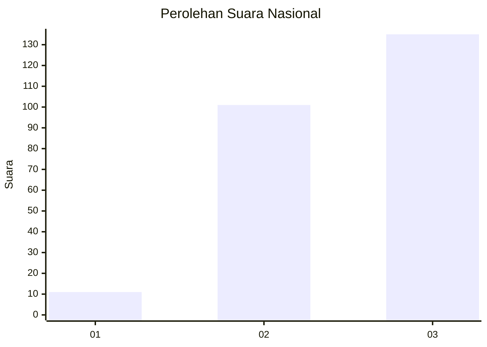
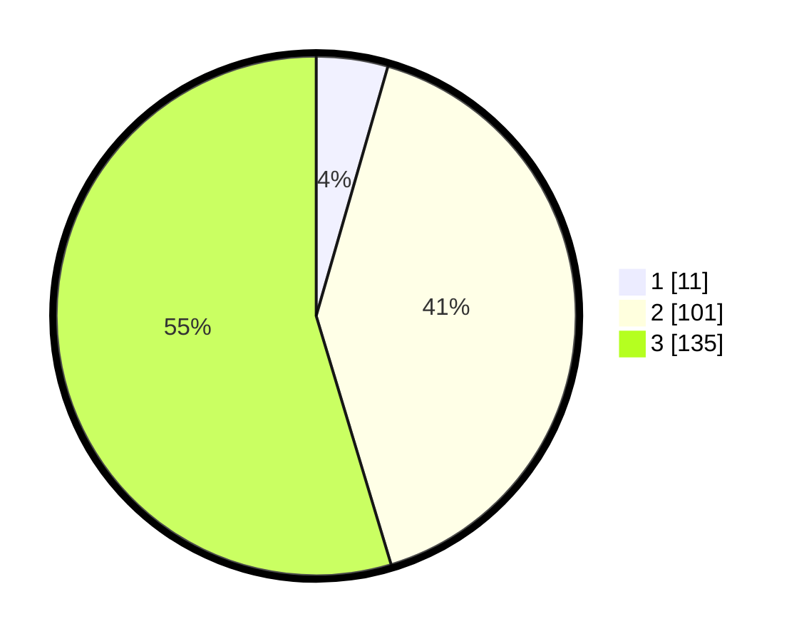

# Hasil

## Grafik

## Tabel

| No. | Nama Paslon    | Suara | Suara (raw) | Persentase |
|:--- |:-------------- | -----:| -----------:| ----------:|
| 1   | ANIES MUHAIMIN | 11    | [11][p-1]   | 4,45       |
| 2   | PRABOWO GIBRAN | 101   | [101][p-2]  | 40,89      |
| 3   | GANJAR MAHFUD  | 135   | [135][p-3]  | 54,66      |

[p-1]: https://github.com/gigit-pemilu/pemilu-2024/blob/main/pilpres/hitung-suara/sub/34-di-yogyakarta/sub/01-kulon-progo/sub/11-samigaluh/sub/2001-kebonharjo/sub/006-tps/sub/paslon-1.txt
[p-2]: https://github.com/gigit-pemilu/pemilu-2024/blob/main/pilpres/hitung-suara/sub/34-di-yogyakarta/sub/01-kulon-progo/sub/11-samigaluh/sub/2001-kebonharjo/sub/006-tps/sub/paslon-2.txt
[p-3]: https://github.com/gigit-pemilu/pemilu-2024/blob/main/pilpres/hitung-suara/sub/34-di-yogyakarta/sub/01-kulon-progo/sub/11-samigaluh/sub/2001-kebonharjo/sub/006-tps/sub/paslon-3.txt

## Foto C Plano

https://sirekap-obj-formc.kpu.go.id/da55/pemilu/ppwp/34/01/11/20/01/3401112001006-20240215-082648--5344008a-620f-4675-b064-4e1feb6cf0ab.jpg

https://sirekap-obj-formc.kpu.go.id/da55/pemilu/ppwp/34/01/11/20/01/3401112001006-20240214-210114--760d9048-01c1-4a18-a918-f5c18332b30a.jpg

https://sirekap-obj-formc.kpu.go.id/da55/pemilu/ppwp/34/01/11/20/01/3401112001006-20240215-082250--8d0316b4-17d3-4ddf-8efa-1e5278053748.jpg

## Metadata

| Key        | Value               |
| ---------- | ------------------- |
| Time Stamp | 2024-02-15 15:00:29 |

