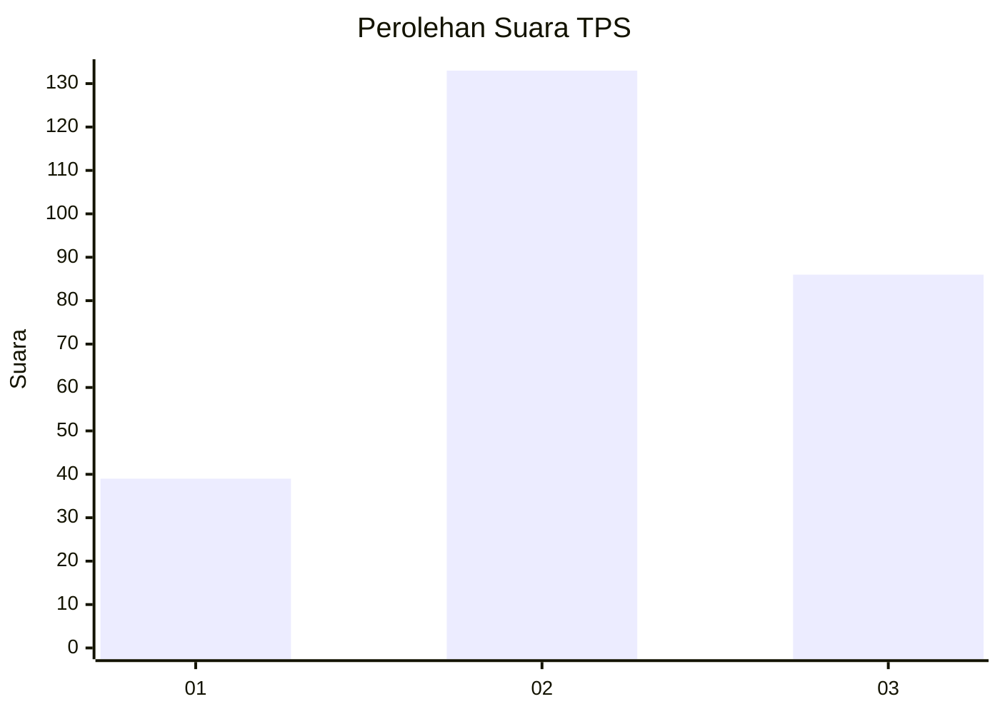
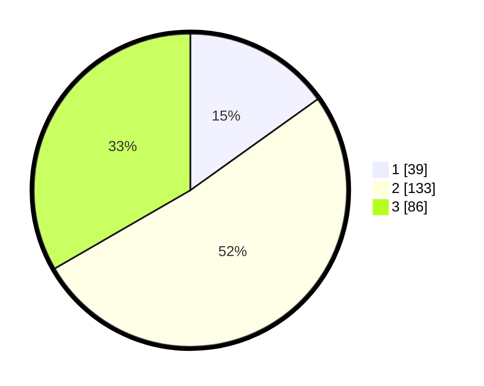

# Hasil

## Grafik

## Tabel

| No. | Nama Paslon    | Suara | Suara (raw) | Persentase |
|:--- |:-------------- | -----:| -----------:| ----------:|
| 1   | ANIES MUHAIMIN | 39    | [39][p-1]   | 15,12      |
| 2   | PRABOWO GIBRAN | 133   | [133][p-2]  | 51,55      |
| 3   | GANJAR MAHFUD  | 86    | [86][p-3]   | 33,33      |

[p-1]: https://github.com/gigit-pemilu/pemilu-2024-34-di-yogyakarta/blob/main/pilpres/hitung-suara/sub/34-di-yogyakarta/sub/01-kulon-progo/sub/11-samigaluh/sub/2001-kebonharjo/sub/007-tps/sub/paslon-1.txt
[p-2]: https://github.com/gigit-pemilu/pemilu-2024-34-di-yogyakarta/blob/main/pilpres/hitung-suara/sub/34-di-yogyakarta/sub/01-kulon-progo/sub/11-samigaluh/sub/2001-kebonharjo/sub/007-tps/sub/paslon-2.txt
[p-3]: https://github.com/gigit-pemilu/pemilu-2024-34-di-yogyakarta/blob/main/pilpres/hitung-suara/sub/34-di-yogyakarta/sub/01-kulon-progo/sub/11-samigaluh/sub/2001-kebonharjo/sub/007-tps/sub/paslon-3.txt

## Foto C Plano

https://sirekap-obj-formc.kpu.go.id/ea79/pemilu/ppwp/34/01/11/20/01/3401112001007-20240214-195211--bc5ccf24-1f3c-4f35-83a8-f74105f10f6b.jpg

https://sirekap-obj-formc.kpu.go.id/ea79/pemilu/ppwp/34/01/11/20/01/3401112001007-20240214-195257--fd3d49cb-bc1f-4bf1-a954-27b24bb0fcbb.jpg

https://sirekap-obj-formc.kpu.go.id/ea79/pemilu/ppwp/34/01/11/20/01/3401112001007-20240215-191054--6f990d23-6721-4149-a638-077e082b5928.jpg

## Metadata

| Key        | Value               |
| ---------- | ------------------- |
| Time Stamp | 2024-02-15 22:00:27 |

