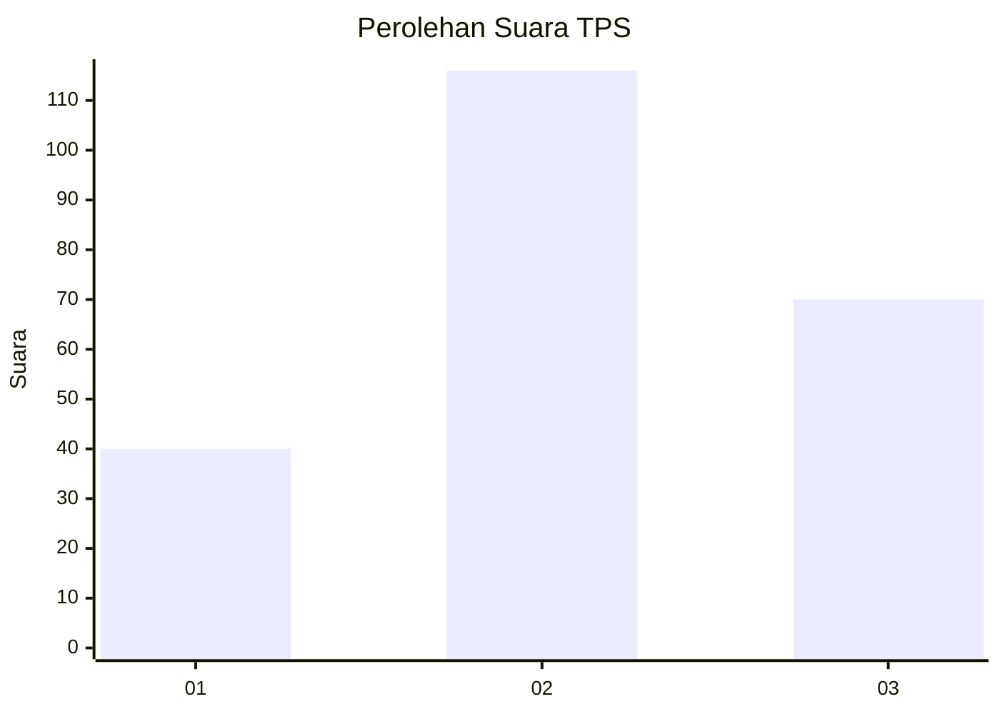
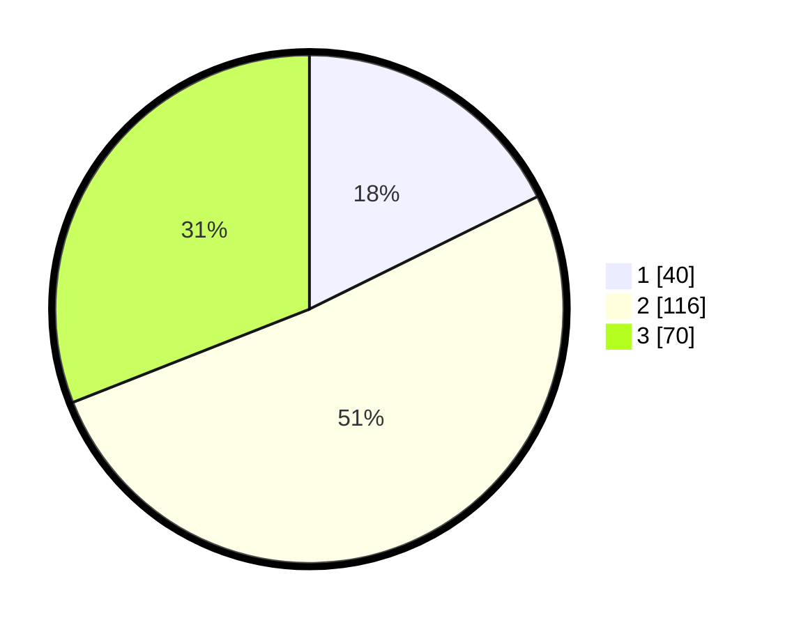

# Hasil

## Grafik

## Tabel

| No. | Nama Paslon    | Suara | Suara (raw) | Persentase |
|:--- |:-------------- | -----:| -----------:| ----------:|
| 1   | ANIES MUHAIMIN | 40    | [40][p-1]   | 17,70      |
| 2   | PRABOWO GIBRAN | 116   | [116][p-2]  | 51,33      |
| 3   | GANJAR MAHFUD  | 70    | [70][p-3]   | 30,97      |

[p-1]: https://github.com/gigit-pemilu/pemilu-2024-34-di-yogyakarta/blob/main/pilpres/hitung-suara/sub/34-di-yogyakarta/sub/01-kulon-progo/sub/11-samigaluh/sub/2002-banjarsari/sub/001-tps/sub/paslon-1.txt
[p-2]: https://github.com/gigit-pemilu/pemilu-2024-34-di-yogyakarta/blob/main/pilpres/hitung-suara/sub/34-di-yogyakarta/sub/01-kulon-progo/sub/11-samigaluh/sub/2002-banjarsari/sub/001-tps/sub/paslon-2.txt
[p-3]: https://github.com/gigit-pemilu/pemilu-2024-34-di-yogyakarta/blob/main/pilpres/hitung-suara/sub/34-di-yogyakarta/sub/01-kulon-progo/sub/11-samigaluh/sub/2002-banjarsari/sub/001-tps/sub/paslon-3.txt

## Foto C Plano

https://sirekap-obj-formc.kpu.go.id/cde9/pemilu/ppwp/34/01/11/20/02/3401112002001-20240215-001342--6f34672c-398b-4050-a118-5424da9d227a.jpg

https://sirekap-obj-formc.kpu.go.id/cde9/pemilu/ppwp/34/01/11/20/02/3401112002001-20240215-001510--dedd3dbe-1b8e-475d-b03e-5045cf7db389.jpg

https://sirekap-obj-formc.kpu.go.id/cde9/pemilu/ppwp/34/01/11/20/02/3401112002001-20240215-001709--7554efeb-19ec-4031-8f3d-8f57f40169c8.jpg

## Metadata

| Key        | Value               |
| ---------- | ------------------- |
| Time Stamp | 2024-02-15 22:00:27 |

