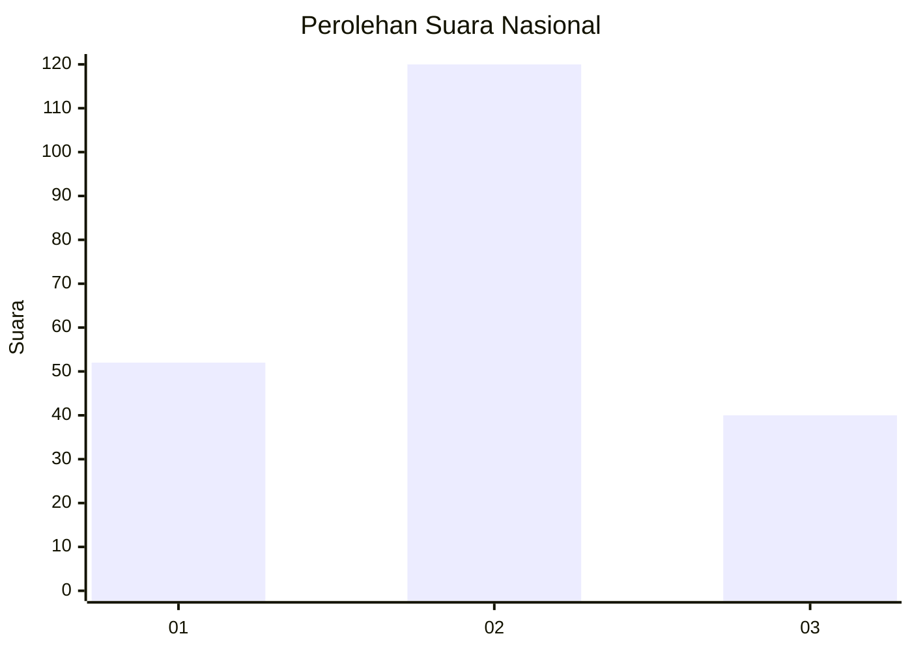
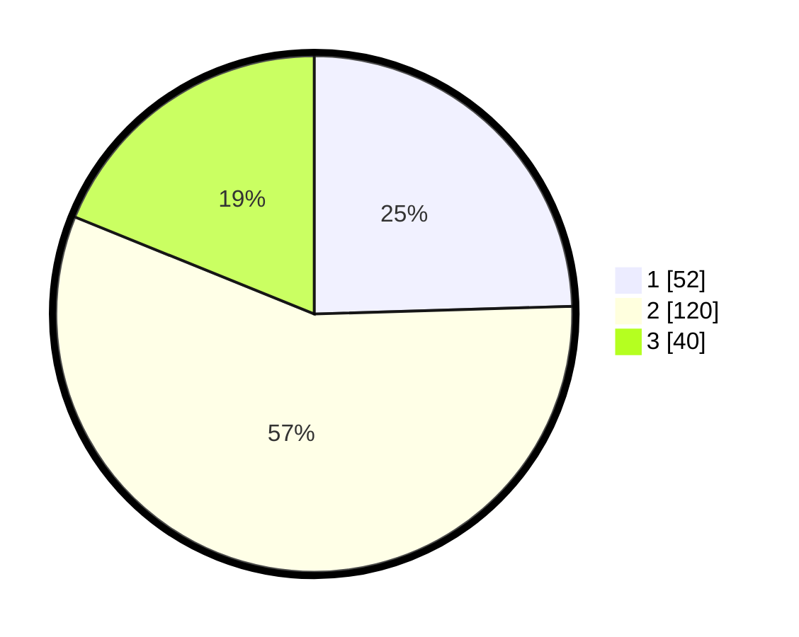

# Hasil

## Grafik

## Tabel

| No. | Nama Paslon    | Suara | Suara (raw) | Persentase |
|:--- |:-------------- | -----:| -----------:| ----------:|
| 1   | ANIES MUHAIMIN | 52    | [52][p-1]   | 24,53      |
| 2   | PRABOWO GIBRAN | 120   | [120][p-2]  | 56,60      |
| 3   | GANJAR MAHFUD  | 40    | [40][p-3]   | 18,87      |

[p-1]: https://github.com/gigit-pemilu/pemilu-2024/blob/main/pilpres/hitung-suara/sub/34-di-yogyakarta/sub/01-kulon-progo/sub/11-samigaluh/sub/2002-banjarsari/sub/002-tps/sub/paslon-1.txt
[p-2]: https://github.com/gigit-pemilu/pemilu-2024/blob/main/pilpres/hitung-suara/sub/34-di-yogyakarta/sub/01-kulon-progo/sub/11-samigaluh/sub/2002-banjarsari/sub/002-tps/sub/paslon-2.txt
[p-3]: https://github.com/gigit-pemilu/pemilu-2024/blob/main/pilpres/hitung-suara/sub/34-di-yogyakarta/sub/01-kulon-progo/sub/11-samigaluh/sub/2002-banjarsari/sub/002-tps/sub/paslon-3.txt

## Foto C Plano

https://sirekap-obj-formc.kpu.go.id/79b9/pemilu/ppwp/34/01/11/20/02/3401112002002-20240216-210852--a5111a5a-2de4-48b8-abe4-6cb63d328b58.jpg

https://sirekap-obj-formc.kpu.go.id/79b9/pemilu/ppwp/34/01/11/20/02/3401112002002-20240216-211235--470d28d2-ff59-4b3a-a7f5-c0197e15456c.jpg

https://sirekap-obj-formc.kpu.go.id/79b9/pemilu/ppwp/34/01/11/20/02/3401112002002-20240216-213055--60c392b8-9a01-4172-861a-f075e2f1d638.jpg

## Metadata

| Key        | Value               |
| ---------- | ------------------- |
| Time Stamp | 2024-02-16 22:01:00 |

## DATA PEMILIH TETAP

Jumlah pemilih dalam DPT: **251**.
 * L: **107**.
 * P: **144**.

## DATA PENGGUNA HAK PILIH

Jumlah pengguna hak pilih dalam DPT: **208**.
 * L: **93**.
 * P: **115**.

Jumlah pengguna hak pilih dalam DPTb: **10**.
 * L: **2**.
 * P: **8**.

Jumlah pengguna hak pilih dalam DPK: **1**.
 * L: **1**.
 * P: **0**.

Jumlah pengguna hak pilih: **219**.
 * L: **96**.
 * P: **123**.

## JUMLAH SUARA SAH DAN TIDAK SAH

JUMLAH SELURUH SUARA SAH: **212**.

JUMLAH SUARA TIDAK SAH: **7**.

JUMLAH SELURUH SUARA SAH DAN SUARA TIDAK SAH: **219**.

