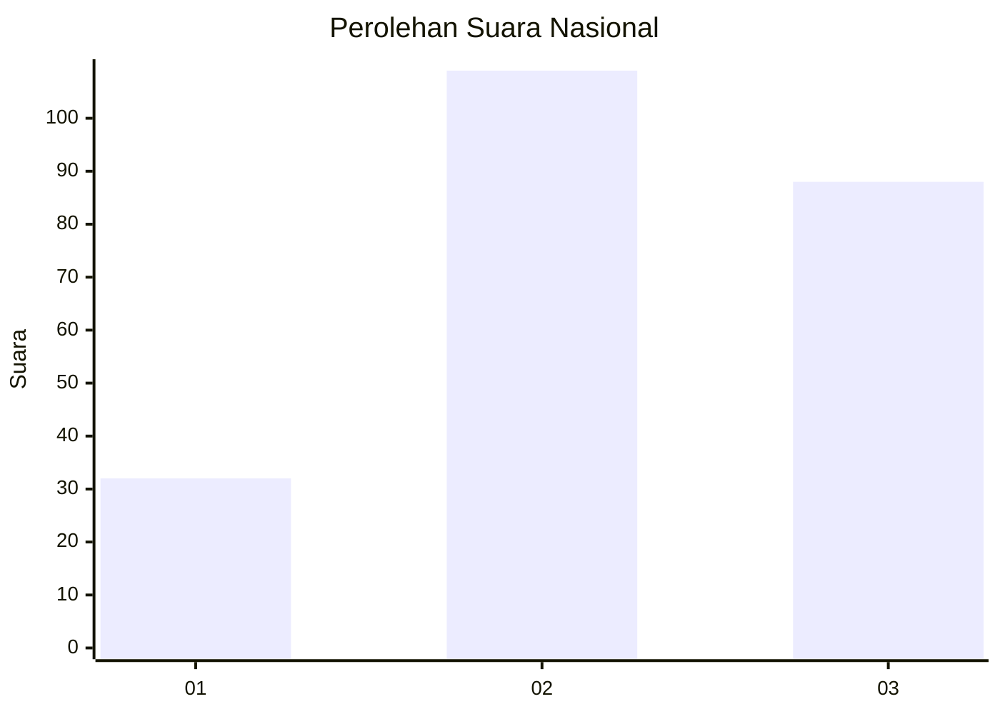
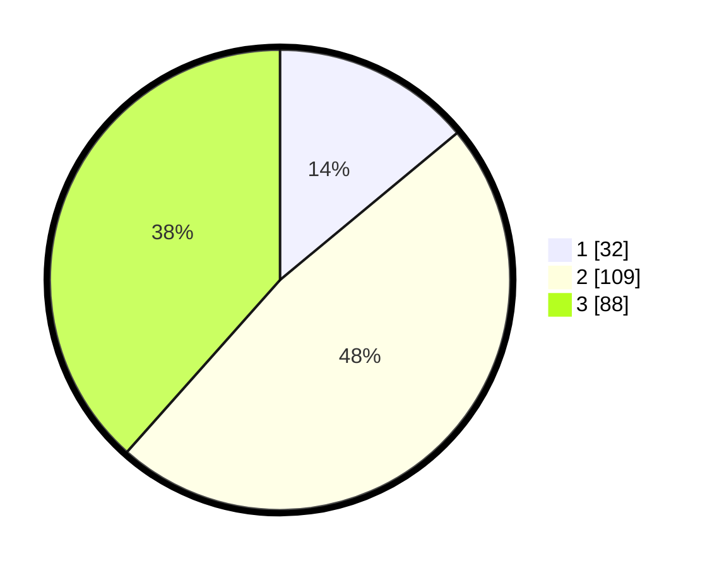

# Hasil

## Grafik

## Tabel

| No. | Nama Paslon    | Suara | Suara (raw) | Persentase |
|:--- |:-------------- | -----:| -----------:| ----------:|
| 1   | ANIES MUHAIMIN | 32    | [32][p-1]   | 13,97      |
| 2   | PRABOWO GIBRAN | 109   | [109][p-2]  | 47,60      |
| 3   | GANJAR MAHFUD  | 88    | [88][p-3]   | 38,43      |

[p-1]: https://github.com/gigit-pemilu/pemilu-2024/blob/main/pilpres/hitung-suara/sub/34-di-yogyakarta/sub/01-kulon-progo/sub/11-samigaluh/sub/2002-banjarsari/sub/004-tps/sub/paslon-1.txt
[p-2]: https://github.com/gigit-pemilu/pemilu-2024/blob/main/pilpres/hitung-suara/sub/34-di-yogyakarta/sub/01-kulon-progo/sub/11-samigaluh/sub/2002-banjarsari/sub/004-tps/sub/paslon-2.txt
[p-3]: https://github.com/gigit-pemilu/pemilu-2024/blob/main/pilpres/hitung-suara/sub/34-di-yogyakarta/sub/01-kulon-progo/sub/11-samigaluh/sub/2002-banjarsari/sub/004-tps/sub/paslon-3.txt

## Foto C Plano

https://sirekap-obj-formc.kpu.go.id/d37d/pemilu/ppwp/34/01/11/20/02/3401112002004-20240216-130855--cda078d1-4562-4ae5-b936-a398d7c4d05a.jpg

https://sirekap-obj-formc.kpu.go.id/d37d/pemilu/ppwp/34/01/11/20/02/3401112002004-20240216-130905--77547ad6-bc9d-4f7a-b5b4-80500c0553d5.jpg

https://sirekap-obj-formc.kpu.go.id/d37d/pemilu/ppwp/34/01/11/20/02/3401112002004-20240216-130858--5ad84554-bd86-4a82-b65b-25276cd8e16d.jpg

## Metadata

| Key        | Value               |
| ---------- | ------------------- |
| Time Stamp | 2024-02-21 17:00:00 |

## DATA PEMILIH TETAP

Jumlah pemilih dalam DPT: **256**.
 * L: **125**.
 * P: **131**.

## DATA PENGGUNA HAK PILIH

Jumlah pengguna hak pilih dalam DPT: **219**.
 * L: **107**.
 * P: **112**.

Jumlah pengguna hak pilih dalam DPTb: **17**.
 * L: **5**.
 * P: **12**.

Jumlah pengguna hak pilih dalam DPK: **0**.
 * L: **0**.
 * P: **0**.

Jumlah pengguna hak pilih: **236**.
 * L: **112**.
 * P: **124**.

## JUMLAH SUARA SAH DAN TIDAK SAH

JUMLAH SELURUH SUARA SAH: **229**.

JUMLAH SUARA TIDAK SAH: **7**.

JUMLAH SELURUH SUARA SAH DAN SUARA TIDAK SAH: **236**.

