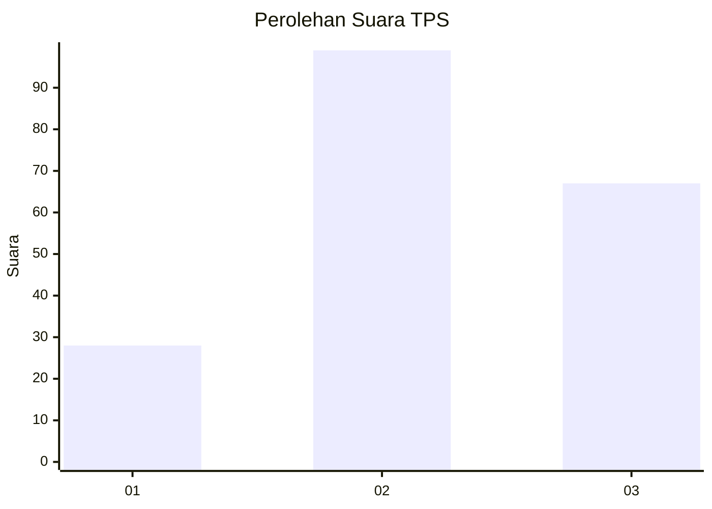
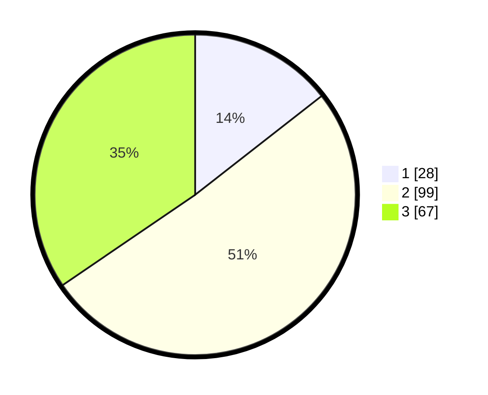

# Hasil

## Grafik

## Tabel

| No. | Nama Paslon    | Suara | Suara (raw) | Persentase |
|:--- |:-------------- | -----:| -----------:| ----------:|
| 1   | ANIES MUHAIMIN | 28    | [28][p-1]   | 14,43      |
| 2   | PRABOWO GIBRAN | 99    | [99][p-2]   | 51,03      |
| 3   | GANJAR MAHFUD  | 67    | [67][p-3]   | 34,54      |

[p-1]: https://github.com/gigit-pemilu/pemilu-2024-34-di-yogyakarta/blob/main/pilpres/hitung-suara/sub/34-di-yogyakarta/sub/01-kulon-progo/sub/11-samigaluh/sub/2002-banjarsari/sub/011-tps/sub/paslon-1.txt
[p-2]: https://github.com/gigit-pemilu/pemilu-2024-34-di-yogyakarta/blob/main/pilpres/hitung-suara/sub/34-di-yogyakarta/sub/01-kulon-progo/sub/11-samigaluh/sub/2002-banjarsari/sub/011-tps/sub/paslon-2.txt
[p-3]: https://github.com/gigit-pemilu/pemilu-2024-34-di-yogyakarta/blob/main/pilpres/hitung-suara/sub/34-di-yogyakarta/sub/01-kulon-progo/sub/11-samigaluh/sub/2002-banjarsari/sub/011-tps/sub/paslon-3.txt

## Foto C Plano

https://sirekap-obj-formc.kpu.go.id/2a34/pemilu/ppwp/34/01/11/20/02/3401112002011-20240214-221056--c64c4267-0366-4452-ac9d-cef1a6e5e290.jpg

https://sirekap-obj-formc.kpu.go.id/2a34/pemilu/ppwp/34/01/11/20/02/3401112002011-20240214-221149--f5e59329-9db2-4edf-8b03-2b6b1ffb3a13.jpg

https://sirekap-obj-formc.kpu.go.id/2a34/pemilu/ppwp/34/01/11/20/02/3401112002011-20240214-221256--486b42da-1797-495d-9d64-8f63ef862008.jpg

## Metadata

| Key        | Value               |
| ---------- | ------------------- |
| Time Stamp | 2024-02-15 12:00:28 |

