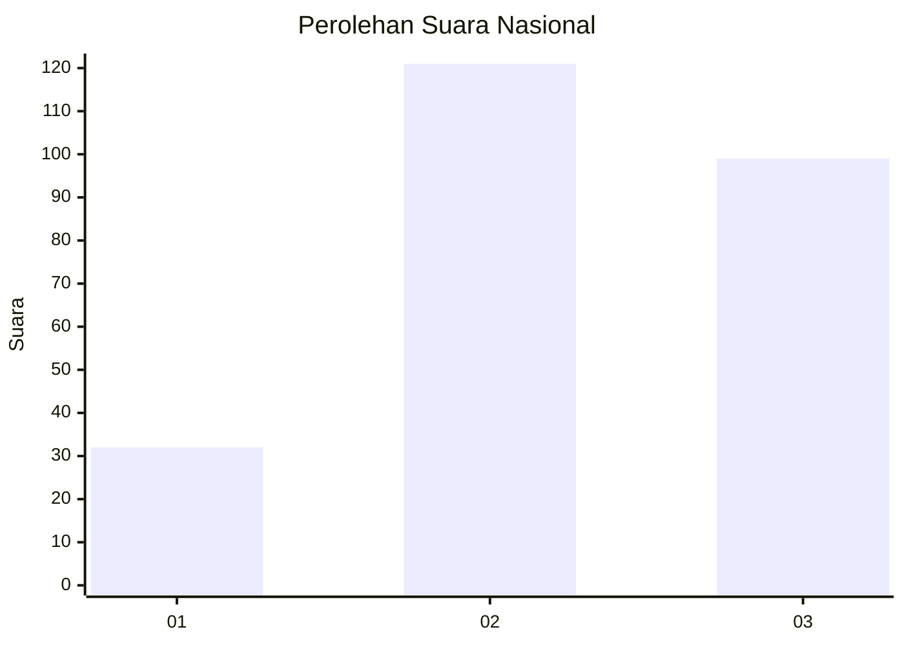
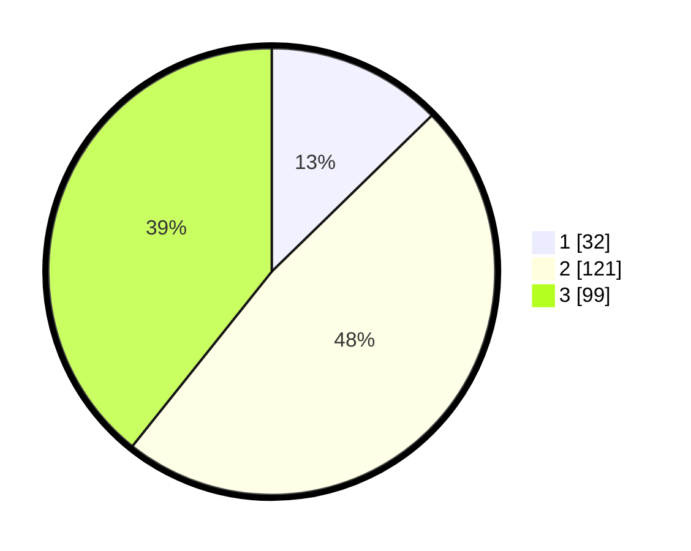

# Hasil

## Grafik

## Tabel

| No. | Nama Paslon    | Suara | Suara (raw) | Persentase |
|:--- |:-------------- | -----:| -----------:| ----------:|
| 1   | ANIES MUHAIMIN | 32    | [32][p-1]   | 12,70      |
| 2   | PRABOWO GIBRAN | 121   | [121][p-2]  | 48,02      |
| 3   | GANJAR MAHFUD  | 99    | [99][p-3]   | 39,29      |

[p-1]: https://github.com/gigit-pemilu/pemilu-2024/blob/main/pilpres/hitung-suara/sub/34-di-yogyakarta/sub/01-kulon-progo/sub/11-samigaluh/sub/2003-purwoharjo/sub/002-tps/sub/paslon-1.txt
[p-2]: https://github.com/gigit-pemilu/pemilu-2024/blob/main/pilpres/hitung-suara/sub/34-di-yogyakarta/sub/01-kulon-progo/sub/11-samigaluh/sub/2003-purwoharjo/sub/002-tps/sub/paslon-2.txt
[p-3]: https://github.com/gigit-pemilu/pemilu-2024/blob/main/pilpres/hitung-suara/sub/34-di-yogyakarta/sub/01-kulon-progo/sub/11-samigaluh/sub/2003-purwoharjo/sub/002-tps/sub/paslon-3.txt

## Foto C Plano

https://sirekap-obj-formc.kpu.go.id/878b/pemilu/ppwp/34/01/11/20/03/3401112003002-20240214-223020--c91caf9c-e1b9-4e3d-85a3-516600bd407b.jpg

https://sirekap-obj-formc.kpu.go.id/878b/pemilu/ppwp/34/01/11/20/03/3401112003002-20240214-223134--4008eab2-557a-4c6a-94b3-0691a961f0e8.jpg

https://sirekap-obj-formc.kpu.go.id/878b/pemilu/ppwp/34/01/11/20/03/3401112003002-20240214-223302--540b29ee-bbed-48e5-a93a-9773950cce90.jpg

## Metadata

| Key        | Value               |
| ---------- | ------------------- |
| Time Stamp | 2024-02-15 16:30:25 |

