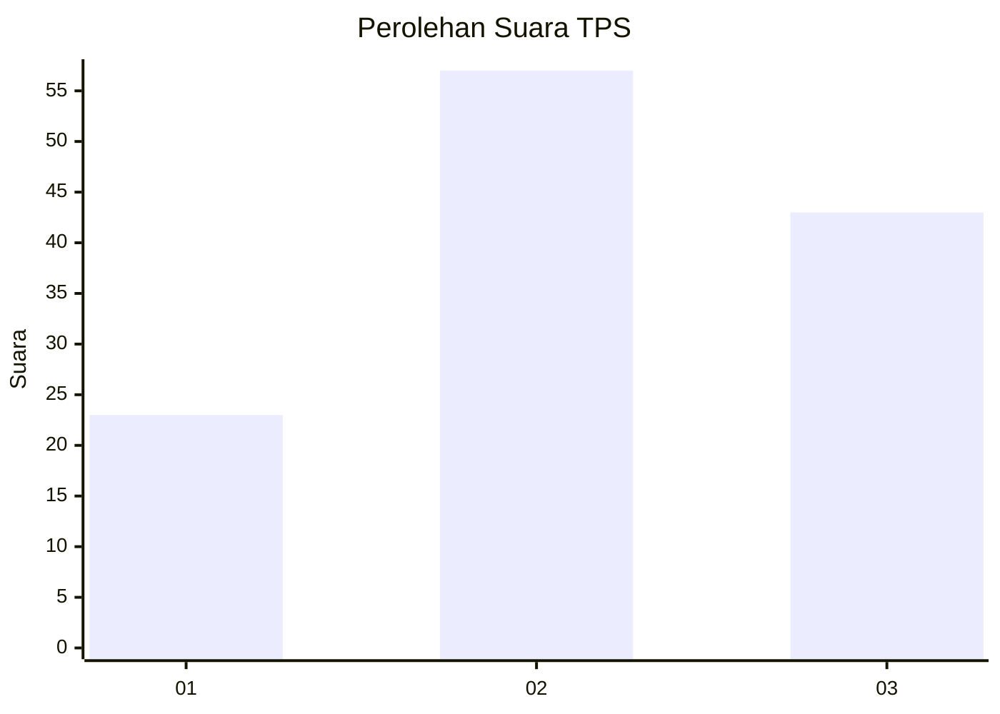
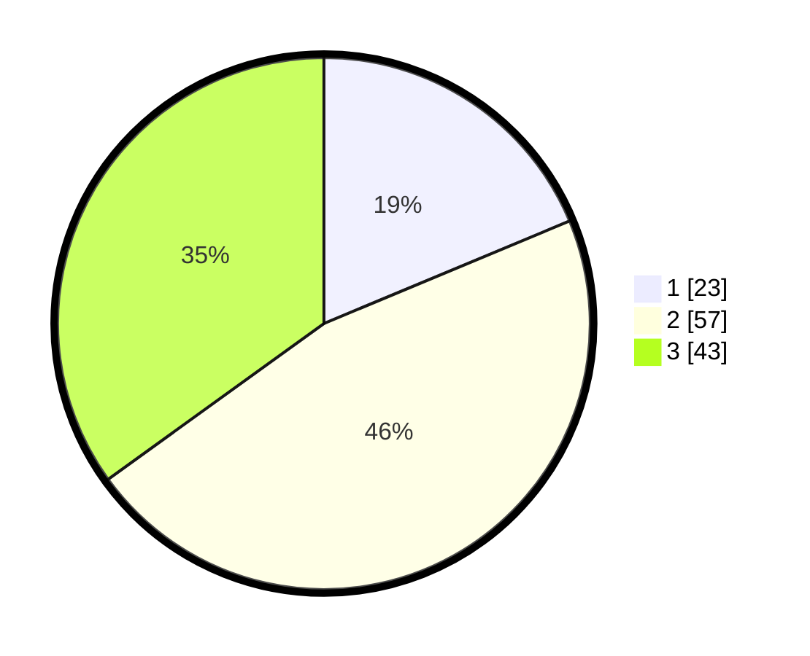

# Hasil

## Grafik

## Tabel

| No. | Nama Paslon    | Suara | Suara (raw) | Persentase |
|:--- |:-------------- | -----:| -----------:| ----------:|
| 1   | ANIES MUHAIMIN | 23    | [23][p-1]   | 18,70      |
| 2   | PRABOWO GIBRAN | 57    | [57][p-2]   | 46,34      |
| 3   | GANJAR MAHFUD  | 43    | [43][p-3]   | 34,96      |

[p-1]: https://github.com/gigit-pemilu/pemilu-2024-34-di-yogyakarta/blob/main/pilpres/hitung-suara/sub/34-di-yogyakarta/sub/01-kulon-progo/sub/11-samigaluh/sub/2003-purwoharjo/sub/008-tps/sub/paslon-1.txt
[p-2]: https://github.com/gigit-pemilu/pemilu-2024-34-di-yogyakarta/blob/main/pilpres/hitung-suara/sub/34-di-yogyakarta/sub/01-kulon-progo/sub/11-samigaluh/sub/2003-purwoharjo/sub/008-tps/sub/paslon-2.txt
[p-3]: https://github.com/gigit-pemilu/pemilu-2024-34-di-yogyakarta/blob/main/pilpres/hitung-suara/sub/34-di-yogyakarta/sub/01-kulon-progo/sub/11-samigaluh/sub/2003-purwoharjo/sub/008-tps/sub/paslon-3.txt

## Foto C Plano

https://sirekap-obj-formc.kpu.go.id/3786/pemilu/ppwp/34/01/11/20/03/3401112003008-20240216-062016--822785bf-1bcd-484b-a18c-b3a0491ac35c.jpg

https://sirekap-obj-formc.kpu.go.id/3786/pemilu/ppwp/34/01/11/20/03/3401112003008-20240216-063612--6df399ec-e633-4d60-a11e-be1b0c32f5d0.jpg

https://sirekap-obj-formc.kpu.go.id/3786/pemilu/ppwp/34/01/11/20/03/3401112003008-20240216-062020--e39720a6-3506-4ebf-9b7d-0f55a73a8b98.jpg

## Metadata

| Key        | Value               |
| ---------- | ------------------- |
| Time Stamp | 2024-02-21 19:00:00 |

## DATA PEMILIH TETAP

Jumlah pemilih dalam DPT: **136**.
 * L: **67**.
 * P: **69**.

## DATA PENGGUNA HAK PILIH

Jumlah pengguna hak pilih dalam DPT: **117**.
 * L: **58**.
 * P: **59**.

Jumlah pengguna hak pilih dalam DPTb: **9**.
 * L: **4**.
 * P: **5**.

Jumlah pengguna hak pilih dalam DPK: **0**.
 * L: **0**.
 * P: **0**.

Jumlah pengguna hak pilih: **126**.
 * L: **62**.
 * P: **64**.

## JUMLAH SUARA SAH DAN TIDAK SAH

JUMLAH SELURUH SUARA SAH: **123**.

JUMLAH SUARA TIDAK SAH: **3**.

JUMLAH SELURUH SUARA SAH DAN SUARA TIDAK SAH: **126**.

