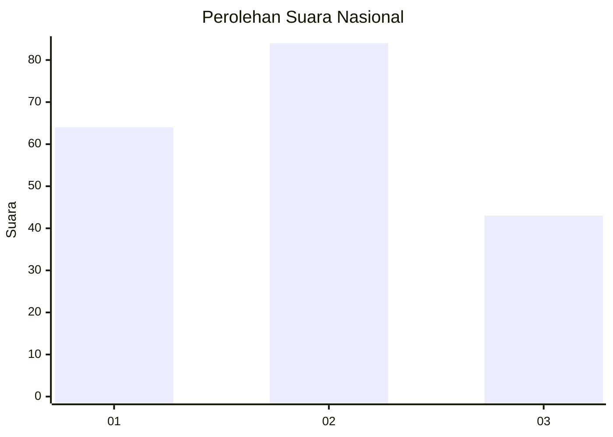
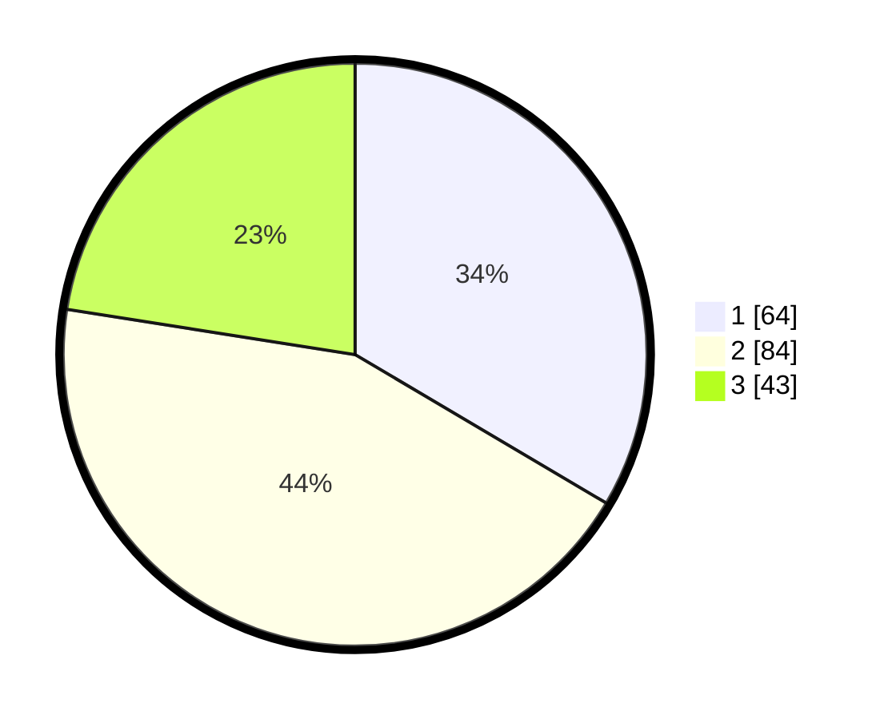

# Hasil

## Grafik

## Tabel

| No. | Nama Paslon    | Suara | Suara (raw) | Persentase |
|:--- |:-------------- | -----:| -----------:| ----------:|
| 1   | ANIES MUHAIMIN | 64    | [64][p-1]   | 33,51      |
| 2   | PRABOWO GIBRAN | 84    | [84][p-2]   | 43,98      |
| 3   | GANJAR MAHFUD  | 43    | [43][p-3]   | 22,51      |

[p-1]: https://github.com/gigit-pemilu/pemilu-2024/blob/main/pilpres/hitung-suara/sub/34-di-yogyakarta/sub/01-kulon-progo/sub/11-samigaluh/sub/2004-sidoharjo/sub/003-tps/sub/paslon-1.txt
[p-2]: https://github.com/gigit-pemilu/pemilu-2024/blob/main/pilpres/hitung-suara/sub/34-di-yogyakarta/sub/01-kulon-progo/sub/11-samigaluh/sub/2004-sidoharjo/sub/003-tps/sub/paslon-2.txt
[p-3]: https://github.com/gigit-pemilu/pemilu-2024/blob/main/pilpres/hitung-suara/sub/34-di-yogyakarta/sub/01-kulon-progo/sub/11-samigaluh/sub/2004-sidoharjo/sub/003-tps/sub/paslon-3.txt

## Foto C Plano

https://sirekap-obj-formc.kpu.go.id/f84a/pemilu/ppwp/34/01/11/20/04/3401112004003-20240215-014127--8ccc37a3-a61b-4b04-aeeb-e19a13187ba6.jpg

https://sirekap-obj-formc.kpu.go.id/f84a/pemilu/ppwp/34/01/11/20/04/3401112004003-20240215-014306--e27944fe-3b45-4f0a-8ab2-7092791e5790.jpg

https://sirekap-obj-formc.kpu.go.id/f84a/pemilu/ppwp/34/01/11/20/04/3401112004003-20240215-014513--a9389125-b8f8-45a9-9402-9da8ae939d39.jpg

## Metadata

| Key        | Value               |
| ---------- | ------------------- |
| Time Stamp | 2024-02-15 16:00:26 |

