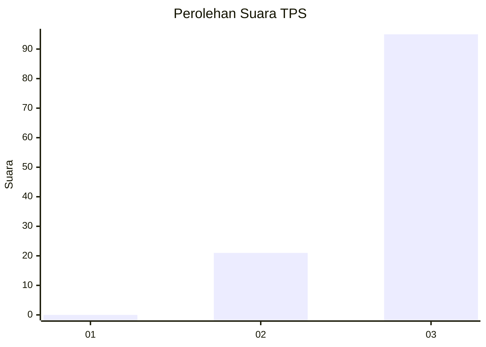
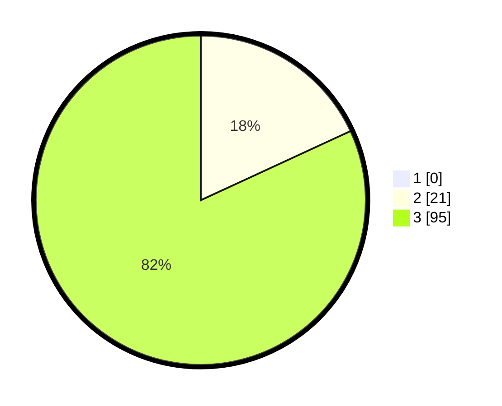

# Hasil

## Grafik

## Tabel

| No. | Nama Paslon    | Suara | Suara (raw) | Persentase |
|:--- |:-------------- | -----:| -----------:| ----------:|
| 1   | ANIES MUHAIMIN | 0     | [0][p-1]    | 0,00       |
| 2   | PRABOWO GIBRAN | 21    | [21][p-2]   | 18,10      |
| 3   | GANJAR MAHFUD  | 95    | [95][p-3]   | 81,90      |

[p-1]: https://github.com/gigit-pemilu/pemilu-2024-34-di-yogyakarta/blob/main/pilpres/hitung-suara/sub/34-di-yogyakarta/sub/01-kulon-progo/sub/11-samigaluh/sub/2004-sidoharjo/sub/007-tps/sub/paslon-1.txt
[p-2]: https://github.com/gigit-pemilu/pemilu-2024-34-di-yogyakarta/blob/main/pilpres/hitung-suara/sub/34-di-yogyakarta/sub/01-kulon-progo/sub/11-samigaluh/sub/2004-sidoharjo/sub/007-tps/sub/paslon-2.txt
[p-3]: https://github.com/gigit-pemilu/pemilu-2024-34-di-yogyakarta/blob/main/pilpres/hitung-suara/sub/34-di-yogyakarta/sub/01-kulon-progo/sub/11-samigaluh/sub/2004-sidoharjo/sub/007-tps/sub/paslon-3.txt

## Foto C Plano

https://sirekap-obj-formc.kpu.go.id/af05/pemilu/ppwp/34/01/11/20/04/3401112004007-20240216-132944--2789e38a-c1d9-4a57-be32-0fc95aaa04dc.jpg

https://sirekap-obj-formc.kpu.go.id/af05/pemilu/ppwp/34/01/11/20/04/3401112004007-20240216-132945--03073500-ce9c-4c01-9a3a-90fb01086890.jpg

https://sirekap-obj-formc.kpu.go.id/af05/pemilu/ppwp/34/01/11/20/04/3401112004007-20240216-132944--028c8744-6b45-47d6-bde8-f91d57d0c891.jpg

## Metadata

| Key        | Value               |
| ---------- | ------------------- |
| Time Stamp | 2024-02-21 16:00:00 |

## DATA PEMILIH TETAP

Jumlah pemilih dalam DPT: **115**.
 * L: **58**.
 * P: **57**.

## DATA PENGGUNA HAK PILIH

Jumlah pengguna hak pilih dalam DPT: **115**.
 * L: **58**.
 * P: **57**.

Jumlah pengguna hak pilih dalam DPTb: **1**.
 * L: **0**.
 * P: **1**.

Jumlah pengguna hak pilih dalam DPK: **0**.
 * L: **0**.
 * P: **0**.

Jumlah pengguna hak pilih: **116**.
 * L: **58**.
 * P: **58**.

## JUMLAH SUARA SAH DAN TIDAK SAH

JUMLAH SELURUH SUARA SAH: **116**.

JUMLAH SUARA TIDAK SAH: **0**.

JUMLAH SELURUH SUARA SAH DAN SUARA TIDAK SAH: **116**.

