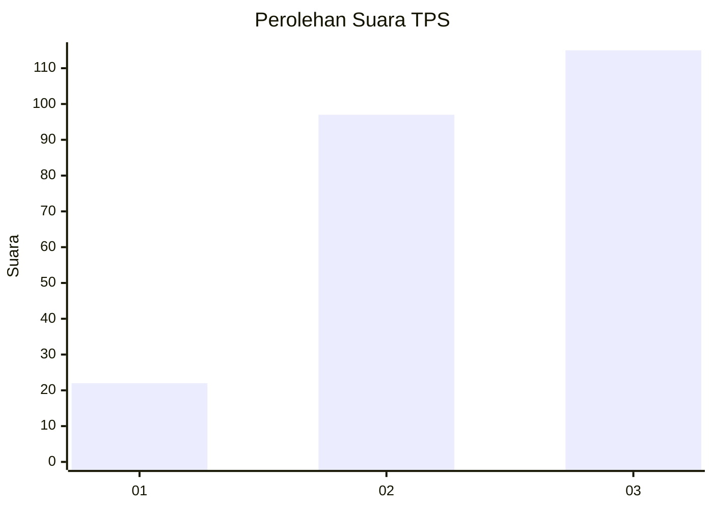
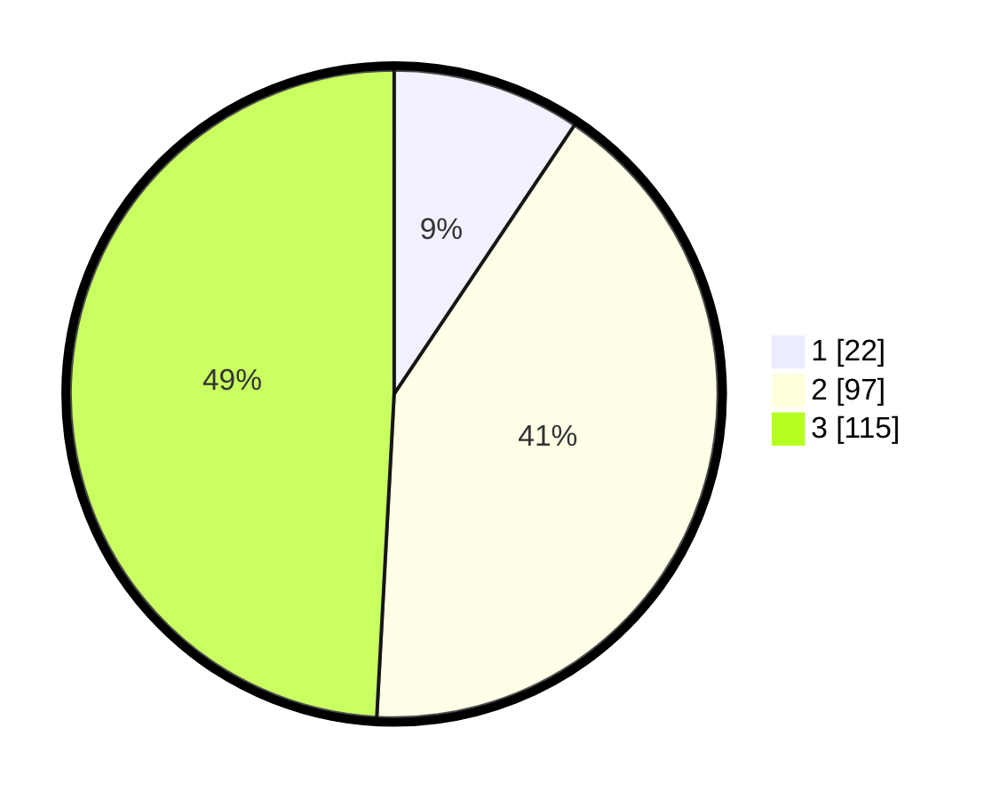

# Hasil

## Grafik

## Tabel

| No. | Nama Paslon    | Suara | Suara (raw) | Persentase |
|:--- |:-------------- | -----:| -----------:| ----------:|
| 1   | ANIES MUHAIMIN | 22    | [22][p-1]   | 9,40       |
| 2   | PRABOWO GIBRAN | 97    | [97][p-2]   | 41,45      |
| 3   | GANJAR MAHFUD  | 115   | [115][p-3]  | 49,15      |

[p-1]: https://github.com/gigit-pemilu/pemilu-2024-34-di-yogyakarta/blob/main/pilpres/hitung-suara/sub/34-di-yogyakarta/sub/01-kulon-progo/sub/11-samigaluh/sub/2007-pagerharjo/sub/004-tps/sub/paslon-1.txt
[p-2]: https://github.com/gigit-pemilu/pemilu-2024-34-di-yogyakarta/blob/main/pilpres/hitung-suara/sub/34-di-yogyakarta/sub/01-kulon-progo/sub/11-samigaluh/sub/2007-pagerharjo/sub/004-tps/sub/paslon-2.txt
[p-3]: https://github.com/gigit-pemilu/pemilu-2024-34-di-yogyakarta/blob/main/pilpres/hitung-suara/sub/34-di-yogyakarta/sub/01-kulon-progo/sub/11-samigaluh/sub/2007-pagerharjo/sub/004-tps/sub/paslon-3.txt

## Foto C Plano

https://sirekap-obj-formc.kpu.go.id/0db1/pemilu/ppwp/34/01/11/20/07/3401112007004-20240214-201013--72d886ea-608e-4ccf-bf7a-857031ed1c4c.jpg

https://sirekap-obj-formc.kpu.go.id/0db1/pemilu/ppwp/34/01/11/20/07/3401112007004-20240214-201057--946dd89a-dc92-401f-b886-c477b28e433a.jpg

https://sirekap-obj-formc.kpu.go.id/0db1/pemilu/ppwp/34/01/11/20/07/3401112007004-20240214-201233--b2d193e9-163c-45f8-b1e1-9b59bd7fd648.jpg

## Metadata

| Key        | Value               |
| ---------- | ------------------- |
| Time Stamp | 2024-02-15 22:00:27 |

