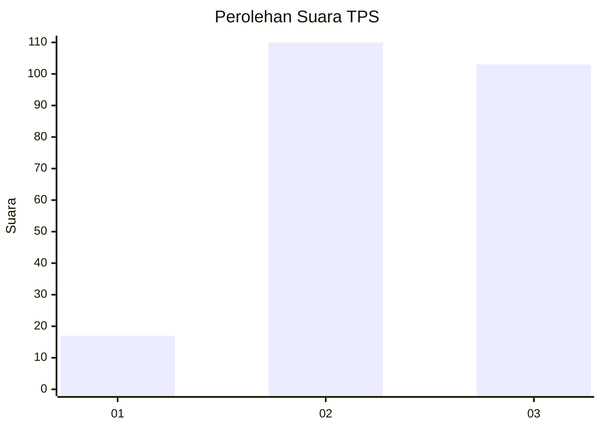
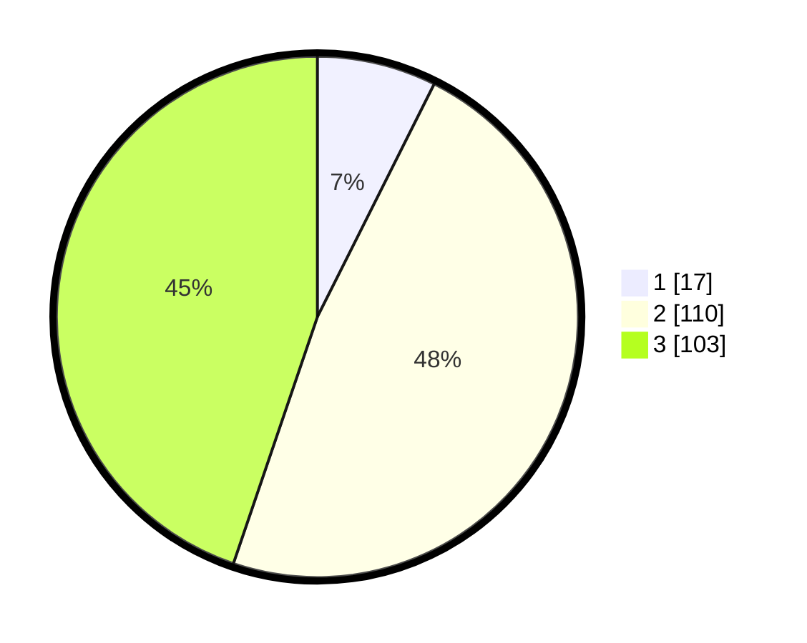

# Hasil

## Grafik

## Tabel

| No. | Nama Paslon    | Suara | Suara (raw) | Persentase |
|:--- |:-------------- | -----:| -----------:| ----------:|
| 1   | ANIES MUHAIMIN | 17    | [17][p-1]   | 7,39       |
| 2   | PRABOWO GIBRAN | 110   | [110][p-2]  | 47,83      |
| 3   | GANJAR MAHFUD  | 103   | [103][p-3]  | 44,78      |

[p-1]: https://github.com/gigit-pemilu/pemilu-2024-34-di-yogyakarta/blob/main/pilpres/hitung-suara/sub/34-di-yogyakarta/sub/01-kulon-progo/sub/11-samigaluh/sub/2007-pagerharjo/sub/007-tps/sub/paslon-1.txt
[p-2]: https://github.com/gigit-pemilu/pemilu-2024-34-di-yogyakarta/blob/main/pilpres/hitung-suara/sub/34-di-yogyakarta/sub/01-kulon-progo/sub/11-samigaluh/sub/2007-pagerharjo/sub/007-tps/sub/paslon-2.txt
[p-3]: https://github.com/gigit-pemilu/pemilu-2024-34-di-yogyakarta/blob/main/pilpres/hitung-suara/sub/34-di-yogyakarta/sub/01-kulon-progo/sub/11-samigaluh/sub/2007-pagerharjo/sub/007-tps/sub/paslon-3.txt

## Foto C Plano

https://sirekap-obj-formc.kpu.go.id/17d0/pemilu/ppwp/34/01/11/20/07/3401112007007-20240215-024833--30a7394d-bd19-48a4-b06e-631713c29e33.jpg

https://sirekap-obj-formc.kpu.go.id/17d0/pemilu/ppwp/34/01/11/20/07/3401112007007-20240215-025001--ab4ebaff-0d88-43c7-9475-6da42f7d3925.jpg

## Metadata

| Key        | Value               |
| ---------- | ------------------- |
| Time Stamp | 2024-02-25 12:00:00 |

