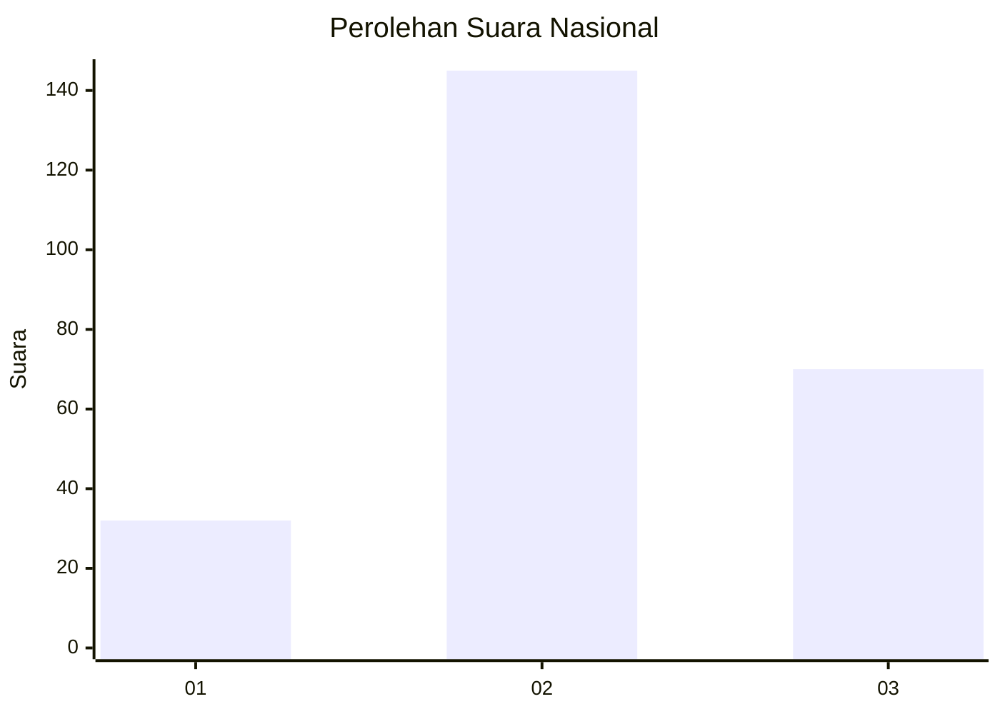
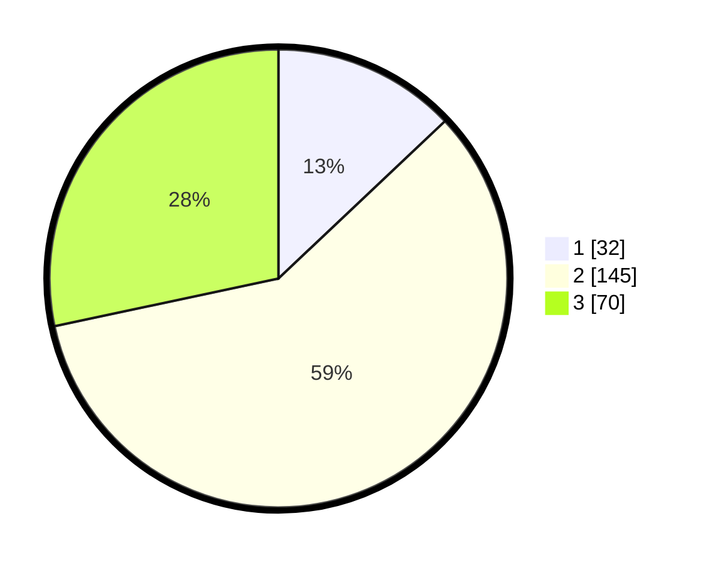

# Hasil

## Grafik

## Tabel

| No. | Nama Paslon    | Suara | Suara (raw) | Persentase |
|:--- |:-------------- | -----:| -----------:| ----------:|
| 1   | ANIES MUHAIMIN | 32    | [32][p-1]   | 12,96      |
| 2   | PRABOWO GIBRAN | 145   | [145][p-2]  | 58,70      |
| 3   | GANJAR MAHFUD  | 70    | [70][p-3]   | 28,34      |

[p-1]: https://github.com/gigit-pemilu/pemilu-2024/blob/main/pilpres/hitung-suara/sub/34-di-yogyakarta/sub/01-kulon-progo/sub/12-kalibawang/sub/2001-banjararum/sub/001-tps/sub/paslon-1.txt
[p-2]: https://github.com/gigit-pemilu/pemilu-2024/blob/main/pilpres/hitung-suara/sub/34-di-yogyakarta/sub/01-kulon-progo/sub/12-kalibawang/sub/2001-banjararum/sub/001-tps/sub/paslon-2.txt
[p-3]: https://github.com/gigit-pemilu/pemilu-2024/blob/main/pilpres/hitung-suara/sub/34-di-yogyakarta/sub/01-kulon-progo/sub/12-kalibawang/sub/2001-banjararum/sub/001-tps/sub/paslon-3.txt

## Foto C Plano

https://sirekap-obj-formc.kpu.go.id/fa1c/pemilu/ppwp/34/01/12/20/01/3401122001001-20240219-143052--163c3b9a-12ff-4c68-b11f-fa66a22003fe.jpg

https://sirekap-obj-formc.kpu.go.id/fa1c/pemilu/ppwp/34/01/12/20/01/3401122001001-20240219-143053--3781aa63-7fc9-46db-8b47-6f1dcdcbea45.jpg

https://sirekap-obj-formc.kpu.go.id/fa1c/pemilu/ppwp/34/01/12/20/01/3401122001001-20240219-143052--af07d0f5-f620-4dd3-b495-1b934b17919b.jpg

## Metadata

| Key        | Value               |
| ---------- | ------------------- |
| Time Stamp | 2024-02-21 18:00:00 |

## DATA PEMILIH TETAP

Jumlah pemilih dalam DPT: **281**.
 * L: **139**.
 * P: **142**.

## DATA PENGGUNA HAK PILIH

Jumlah pengguna hak pilih dalam DPT: **243**.
 * L: **118**.
 * P: **125**.

Jumlah pengguna hak pilih dalam DPTb: **3**.
 * L: **1**.
 * P: **2**.

Jumlah pengguna hak pilih dalam DPK: **4**.
 * L: **2**.
 * P: **2**.

Jumlah pengguna hak pilih: **250**.
 * L: **121**.
 * P: **129**.

## JUMLAH SUARA SAH DAN TIDAK SAH

JUMLAH SELURUH SUARA SAH: **247**.

JUMLAH SUARA TIDAK SAH: **3**.

JUMLAH SELURUH SUARA SAH DAN SUARA TIDAK SAH: **250**.

