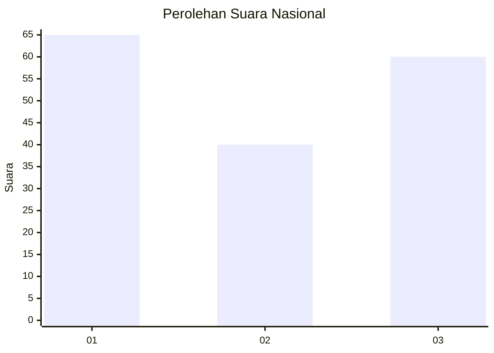
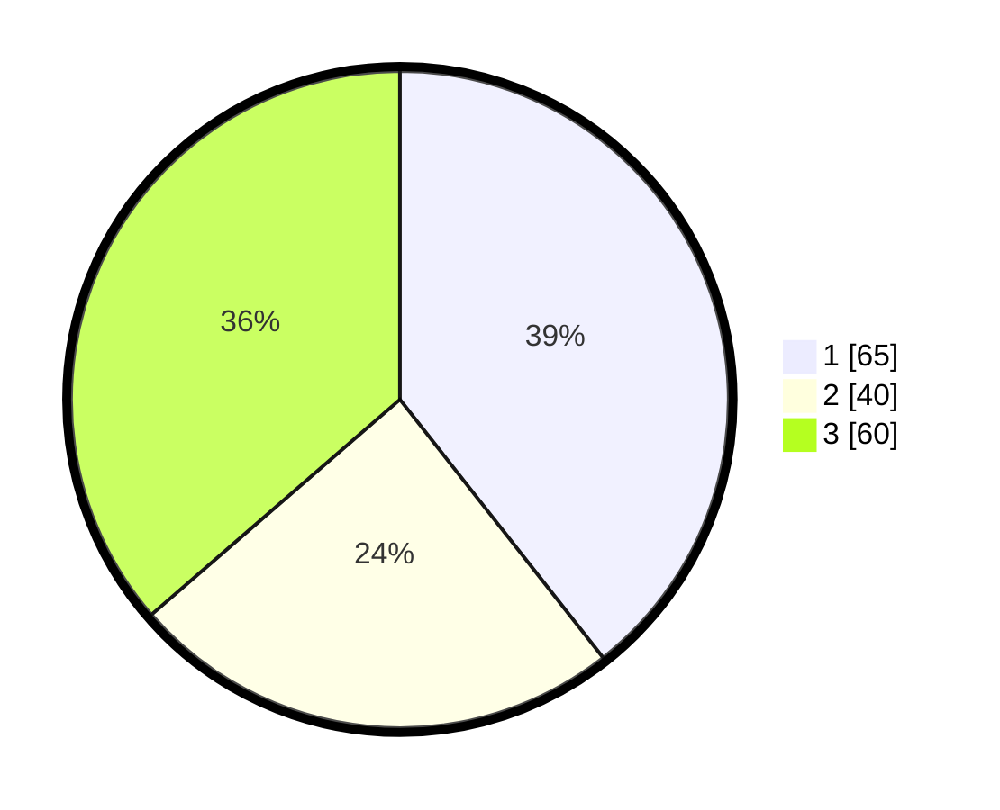

# Hasil

## Grafik

## Tabel

| No. | Nama Paslon    | Suara | Suara (raw) | Persentase |
|:--- |:-------------- | -----:| -----------:| ----------:|
| 1   | ANIES MUHAIMIN | 65    | [65][p-1]   | 39,39      |
| 2   | PRABOWO GIBRAN | 40    | [40][p-2]   | 24,24      |
| 3   | GANJAR MAHFUD  | 60    | [60][p-3]   | 36,36      |

[p-1]: https://github.com/gigit-pemilu/pemilu-2024/blob/main/pilpres/hitung-suara/sub/34-di-yogyakarta/sub/01-kulon-progo/sub/12-kalibawang/sub/2001-banjararum/sub/002-tps/sub/paslon-1.txt
[p-2]: https://github.com/gigit-pemilu/pemilu-2024/blob/main/pilpres/hitung-suara/sub/34-di-yogyakarta/sub/01-kulon-progo/sub/12-kalibawang/sub/2001-banjararum/sub/002-tps/sub/paslon-2.txt
[p-3]: https://github.com/gigit-pemilu/pemilu-2024/blob/main/pilpres/hitung-suara/sub/34-di-yogyakarta/sub/01-kulon-progo/sub/12-kalibawang/sub/2001-banjararum/sub/002-tps/sub/paslon-3.txt

## Foto C Plano

https://sirekap-obj-formc.kpu.go.id/4abc/pemilu/ppwp/34/01/12/20/01/3401122001002-20240216-124048--9bd5973b-19ac-4855-95b2-3301ad2c582d.jpg

https://sirekap-obj-formc.kpu.go.id/4abc/pemilu/ppwp/34/01/12/20/01/3401122001002-20240216-124049--348311fc-fc57-450c-b8d6-8558ff3ea68d.jpg

https://sirekap-obj-formc.kpu.go.id/4abc/pemilu/ppwp/34/01/12/20/01/3401122001002-20240216-124049--8f1e446f-84e1-4946-a166-15ff913a1425.jpg

## Metadata

| Key        | Value               |
| ---------- | ------------------- |
| Time Stamp | 2024-02-19 14:00:00 |

## DATA PEMILIH TETAP

Jumlah pemilih dalam DPT: **295**.
 * L: **144**.
 * P: **151**.

## DATA PENGGUNA HAK PILIH

Jumlah pengguna hak pilih dalam DPT: **266**.
 * L: **130**.
 * P: **136**.

Jumlah pengguna hak pilih dalam DPTb: **2**.
 * L: **0**.
 * P: **2**.

Jumlah pengguna hak pilih dalam DPK: **0**.
 * L: **0**.
 * P: **0**.

Jumlah pengguna hak pilih: **268**.
 * L: **130**.
 * P: **138**.

## JUMLAH SUARA SAH DAN TIDAK SAH

JUMLAH SELURUH SUARA SAH: **265**.

JUMLAH SUARA TIDAK SAH: **3**.

JUMLAH SELURUH SUARA SAH DAN SUARA TIDAK SAH: **268**.

