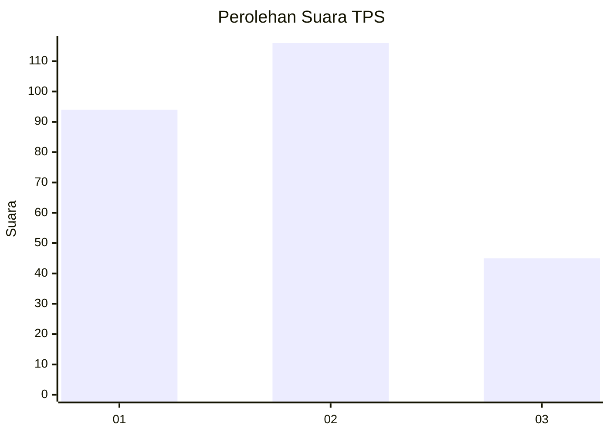
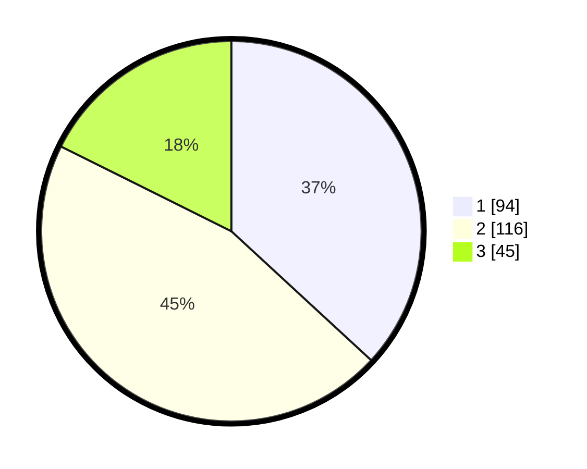

# Hasil

## Grafik

## Tabel

| No. | Nama Paslon    | Suara | Suara (raw) | Persentase |
|:--- |:-------------- | -----:| -----------:| ----------:|
| 1   | ANIES MUHAIMIN | 94    | [94][p-1]   | 36,86      |
| 2   | PRABOWO GIBRAN | 116   | [116][p-2]  | 45,49      |
| 3   | GANJAR MAHFUD  | 45    | [45][p-3]   | 17,65      |

[p-1]: https://github.com/gigit-pemilu/pemilu-2024-34-di-yogyakarta/blob/main/pilpres/hitung-suara/sub/34-di-yogyakarta/sub/01-kulon-progo/sub/12-kalibawang/sub/2001-banjararum/sub/003-tps/sub/paslon-1.txt
[p-2]: https://github.com/gigit-pemilu/pemilu-2024-34-di-yogyakarta/blob/main/pilpres/hitung-suara/sub/34-di-yogyakarta/sub/01-kulon-progo/sub/12-kalibawang/sub/2001-banjararum/sub/003-tps/sub/paslon-2.txt
[p-3]: https://github.com/gigit-pemilu/pemilu-2024-34-di-yogyakarta/blob/main/pilpres/hitung-suara/sub/34-di-yogyakarta/sub/01-kulon-progo/sub/12-kalibawang/sub/2001-banjararum/sub/003-tps/sub/paslon-3.txt

## Foto C Plano

https://sirekap-obj-formc.kpu.go.id/19a2/pemilu/ppwp/34/01/12/20/01/3401122001003-20240215-201236--2a076fbf-d700-42af-98ef-3c269068bf40.jpg

https://sirekap-obj-formc.kpu.go.id/19a2/pemilu/ppwp/34/01/12/20/01/3401122001003-20240216-152333--e6fff06c-c4bc-485f-8f7b-53ea92bde6ea.jpg

https://sirekap-obj-formc.kpu.go.id/19a2/pemilu/ppwp/34/01/12/20/01/3401122001003-20240215-202043--1fc8a8b3-3cff-4858-88cd-07c416731dfe.jpg

## Metadata

| Key        | Value               |
| ---------- | ------------------- |
| Time Stamp | 2024-02-17 16:36:25 |

## DATA PEMILIH TETAP

Jumlah pemilih dalam DPT: **297**.
 * L: **141**.
 * P: **156**.

## DATA PENGGUNA HAK PILIH

Jumlah pengguna hak pilih dalam DPT: **262**.
 * L: **122**.
 * P: **140**.

Jumlah pengguna hak pilih dalam DPTb: **0**.
 * L: **0**.
 * P: **0**.

Jumlah pengguna hak pilih dalam DPK: **1**.
 * L: **1**.
 * P: **0**.

Jumlah pengguna hak pilih: **263**.
 * L: **123**.
 * P: **240**.

## JUMLAH SUARA SAH DAN TIDAK SAH

JUMLAH SELURUH SUARA SAH: **255**.

JUMLAH SUARA TIDAK SAH: **8**.

JUMLAH SELURUH SUARA SAH DAN SUARA TIDAK SAH: **263**.

