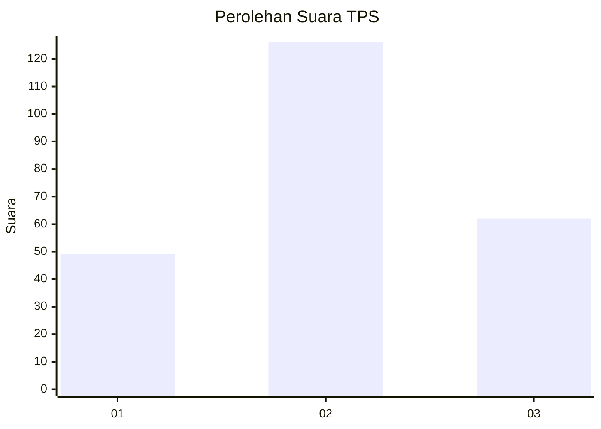
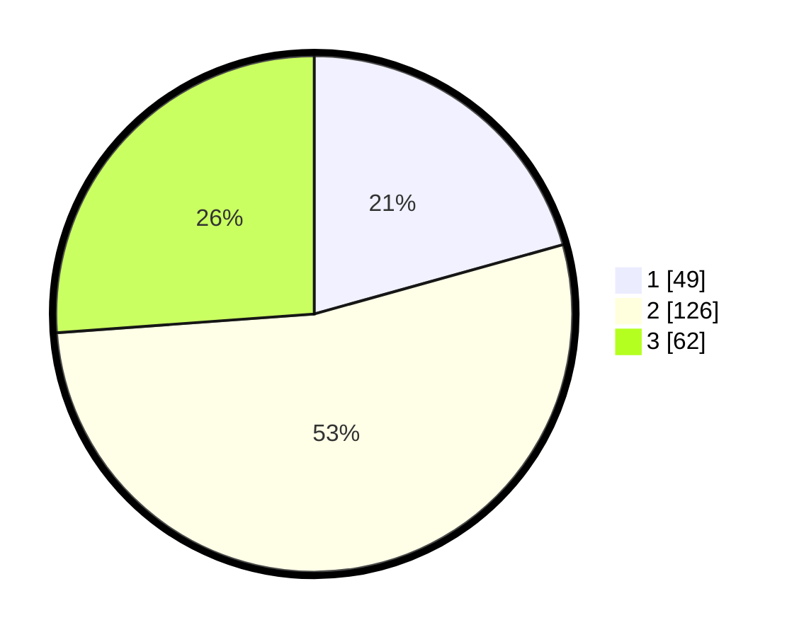

# Hasil

## Grafik

## Tabel

| No. | Nama Paslon    | Suara | Suara (raw) | Persentase |
|:--- |:-------------- | -----:| -----------:| ----------:|
| 1   | ANIES MUHAIMIN | 49    | [49][p-1]   | 20,68      |
| 2   | PRABOWO GIBRAN | 126   | [126][p-2]  | 53,16      |
| 3   | GANJAR MAHFUD  | 62    | [62][p-3]   | 26,16      |

[p-1]: https://github.com/gigit-pemilu/pemilu-2024-34-di-yogyakarta/blob/main/pilpres/hitung-suara/sub/34-di-yogyakarta/sub/01-kulon-progo/sub/12-kalibawang/sub/2001-banjararum/sub/005-tps/sub/paslon-1.txt
[p-2]: https://github.com/gigit-pemilu/pemilu-2024-34-di-yogyakarta/blob/main/pilpres/hitung-suara/sub/34-di-yogyakarta/sub/01-kulon-progo/sub/12-kalibawang/sub/2001-banjararum/sub/005-tps/sub/paslon-2.txt
[p-3]: https://github.com/gigit-pemilu/pemilu-2024-34-di-yogyakarta/blob/main/pilpres/hitung-suara/sub/34-di-yogyakarta/sub/01-kulon-progo/sub/12-kalibawang/sub/2001-banjararum/sub/005-tps/sub/paslon-3.txt

## Foto C Plano

https://sirekap-obj-formc.kpu.go.id/2628/pemilu/ppwp/34/01/12/20/01/3401122001005-20240214-214843--cb34649a-a27d-4f4e-a0f1-8b41d4d52e55.jpg

https://sirekap-obj-formc.kpu.go.id/2628/pemilu/ppwp/34/01/12/20/01/3401122001005-20240214-215244--94008baf-0e10-475b-b155-cc793c9f1bf6.jpg

https://sirekap-obj-formc.kpu.go.id/2628/pemilu/ppwp/34/01/12/20/01/3401122001005-20240214-215544--609264f8-af65-46aa-ae2b-27afb5d21ce9.jpg

## Metadata

| Key        | Value               |
| ---------- | ------------------- |
| Time Stamp | 2024-02-15 09:00:24 |

