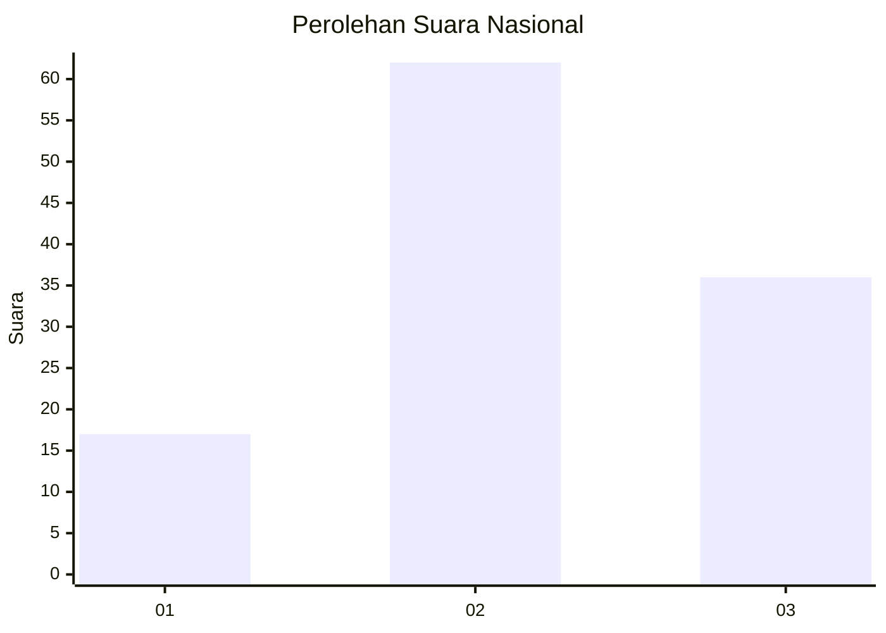
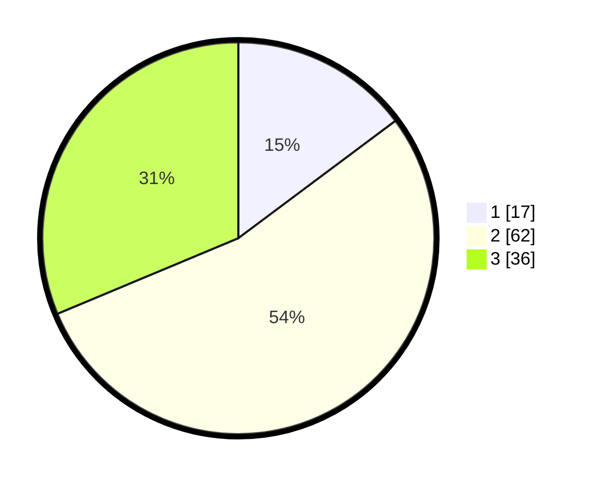

# Hasil

## Grafik

## Tabel

| No. | Nama Paslon    | Suara | Suara (raw) | Persentase |
|:--- |:-------------- | -----:| -----------:| ----------:|
| 1   | ANIES MUHAIMIN | 17    | [17][p-1]   | 14,78      |
| 2   | PRABOWO GIBRAN | 62    | [62][p-2]   | 53,91      |
| 3   | GANJAR MAHFUD  | 36    | [36][p-3]   | 31,30      |

[p-1]: https://github.com/gigit-pemilu/pemilu-2024/blob/main/pilpres/hitung-suara/sub/34-di-yogyakarta/sub/01-kulon-progo/sub/12-kalibawang/sub/2001-banjararum/sub/008-tps/sub/paslon-1.txt
[p-2]: https://github.com/gigit-pemilu/pemilu-2024/blob/main/pilpres/hitung-suara/sub/34-di-yogyakarta/sub/01-kulon-progo/sub/12-kalibawang/sub/2001-banjararum/sub/008-tps/sub/paslon-2.txt
[p-3]: https://github.com/gigit-pemilu/pemilu-2024/blob/main/pilpres/hitung-suara/sub/34-di-yogyakarta/sub/01-kulon-progo/sub/12-kalibawang/sub/2001-banjararum/sub/008-tps/sub/paslon-3.txt

## Foto C Plano

https://sirekap-obj-formc.kpu.go.id/d96c/pemilu/ppwp/34/01/12/20/01/3401122001008-20240215-043051--5172cdd0-42ea-48ab-9256-5a47e9006d5c.jpg

https://sirekap-obj-formc.kpu.go.id/d96c/pemilu/ppwp/34/01/12/20/01/3401122001008-20240215-042959--2119f89b-fbab-4250-9150-42707d4ad460.jpg

https://sirekap-obj-formc.kpu.go.id/d96c/pemilu/ppwp/34/01/12/20/01/3401122001008-20240215-043152--622fea69-bda0-426d-bbdd-0d3f63fb10a3.jpg

## Metadata

| Key        | Value               |
| ---------- | ------------------- |
| Time Stamp | 2024-02-16 03:00:26 |

## DATA PEMILIH TETAP

Jumlah pemilih dalam DPT: **147**.
 * L: **72**.
 * P: **75**.

## DATA PENGGUNA HAK PILIH

Jumlah pengguna hak pilih dalam DPT: **115**.
 * L: **55**.
 * P: **60**.

Jumlah pengguna hak pilih dalam DPTb: **4**.
 * L: **2**.
 * P: **2**.

Jumlah pengguna hak pilih dalam DPK: **0**.
 * L: **0**.
 * P: **0**.

Jumlah pengguna hak pilih: **119**.
 * L: **57**.
 * P: **62**.

## JUMLAH SUARA SAH DAN TIDAK SAH

JUMLAH SELURUH SUARA SAH: **115**.

JUMLAH SUARA TIDAK SAH: **4**.

JUMLAH SELURUH SUARA SAH DAN SUARA TIDAK SAH: **119**.

